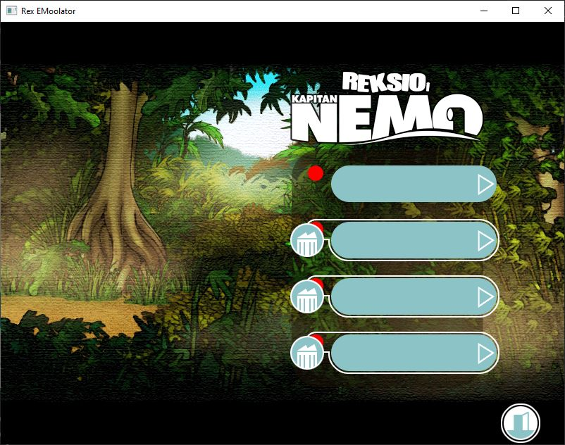
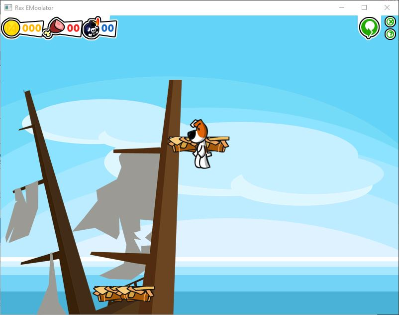

# Rex EMoolator
Emulator silnika graficznego Piklib/BlooMoo autorstwa firmy Aidem Media oraz interpretera skryptów.

> [!WARNING]
> Na ten moment trwają prace nad poprawą interpretera oraz naprawieniem scen ARCADE i CUTSCENKI. 

Dla tabeli niżej zastosowano następujący podział grywalności:
-  grę daje się ukończyć od początku do końca, bez błędów, które mogą ją zablokować.
-  gra działa, jednak przez różne błędy i niedoróbki nie jest możliwa do ukończenia.
-  gra ładuje się, jednak nie przechodzi poza intro.
-  gra nie inicjalizuje się poprawnie, ładuje się z błędem, wywołuje crash emulatora lub daje czarny obraz.

Aktualne statusy gier opartych na silniku Piklib/BlooMoo:
<table>
<thead>
<tr>
<th>Nazwa gry</th>
<th>Status</th>
<th>Uwagi</th>
</tr>
</thead>
<tbody>
<tr>
<td>Reksio i Skarb Piratów</td>
<td></td>
<td>Gra działa bez poważniejszych błędów do momentu dotarcia do wioski (sekwencja z kokosami nie działa poprawnie, są jeszcze problemy z systemem kolizji lub skryptami, kiedy szczur wejdzie na kładkę). Nie działa etap ze zbieraniem pereł. Są problemy ze strażnikiem do świątyni Boga Twaroga.</td>
</tr>
<tr>
<td>Reksio i Ufo</td>
<td></td>
<td>Gra działa w większości poprawnie do momentu, gdzie składamy wajhadłowiec. Podczas sekwencji z inwazją ufo są problemy z laserem, który przebija się przez ufo i nie znika przy ziemi, dodatkowo kod interpretera zaczyna przymulać przy takiej ilości obiektów. Buguje się menu przedmiotów, wzięte przedmioty na powrót się pojawiają na swoich miejscach po przeładowaniu sceny. Podczas kalibrowania kreta elementy na ekranach się nie ruszają.</td>
</tr>
<tr>
<td>Reksio i Czarodzieje</td>
<td></td>
<td>Działa cała sekwencja intra z przerzucaniem kartek i streszczeniem poprzednich części. Na Androidzie ten segment się nieco przymula przez częstą zmianę plików audio i grafik. Działa również plansza z pagórkami, ale po trzeciej planszy nie ładują się drzwi, tj. jest czarny prostokąt i dodatkowo nie działa. Poprawnie działają zrzuty ekranu podczas zapisywania.</td>
</tr>
<tr>
<td>Reksio i Wehikuł Czasu</td>
<td></td>
<td>Odpala się sekwencja z panoramą, odpala się muzyka w tle, ale sypie się pauzowanie i wznawianie sekwencji. Sekwencja z opowieścią babcia Kretesa działa prawie dobrze, ale nie do końca wyświetla poprawnie obrazki z projektora. Dodatkowo koniec sekwencji z jakiegoś powodu się zapętla (prawdopodobnie z powodów problemów ze wznawianiem sekwencji) oraz zaczynają się przenikać wcześniejsze sekwencje z późniejszymi.</td>
</tr>
<tr>
<td>Reksio i Kapitan Nemo</td>
<td></td>
<td>Czarny ekran i uruchamia się muzyka w tle. Działa cutscenka z intro, po kliknięciu myszką lub zakończeniu intra przechodzi do menu, daje się przestawić trudność, ale nie działają przyciski szuflad.</td>
</tr>
<tr>
<td>Reksio i Kretes w Akcji!</td>
<td></td>
<td>Uruchamia się cutscenka z pierwszego poziomu Reksio i Skarb Piratów, po kliknięciu myszką lub zakończeniu intra przechodzi do zabugowanego poziomu minigierki Reksio i Skarb Piratów. Daje się wyjść z minigierki, jednak silnik crashuje się po najechaniu na wybór poziomu. Menu wyboru minigierek działa, jednak kierują w to samo miejsce, tj. Reksio i Skarb Piratów.</td>
</tr>
<tr>
<td>Poznaj Mity: Wyprawa po Złote Runo</td>
<td></td>
<td>Przechodzi do menu i przyciski działają. Minigierki na ten moment nie działają (bugują się, crashują grę itp.). Bajka prawie działa (są problemy pod Androidem).</td>
</tr>
<tr>
<td>Poznaj Mity: Wojna Trojańska</td>
<td></td>
<td>Przechodzi do menu i przyciski działają. Minigierki na ten moment nie działają (głównie się bugują), czasami guziki znikają.</td>
</tr>
<tr>
<td>Poznaj Mity: Przygody Odyseusza</td>
<td></td>
<td>Przechodzi do menu i przyciski działają. Statek Ozyrysa czasami znika. Odnoszę wrażenie, że bajka działa z błędami. Minigierki na ten moment nie działają lub wywalają grę.</td>
</tr>
<tr>
<td>Poznaj Mity: Herkules</td>
<td></td>
<td>Pojawia się plansza startowa i wchodzi do menu, przyciski działają i udaje się przejść do minigierek, ale nie da się jeszcze grać. Bajka się buguje (grafiki się podmieniają jedynie podczas ręcznego przechodzenia między rozdziałami).</td>
</tr>
</tbody>
</table>

## Garść screenshotów

*Screen z próby uruchomienia Reksio i Skarb Piratów*

*Screen z próby uruchomienia Reksio i Ufo*

*Screen z próby uruchomienia Reksio i Czarodzieje*

*Screen z próby uruchomienia Reksio i Wehikuł Czasu*

*Screen z próby uruchomienia Reksio i Kapitan Nemo*

*Screen z próby uruchomienia Reksio i Kretes w Akcji!*

*Screen z próby uruchomienia Wyprawy po Złote Runo*

*Screen z próby uruchomienia Wojny Trojańskiej*

*Screen z próby uruchomienia Przygód Odyseusza*

*Screen z próby uruchomienia Herkulesa*