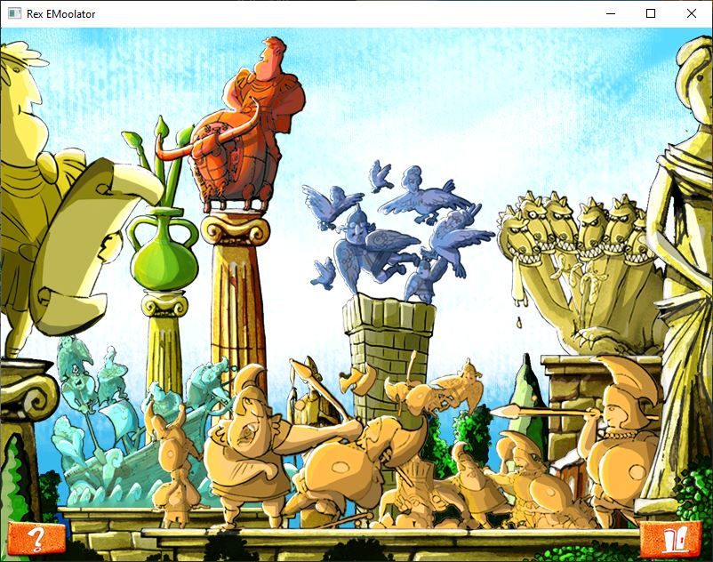

# Rex EMoolator

[Polski](README.pl.md) | **English**

An open-source emulator that recreates the behavior of the Piklib/BlooMoo engine used in Aidem Media games.

## Requirements

### Desktop
- **Java**: Version 11 or newer
- **Operating System**: Windows, Linux, or macOS
- **Game Files**: Original game files (data from the original CD-ROM or installation)

### Android
- **Android Version**: 7.0 (API level 24) or newer
- **Game Files**: Original game files

## Building the Project

This project uses Gradle as its build system.

### Desktop Build
```bash
# Windows
gradlew.bat desktop:shadowJar

# Linux/macOS
./gradlew desktop:shadowJar
```

The executable JAR will be created in `desktop/build/libs/`.

### Android Build
```bash
# Windows
gradlew.bat android:assembleRelease

# Linux/macOS
./gradlew android:assembleRelease
```

The APK will be created in `android/build/outputs/apk/`.

## Running the Emulator

### Desktop
After building:
```bash
java -jar desktop/build/libs/Rex_EMoolator-desktop.jar
```

Or run directly with Gradle:
```bash
# Windows
gradlew.bat desktop:run

# Linux/macOS
./gradlew desktop:run
```

### Android
Install the generated APK on your Android device and launch the application.

## Supported Games

The emulator targets games based on the Piklib/BlooMoo engine.

### Playability Status Legend
-  Game can be completed from start to finish without blocking bugs
-  Game runs but cannot be completed due to various bugs
-  Game loads but doesn't progress past the intro
-  Game doesn't initialize properly, loads with errors, crashes, or shows a black screen

Playability estimates are based on the number of scenes that play correctly according to the game scripts until the first point where emulator bugs prevent further progress. Minor bugs and animation issues are not counted—only bugs that prevent scenes from starting/ending or cause crashes. Since this requires playing through titles repeatedly, this information may not be updated frequently. The list of scenes and the assessment of their correctness will be gradually created as part of GitHub Projects. However, since the newer games use dedicated scenes for cutscenes and minigames—which are significantly harder to trace in the code than simple `GOTO` transitions—this process will not be immediate.

### Current Game Status
<table>
<thead>
<tr>
<th>Game Title</th>
<th>Status</th>
<th>Notes</th>
<th>Estimated Playability</th>
<th>Project Tracking</th>
</tr>
</thead>
<tbody>
<tr>
<td>Reksio i Skarb Piratów</td>
<td></td>
<td>Fully playable with minor bugs. River crossing stages started to lag (needs verification). Coconut sequence has minor collision detection differences vs original (also a chicken appears in the corner slightly obscuring the menu button). During Twarog God statue puzzles, answer graphics occasionally swap positions (narrator reads correctly though). UFO stage occasionally has animation priority issues (elevator obscures Rex, needs verification). Otherwise everything works correctly.</td>
<td>100%</td>
<td><a href="https://github.com/users/patryk025/projects/3">Link</a></td>
</tr>
<tr>
<td>Reksio i Ufo</td>
<td></td>
<td>Works correctly until reaching the canyon on Indor. Platform sequence works but has issues (can exit ladder and walk in air). Race has problems—completable but opponents can get stuck. Egg vacuuming sequence has issues with vacuum animation running too fast (seems to be a global emulator issue, needs checking). Crashed after first torpedo fired. Also reveals "leaking" sound issues—sounds from previous scene can play in the next.</td>
<td>~30% (26/86 scenes)</td>
<td><a href="https://github.com/users/patryk025/projects/4">Link</a></td>
</tr>
<tr>
<td>Reksio i Czarodzieje</td>
<td></td>
<td>Menu is slightly laggy. Hills sequence works, but the stage after with hidden doors doesn't due to missing World type implementation (in progress). This is a blocking point preventing further gameplay.</td>
<td></td>
<td><a href="https://github.com/users/patryk025/projects/6">Link</a></td>
</tr>
<tr>
<td>Reksio i Wehikuł Czasu</td>
<td></td>
<td>Requires re-evaluation.</td>
<td>0%</td>
<td><a href="https://github.com/users/patryk025/projects/8">Link</a></td>
</tr>
<tr>
<td>Reksio i Kapitan Nemo</td>
<td></td>
<td>Requires re-evaluation.</td>
<td>0%</td>
<td><a href="https://github.com/users/patryk025/projects/10">Link</a></td>
</tr>
<tr>
<td>Reksio i Kretes w Akcji!</td>
<td></td>
<td>Opening intro works and proceeds correctly. Clicking brings you to menu. All buttons work and go to corresponding minigames. Reksio i Skarb Piratów technically works—background doesn't scroll but collisions work. In Reksio i Ufo, only background, Millennium Falcon, and particle effects render, but stage doesn't work due to missing Inertia implementation. In Reksio i Czarodzieje, track renders but everything seems over-accelerated. Collisions work but elements don't move. In Reksio i Wehikuł Czasu, map draws and characters can move but there are bugs with graphics and positions. Super Heros i Kapitan Nemo doesn't load the map. Map editor is also incomplete.</td>
<td>0%</td>
<td><a href="https://github.com/users/patryk025/projects/11">Link</a></td>
</tr>
<tr>
<td>Poznaj Mity: Wyprawa po Złote Runo</td>
<td></td>
<td>Requires re-evaluation.</td>
<td></td>
<td><a href="https://github.com/users/patryk025/projects/12">Link</a></td>
</tr>
<tr>
<td>Poznaj Mity: Wojna Trojańska</td>
<td></td>
<td>Requires re-evaluation.</td>
<td></td>
<td><a href="https://github.com/users/patryk025/projects/13">Link</a></td>
</tr>
<tr>
<td>Poznaj Mity: Przygody Odyseusza</td>
<td></td>
<td>Requires re-evaluation.</td>
<td></td>
<td><a href="https://github.com/users/patryk025/projects/14">Link</a></td>
</tr>
<tr>
<td>Poznaj Mity: Herkules</td>
<td></td>
<td>Requires re-evaluation.</td>
<td></td>
<td><a href="https://github.com/users/patryk025/projects/15">Link</a></td>
</tr>
</tbody>
</table>

## Screenshots
### Reksio i Skarb Piratów

<br>*Screenshot from Reksio i Skarb Piratów*

### Reksio i Ufo

<br>*Screenshot from Reksio i Ufo*

### Reksio i Czarodzieje

<br>*Screenshot from Reksio i Czarodzieje*

### Reksio i Wehikuł Czasu

<br>*Screenshot from Reksio i Wehikuł Czasu*

### Reksio i Kapitan Nemo

<br>*Reksio i Kapitan Nemo menu*


<br>*Intro after clicking the drawer*

### Reksio i Kretes w Akcji

<br>*Reksio i Kretes w Akcji intro*


<br>*Reksio i Kretes w Akcji menu*


<br>*Reksio i Skarb Piratów intro*


<br>*Reksio i Skarb Piratów gameplay*


<br>*Reksio i Ufo intro*


<br>*Reksio i Ufo gameplay*


<br>*Reksio i Czarodzieje intro*


<br>*Reksio i Czarodzieje intro*


<br>*Reksio i Czarodzieje gameplay*


<br>*Reksio i Wehikuł Czasu menu*


<br>*Reksio i Wehikuł Czasu gameplay moments before crash*


<br>*Super Heros i Kapitan Nemo intro*


<br>*Super Heros i Kapitan Nemo gameplay*

### Poznaj Mity: Wyprawa po Złote Runo

<br>*Screenshot from Wyprawa po Złote Runo*

### Poznaj Mity: Wojna Trojańska

<br>*Screenshot from Wojna Trojańska*

### Poznaj Mity: Przygody Odyseusza

<br>*Screenshot from Przygody Odyseusza*

### Poznaj Mity: Herkules

<br>*Screenshot from Herkules*

## License

This project is intended for educational and preservation purposes. You must own the original games to use this emulator.

The project does not distribute complete copyrighted assets from the original titles, such as full graphics, audio, or binary data.
The assets/ directory may contain minimal, necessary fragments of assets used solely for automated testing and engine validation. These files are included only to the extent required to analyze and reproduce the engine’s behavior, and fall under fair use / permitted use for interoperability.

Users are required to obtain the full original game assets legally, from copies they personally own.

The author of this project is not affiliated with the rights holders of the original games. The emulator is provided in good faith, “as is”, without any warranties, as a research and documentation tool.
