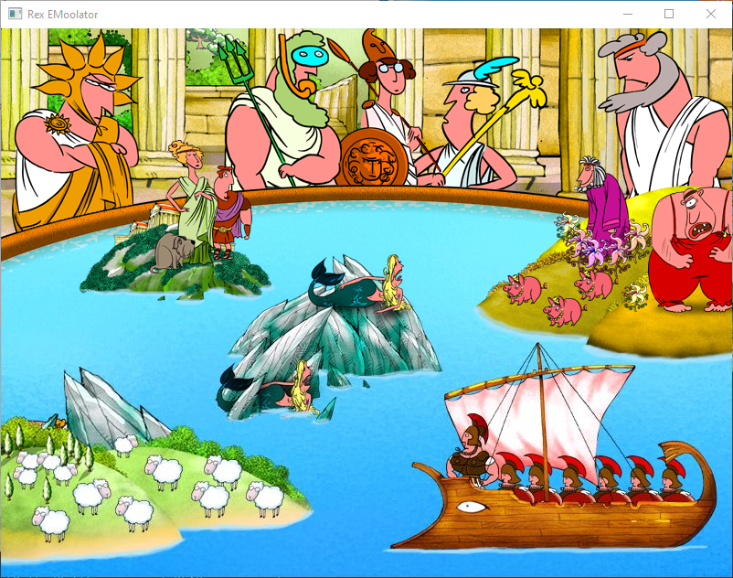

# Rex EMoolator
Emulator silnika graficznego Piklib/BlooMoo autorstwa firmy Aidem Media oraz interpretera skryptów.

> [!WARNING]
> Na ten moment wysiłki są skoncentrowane na rewersowaniu plików SEK oraz działania obiektów typu World. Postępy prac nad tym, jak i innymi typami plików będą widoczne w branchu [format_definitions](https://github.com/patryk025/Rex-EMoolator/tree/format_definitions)

Dla tabeli niżej zastosowano następujący podział grywalności:
-  grę daje się ukończyć od początku do końca, bez błędów, które mogą ją zablokować.
-  gra działa, jednak przez różne błędy i niedoróbki nie jest możliwa do ukończenia.
-  gra ładuje się, jednak nie przechodzi poza intro.
-  gra nie inicjalizuje się poprawnie, ładuje się z błędem, wywołuje crash emulatora lub daje czarny obraz.

Szacowane poziomy grywalności są wyznaczane na podstawie ilości scen, które się odgrywają poprawnie zgodnie z przepływem narzuconym przez skrypty gry do pierwszego momentu, w którym błędy emulatora uniemożliwiają przejście dalej. Nie uwzględniam tutaj drobnych błędów, problemów z animacjami, a jedynie błędy, które powodują, że scena się nie kończy bądź nie zaczyna lub emulator się crashuje. Z racji, iż wymaga to przechodzenia tytułu przynajmniej od momentu, gdzie wszystko działało, a co któryś raz od początku informacja ta nie będzie aktualizowana na bieżąco.

Aktualne statusy gier opartych na silniku Piklib/BlooMoo:
<table>
<thead>
<tr>
<th>Nazwa gry</th>
<th>Status</th>
<th>Uwagi</th>
<th>Szacowany poziom grywalności</th>
<th>Link do projektu z trackingiem</th>
</tr>
</thead>
<tbody>
<tr>
<td>Reksio i Skarb Piratów</td>
<td></td>
<td>Gra w pełni grywalna z drobnymi bugami. Etapy z przejściem rzeki zaczęły się przymulać (do sprawdzenia). Sekwencja z kokosami ma drobne różnice w detekcji kolizji w stosunku do oryginału (dodatkowo pojawia się w rogu kura lekko przesłaniająca przycisk menu, nie wiem czemu). Podczas zagadek przy posągu Boga Twaroga sporadycznie grafiki odpowiedzi są zamienione miejscami (narrator jednak czyta poprawnie). W etapie z UFO sporadycznie są problemy z priorytetami animacji (winda przesłania Reksia, do weryfikacji). Poza tymi niekrytycznymi bugami wszystko działa poprawnie.</td>
<td>100%</td>
<td><a href="https://github.com/users/patryk025/projects/3">Link</a></td>
</tr>
<tr>
<td>Reksio i Ufo</td>
<td></td>
<td>Gra działa poprawnie do momentu dotarcia do wąwozu na Indorze. Sekwencja platformowa działa, aczkolwiek ma problemy, np. można wyjść z drabiny i iść w powietrzu. Są problemy w wyścigu. Da się przejść, tylko są problemy z przeciwnikami, którzy potrafią utknąć. Sekwencja odkurzania Jaja z kury ma problemy ze zbyt szybko działającą animacją odkurzacza (zdaje się jest to problem globalny z emulatorem, do sprawdzenia). Do tego wysypała emulator po pierwszym wystrzeleniu torpedy. Ujawniają się też problemy z "przeciekającymi" dźwiękami. Dźwięki z poprzedniej sceny potrafią się odtworzyć w następnej.</td>
<td>ok. 30% (26/86 scen)</td>
<td><a href="https://github.com/users/patryk025/projects/4">Link</a></td>
</tr>
<tr>
<td>Reksio i Czarodzieje</td>
<td></td>
<td>Menu jest lekko zlagowane. Sekwencja ze wzgórzami działa, jednak etap zaraz za nimi z ukrytymi drzwami już nie z racji braku implementacji typu World (prace w toku). Jest to punkt blokujący i uniemożliwia dalszą rozgrywkę.</td>
<td></td>
<td><a href="https://github.com/users/patryk025/projects/5">Link</a></td>
</tr>
<tr>
<td>Reksio i Wehikuł Czasu</td>
<td></td>
<td>Wymagana ponowna ewaluacja.</td>
<td>0%</td>
<td></td>
</tr>
<tr>
<td>Reksio i Kapitan Nemo</td>
<td></td>
<td>Wymagana ponowna ewaluacja.</td>
<td>0%</td>
<td></td>
</tr>
<tr>
<td>Reksio i Kretes w Akcji!</td>
<td></td>
<td>Działa startowe intro i przechodzi poprawnie dalej. Po kliknięciu myszą przenosi nas do menu. Wszystkie guziki działają i przenoszą od odpowiadających im minigierek. Reksio i Skarb Piratów technicznie działa. Tło się nie przesuwa, ale kolizje działają. Przy Reksio i Ufo gra rysuje tylko tło, Sikora Millenium oraz jakieś efekty cząsteczkowe, ale przez brak implementacji Inertia etap nie działa. Przy Reksio i Czarodzieje renderuje trasę, jednak całość jest jakby dopalona sterydami. Kolizje działają, ale elementy się nie przesuwają. Przy Reksio i Wehikuł Czasu mapa się rysuje oraz daje się poruszać postaciami, jednak są błędy oraz problemy z grafikami i ich pozycjami. Przy Super Heros i Kapitan Nemo nie ładuje się mapa. Edytor map jest również niekompletny.</td>
<td>0%</td>
<td></td>
</tr>
<tr>
<td>Poznaj Mity: Wyprawa po Złote Runo</td>
<td></td>
<td>Wymagana ponowna ewaluacja.</td>
<td></td>
<td></td>
</tr>
<tr>
<td>Poznaj Mity: Wojna Trojańska</td>
<td></td>
<td>Wymagana ponowna ewaluacja.</td>
<td></td>
<td></td>
</tr>
<tr>
<td>Poznaj Mity: Przygody Odyseusza</td>
<td></td>
<td>Wymagana ponowna ewaluacja.</td>
<td></td>
<td></td>
</tr>
<tr>
<td>Poznaj Mity: Herkules</td>
<td></td>
<td>Wymagana ponowna ewaluacja.</td>
<td></td>
<td></td>
</tr>
</tbody>
</table>

## Garść screenshotów
### Reksio i Skarb Piratów

*Screen z próby uruchomienia Reksio i Skarb Piratów*

### Reksio i Ufo

*Screen z próby uruchomienia Reksio i Ufo*

### Reksio i Czarodzieje

*Screen z próby uruchomienia Reksio i Czarodzieje*

### Reksio i Wehikuł Czasu

*Screen z próby uruchomienia Reksio i Wehikuł Czasu*

### Reksio i Kapitan Nemo

*Menu gry Reksio i Kapitan Nemo*

*Intro po kliknięciu szuflady*

### Reksio i Kretes w Akcji

*Intro gry Reksio i Kretes w Akcji*

*Menu gry Reksio i Kretes w Akcji*

*Intro gry Reksio i Skarb Piratów*

*Gra Reksio i Skarb Piratów*

*Intro gry Reksio i Ufo*

*Gra Reksio i Ufo*

*Intro gry Reksio i Czarodzieje*

*Intro gry Reksio i Czarodzieje*

*Gra Reksio i Czarodzieje*

*Menu gry Reksio i Wehikuł Czasu*

*Gra Reksio i Wehikuł Czasu na moment przed wywaleniem się.*

*Intro gry Super Heros i Kapitan Nemo*

*Gra Super Heros i Kapitan Nemo*

### Poznaj Mity: Wyprawa po Złote Runo

*Screen z próby uruchomienia Wyprawy po Złote Runo*

### Poznaj Mity: Wojna Trojańska

*Screen z próby uruchomienia Wojny Trojańskiej*

### Poznaj Mity: Przygody Odyseusza

*Screen z próby uruchomienia Przygód Odyseusza*

### Poznaj Mity: Herkules

*Screen z próby uruchomienia Herkulesa*
