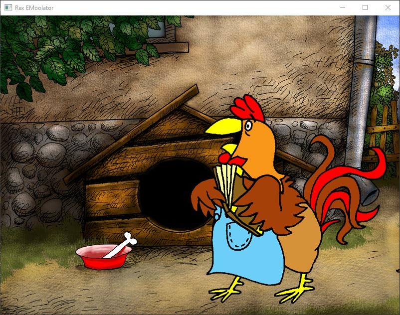

# Rex EMoolator
Prototyp emulatora silnika graficznego Piklib/BlooMoo autorstwa firmy Aidem Media oraz interpretera skryptów.

> [!WARNING]
> Na ten moment działa ładowanie plików graficznych oraz animacji, podczas gdy prace nad interpreterem oraz ładowaniem skryptów są w toku.

Aktualny status gier opartych na silniku Piklib/BlooMoo:
<table>
<thead>
<tr>
<th>Nazwa gry</th>
<th>Status</th>
<th>Uwagi</th>
</tr>
</thead>
<tbody>
<tr>
<td>Reksio i Skarb Piratów</td>
<td></td>
<td>Prawie działa cała sekwencja intra, z brakującymi kilkoma dźwiękami, crashuje się przy przejściu do wraku</td>
</tr>
<tr>
<td>Reksio i Ufo</td>
<td></td>
<td>Działa praktycznie całe intro z małym problemem z muzyką w tlem, która nie chce się odtwarzać w pętli, na podwórku gra staje.</td>
</tr>
<tr>
<td>Reksio i Czarodzieje</td>
<td></td>
<td>Wyświetla się plansza z tłem i napisem "Reksio i Czarodzieje", skrypty się ładują w większość poprawnie</td>
</tr>
<tr>
<td>Reksio i Wehikuł Czasu</td>
<td></td>
<td>Czarny ekran, są pewne problemy z przejściem dalej</td>
</tr>
<tr>
<td>Reksio i Kapitan Nemo</td>
<td></td>
<td>Czarny ekran, występują błędy z analizą skryptów</td>
</tr>
<tr>
<td>Reksio i Kretes w Akcji!</td>
<td></td>
<td>Czarny ekran, występują pewne problemy z ładowaniem skryptów</td>
</tr>
<tr>
<td>Poznaj Mity: Wyprawa po Złote Runo</td>
<td></td>
<td>Pojawia się plansza startowa, nie przechodzi dalej</td>
</tr>
<tr>
<td>Poznaj Mity: Wojna Trojańska</td>
<td></td>
<td>Pojawia się plansza startowa, nie przechodzi dalej</td>
</tr>
<tr>
<td>Poznaj Mity: Przygody Odyseusza</td>
<td></td>
<td>Pojawia się plansza startowa, nie przechodzi dalej</td>
</tr>
<tr>
<td>Poznaj Mity: Herkules</td>
<td></td>
<td>Pojawia się plansza startowa i wchodzi do menu</td>
</tr>
</tbody>
</table>

## Garść screenshotów

*Screen z próby uruchomienia Reksio i Skarb Piratów*

*Screen z próby uruchomienia Reksio i Ufo*

*Screen z próby uruchomienia Reksio i Czarodzieje*