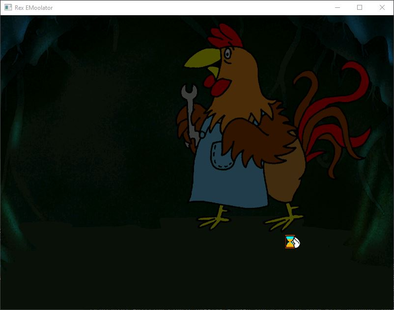
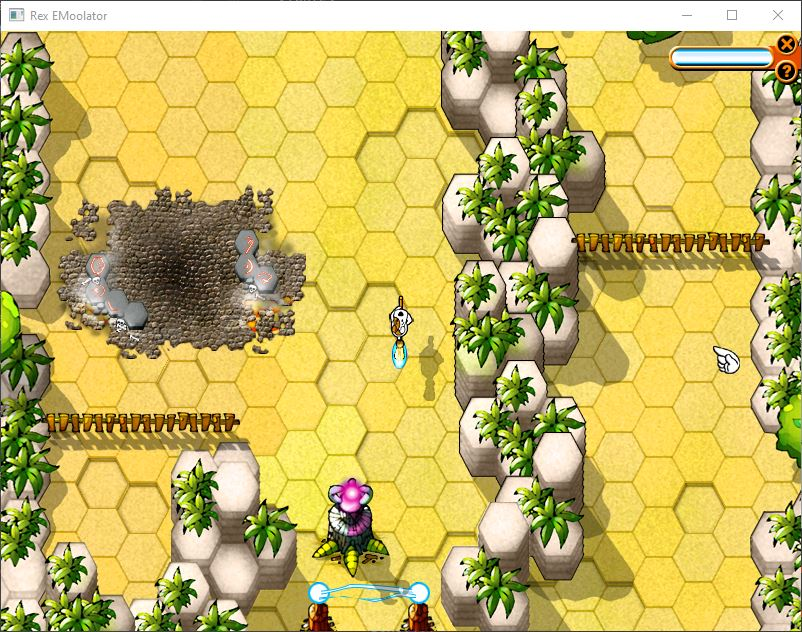

# Rex EMoolator
Emulator silnika graficznego Piklib/BlooMoo autorstwa firmy Aidem Media oraz interpretera skryptów.

> [!WARNING]
> Na ten moment trwają prace nad poprawą interpretera oraz naprawieniem scen ARCADE i CUTSCENKI. 

Dla tabeli niżej zastosowano następujący podział grywalności:
-  grę daje się ukończyć od początku do końca, bez błędów, które mogą ją zablokować.
-  gra działa, jednak przez różne błędy i niedoróbki nie jest możliwa do ukończenia.
-  gra ładuje się, jednak nie przechodzi poza intro.
-  gra nie inicjalizuje się poprawnie, ładuje się z błędem, wywołuje crash emulatora lub daje czarny obraz.

Szacowane poziomy grywalności są wyznaczane na podstawie ilości scen, które się odgrywają poprawnie zgodnie z przepływem narzuconym przez skrypty gry do pierwszego momentu, w którym błędy emulatora uniemożliwiają przejście dalej. Nie uwzględniam tutaj drobnych błędów, problemów z animacjami, a jedynie błędy, które powodują, że scena się nie kończy bądź nie zaczyna lub emulator się crashuje. Z racji, iż wymaga to przechodzenia tytułu przynajmniej od momentu, gdzie wszystko działało, a co któryś raz od początku informacja ta nie będzie aktualizowana na bieżąco.

Aktualne statusy gier opartych na silniku Piklib/BlooMoo:
<table>
<thead>
<tr>
<th>Nazwa gry</th>
<th>Status</th>
<th>Uwagi</th>
<th>Szacowany poziom grywalności</th>
</tr>
</thead>
<tbody>
<tr>
<td>Reksio i Skarb Piratów</td>
<td></td>
<td>Gra działa bez poważniejszych błędów do outra. Praktycznie jest już grywalna z drobnymi bugami. Sekwencja z rzeką jest dość trudna do przejścia (nie, żeby w oryginale było to proste). Cutscenka z piratami kończy się za wcześnie. Sekwencja z kokosami ma drobne różnice w detekcji kolizji w stosunku do oryginału (dodatkowo pojawia się w rogu kura lekko przesłaniająca przycisk menu, nie wiem czemu). Jak się wejdzie do królewny, to wszystkie elementy graficzne przez moment są niewidoczne. Etap ze zbieraniem pereł działa, jednak nie pojawia się pasek z tlenem. Podczas zagadek przy posągu Boga Twaroga sporadycznie grafiki odpowiedzi są zamienione miejscami (narrator jednak czyta poprawnie). W etapie z UFO sporadycznie są problemy z priorytetami animacji (winda przesłania Reksia). Przy włazie nie wyświetla się drzewo, na którym siedzą papugi. Jest problem z sekwencją, gdzie piraci płyną po Kapitana O'Gryzka, przestaje działać audio i nie jest w stanie przejść dalej.</td>
<td>ok. 61% (28/46 scen)</td>
</tr>
<tr>
<td>Reksio i Ufo</td>
<td></td>
<td>Występują problemy z menu. Gra działa w większości poprawnie do momentu, gdzie składamy wajhadłowiec. Buguje się menu przedmiotów, tj. kliknięte guziki nie znikają. Podczas kalibrowania kreta elementy na ekranach się ruszają, ale przestają, kiedy się na nie kliknie.</td>
<td></td>
</tr>
<tr>
<td>Reksio i Czarodzieje</td>
<td></td>
<td>Działa cała sekwencja intra z przerzucaniem kartek i streszczeniem poprzednich części. Na Androidzie ten segment się nieco przymula przez częstą zmianę plików audio i grafik. Działa również plansza z pagórkami, ale po trzeciej planszy nie ładują się drzwi, tj. jest czarny prostokąt i dodatkowo nie działa. Poprawnie działają zrzuty ekranu podczas zapisywania. Po którejś zmianie przestały się wyświetlać obrazy przy zapisach, jak i tło.</td>
<td><5%</td>
</tr>
<tr>
<td>Reksio i Wehikuł Czasu</td>
<td></td>
<td>Odpala się sekwencja z panoramą. Menu startowe również, jednak nie wyświetla się tło menu bocznego oraz zrzuty ekranu zapisów. Sekwencja z opowieścią babcia Kretesa działa poprawnie. Po intrze z racji braku obsługi WORLD wyświetla się jedynie Kornelek, a resztę spowija czarne tło.</td>
<td>0%</td>
</tr>
<tr>
<td>Reksio i Kapitan Nemo</td>
<td></td>
<td>Działa cutscenka z intro. Menu z szufladami również. Intro wprowadzające do gry działa, jednak jest jeszcze zabugowane. Czasami nie ładuje obrazków, czasem plików audio. Po intrze ładuje się pierwsza plansza w Paryżu, jednak bez Kretesa oraz nie działają zdarzenia myszy.</td>
<td>0%</td>
</tr>
<tr>
<td>Reksio i Kretes w Akcji!</td>
<td></td>
<td>Działa startowe intro i przechodzi poprawnie dalej. Po kliknięciu myszą przenosi nas do menu. Wszystkie guziki działają i przenoszą od odpowiadających im minigierek. Po włączeniu Reksio i Skarb Piratów z powodu braku kolizji Reksio spada. Część elementów nie jest rysowana. Przy Reksio i Ufo gra rysuje tylko tło. Przy Reksio i Czarodzieje renderuje trasę, jednak całość jest jakby dopalona sterydami i gdzieś pojawia się masywny wyciek pamięci. Kolizje nie działają. Przy Reksio i Wehikuł czasu po intrze wywala się na pulpit. Przy Super Heros i Kapitan Nemo ładuje się zbugowana cutscenka, ale już nie mapa. Wejście w edytor poziomów zapętla emulator.</td>
<td>0%</td>
</tr>
<tr>
<td>Poznaj Mity: Wyprawa po Złote Runo</td>
<td></td>
<td>Przechodzi do menu i przyciski działają. Minigierki na ten moment nie działają (bugują się, crashują grę itp.). Bajka prawie działa (są problemy pod Androidem).</td>
<td></td>
</tr>
<tr>
<td>Poznaj Mity: Wojna Trojańska</td>
<td></td>
<td>Przechodzi do menu i przyciski działają. Minigierki na ten moment nie działają (głównie się bugują), czasami guziki znikają.</td>
<td></td>
</tr>
<tr>
<td>Poznaj Mity: Przygody Odyseusza</td>
<td></td>
<td>Przechodzi do menu i przyciski działają. Statek Ozyrysa czasami znika. Odnoszę wrażenie, że bajka działa z błędami. Minigierki na ten moment nie działają lub wywalają grę.</td>
<td></td>
</tr>
<tr>
<td>Poznaj Mity: Herkules</td>
<td></td>
<td>Pojawia się plansza startowa i wchodzi do menu, przyciski działają i udaje się przejść do minigierek, ale nie da się jeszcze grać. Bajka się buguje (grafiki się podmieniają jedynie podczas ręcznego przechodzenia między rozdziałami).</td>
<td></td>
</tr>
</tbody>
</table>

## Garść screenshotów
### Reksio i Skarb Piratów

*Screen z próby uruchomienia Reksio i Skarb Piratów*

### Reksio i Ufo

*Screen z próby uruchomienia Reksio i Ufo*

### Reksio i Czarodzieje

*Screen z próby uruchomienia Reksio i Czarodzieje*

### Reksio i Wehikuł Czasu

*Screen z próby uruchomienia Reksio i Wehikuł Czasu*

### Reksio i Kapitan Nemo

*Menu gry Reksio i Kapitan Nemo*

*Intro po kliknięciu szuflady*

### Reksio i Kretes w Akcji

*Intro gry Reksio i Kretes w Akcji*

*Menu gry Reksio i Kretes w Akcji*

*Intro gry Reksio i Skarb Piratów*

*Gra Reksio i Skarb Piratów*

*Intro gry Reksio i Ufo*

*Gra Reksio i Ufo*

*Intro gry Reksio i Czarodzieje*

*Intro gry Reksio i Czarodzieje*

*Gra Reksio i Czarodzieje*

*Menu gry Reksio i Wehikuł Czasu*

*Gra Reksio i Wehikuł Czasu na moment przed wywaleniem się.*

*Intro gry Super Heros i Kapitan Nemo*

*Gra Super Heros i Kapitan Nemo*

### Poznaj Mity: Wyprawa po Złote Runo

*Screen z próby uruchomienia Wyprawy po Złote Runo*

### Poznaj Mity: Wojna Trojańska

*Screen z próby uruchomienia Wojny Trojańskiej*

### Poznaj Mity: Przygody Odyseusza

*Screen z próby uruchomienia Przygód Odyseusza*

### Poznaj Mity: Herkules

*Screen z próby uruchomienia Herkulesa*