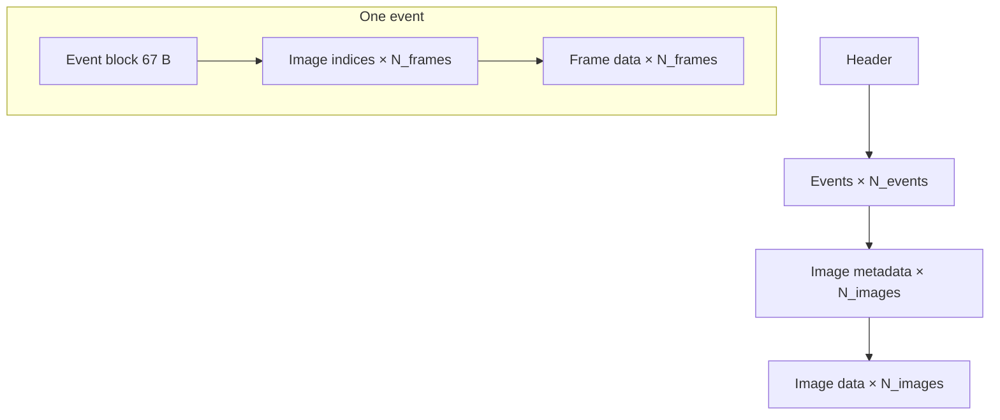

# ANN format — animations

The `.ANN` file holds an [animation](../internals/animation.md): a set of named **events**, each of which is a sequence of **frames** referencing a shared pool of **images**. All numbers are **little-endian**.

!!! tip "Tables reconciled with the code"
    The layout below matches the `AnimoLoader` parser in Rex-EMoolator. Fields that earlier notes described as "unknown" or "weird numbers" are decoded here — among them the loop control block and the event flags.

## File structure

## Header

The signature `NVP\0` (4 bytes), followed by a 44-byte block:

| Offset | Field | Type | Description |
|---:|---|---|---|
| 0 | magic | `char[4]` | `4E 56 50 00` (`NVP\0`) |
| 4 | image count | `uint16` | size of the shared image pool |
| 6 | colour depth | `uint16` | `15` (RGB555) or `16` (RGB565) |
| 8 | event count | `uint16` | how many event blocks follow |
| 10 | description | `char[13]` | `\0`-terminated text (garbage may follow) |
| 23 | FPS | `uint32` | default playback rate |
| 27 | — | 4 B | unused / offset |
| 31 | opacity | `uint8` | `0`–`255` |
| 32 | — | 12 B | unused |
| 44 | signature length | `uint32` | length of the "signature" field |

Immediately after the header:

| Field | Type | Description |
|---|---|---|
| signature | `char[signature length]` | e.g. the author's name |
| padding | 4 B | alignment |

## Event block

For each event — a 67-byte block:

| Offset | Field | Type | Description |
|---:|---|---|---|
| 0 | event name | `char[32]` | `\0`-terminated, read in upper case |
| 32 | frame count | `uint16` | the event's length |
| 34 | — | 4 B | unused |
| 38 | `loopStart` | `uint16` | the frame index the loop returns to |
| 40 | `loopEnd` | `uint16` | the last frame of the loop (`0` = no loop) |
| 42 | `repeatCount` | `uint16` | number of loop repeats (`0` = endless) |
| 44 | `repeatCounter` | `uint16` | the current repeat counter |
| 46 | — | 4 B | unused |
| 50 | `flags` | `uint32` | behaviour flags (see below) |
| 54 | opacity | `uint8` | `0`–`255` |
| 55 | — | 12 B | unused |

The block is followed by an **image-index table** (`uint16` × frame count) — each frame points to an image in the shared pool — and then the **frame data** (one block per frame).

### Event flags

The `flags` field controls behaviour at an event boundary (interpretation from the [animation system](../internals/animation.md#playback-state-machine)):

| Flag | Value | Meaning |
|---|---|---|
| `FLAG_PING_PONG` | `0x20000` | after the end, the sequence plays backward |
| `FLAG_WAIT_FOR_SFX` | `0x100000` | sync progress with the frame's sound |
| `FLAG_PLAY_NEXT_EVENT` | `0x800000` | after finishing, the next event starts |

## Frame data block

For each frame — a 34-byte block, followed by a variable-length name and (optionally) an SFX description:

| Offset | Field | Type | Description |
|---:|---|---|---|
| 0 | starting bytes | 4 B | purpose undetermined |
| 4 | — | 4 B | unused |
| 8 | offset X | `int16` | frame offset relative to the base position |
| 10 | offset Y | `int16` | frame offset relative to the base position |
| 12 | — | 4 B | unused |
| 16 | SFX seed | `uint32` | `> 0` → an SFX description is present (see below) |
| 20 | — | 4 B | unused |
| 24 | opacity | `uint8` | `0`–`255` |
| 25 | — | 5 B | unused |
| 30 | name length | `uint32` | length of the "frame name" field |

Then:

| Field | Condition | Description |
|---|---|---|
| frame name | always | `char[name length]`, `\0`-terminated |
| SFX description length | `SFX seed > 0` | `uint32` |
| SFX description | `SFX seed > 0` | a `;`-separated list of `.wav` files |

!!! note "Per-frame offset and SFX"
    The X/Y offsets let an animation "move" during playback without touching the base position — see [frame position on screen](../internals/animation.md#frame-position-on-screen). The SFX seed is tied to a random pick of the frame's sound effect.

## Image metadata

After all events — for each image in the pool, a 52-byte block:

| Offset | Field | Type | Description |
|---:|---|---|---|
| 0 | width | `uint16` | in pixels |
| 2 | height | `uint16` | in pixels |
| 4 | offset X | `int16` | image offset |
| 6 | offset Y | `int16` | image offset |
| 8 | compression type | `uint16` | see the compression table |
| 10 | image data size | `uint32` | length of the colour block |
| 14 | — | 14 B | unused |
| 28 | alpha data size | `uint32` | length of the transparency block |
| 32 | name | `char[20]` | `\0`-terminated |

## Image data

At the end of the file, for each image in turn: a colour data block (`image data size` bytes), followed by an alpha data block (`alpha data size` bytes). Both may be compressed.

### Compression types

| Value | Compression |
|---:|---|
| `0` | none |
| `2` | CLZW2 |
| `3` | CRLE, with the result additionally CLZW2 |
| `4` | CRLE |
| `5` | JPEG |

The CRLE and CLZW2 algorithms and pixel decoding RGB565/555 → RGBA are described in the [Compression](compression.md) chapter. Here only the **type** stored in the metadata matters.

## See also

- [Animation system](../internals/animation.md) — how the engine plays back this data.
- [`ANIMO`](../reference/ANIMO.md) — the scripting object based on `.ANN`.
- [IMG format](IMG.md) — the related single-image format.
- [Compression](compression.md) — CRLE, CLZW2, and pixel decoding.
