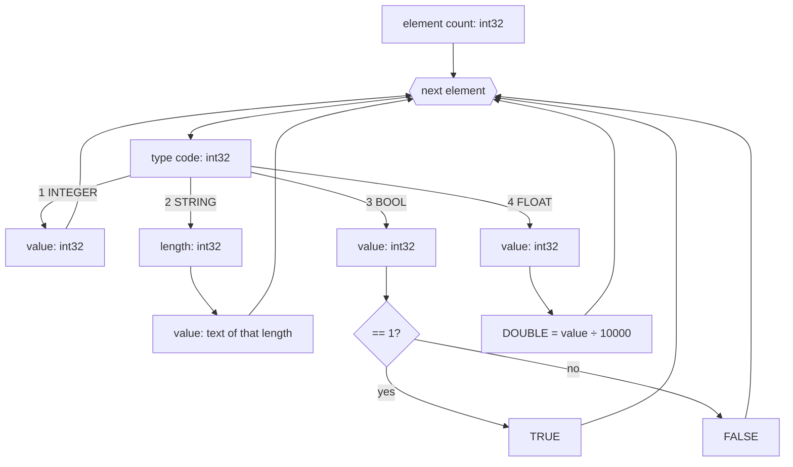

# ARR format — arrays

The `.ARR` file is a binary dump of an [`ARRAY`](../reference/ARRAY.md): an element count, followed by the elements, each preceded by its type code. Numbers are **little-endian**, signed integers.

## File structure

| Field | Type | Description |
|---|---|---|
| element count | `int32` | how many elements follow |
| elements | — | one block per element (min. 8 bytes) |

Each element starts with a **type code** (`int32`), followed by a value depending on the type:

| Code | Type | Value |
|---:|---|---|
| `1` | `INTEGER` | `int32` — read as-is |
| `2` | `STRING` | `int32` length, then that many bytes of text |
| `3` | `BOOL` | `int32` — `TRUE` when `== 1` |
| `4` | `FLOAT` | `int32` — the real value is the number ÷ `10000` (fixed-point, 4 decimals) |

## Decoding

!!! note "FLOAT is fixed-point"
    Type `4` is not IEEE 754 — it's an integer storing the value multiplied by `10000`. Hence the limit of **four** decimal places: `12345` on disk means `1.2345`.

## See also

- [`ARRAY`](../reference/ARRAY.md) — a one-dimensional array.
- [`MULTIARRAY`](../reference/MULTIARRAY.md) — a multi-dimensional array.
