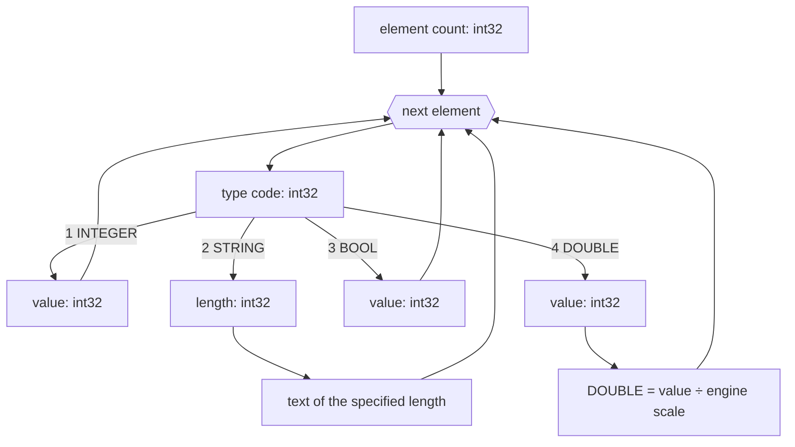

# ARR format — arrays

An `.ARR` file is a binary dump of an [`ARRAY`](../reference/ARRAY.md):
an element count followed by elements, each prefixed with its type
code. Integers are signed and little-endian.

## File structure

| Field | Type | Description |
|---|---|---|
| element count | `int32` | number of following elements |
| elements | — | one block per element |

Each element starts with a type code (`int32`):

| Code | Type | Value |
|---:|---|---|
| `1` | `INTEGER` | `int32` |
| `2` | `STRING` | `int32` length followed by exactly that many text bytes; no `NUL` terminator |
| `3` | `BOOL` | `int32`; `TRUE` when non-zero |
| `4` | `DOUBLE` | fixed-point `int32`, divided by the engine-specific scale |

## DOUBLE scale

The scale belongs to the engine variant, not to the file extension:

| Engine | Write | Read | Precision |
|---|---:|---:|---:|
| BlooMoo | `DOUBLE × 10000` | `int32 ÷ 10000` | 4 decimals |
| Piklib 8 | `DOUBLE × 1000` | `int32 ÷ 1000` | 3 decimals |

Type `4` is not IEEE 754. Raw `12345` means `1.2345` in BlooMoo, while
Piklib 8 reads the same bytes as `12.345`.

## Decoding

## See also

- [`ARRAY`](../reference/ARRAY.md)
- [`MULTIARRAY`](../reference/MULTIARRAY.md)
