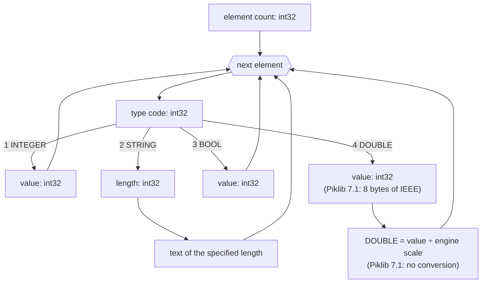

# ARR format — arrays

An `.ARR` file is a binary dump of an [`ARRAY`](../reference/ARRAY.md):
an element count followed by elements, each prefixed with its type
code. Integers are signed and little-endian.

## File structure

| Field | Type | Description |
|---|---|---|
| element count | `int32` | number of following elements |
| elements | — | one block per element |

Each element starts with a type code (`int32`):

| Code | Type | Value |
|---:|---|---|
| `1` | `INTEGER` | `int32` |
| `2` | `STRING` | `int32` length followed by exactly that many text bytes; no `NUL` terminator |
| `3` | `BOOL` | `int32`; `TRUE` when non-zero |
| `4` | `DOUBLE` | engine-dependent: a fixed-point `int32` or the raw 8 bytes |

## DOUBLE encoding

The encoding belongs to the engine variant, not to the file extension:

| Engine | Write | Read | Precision |
|---|---:|---:|---:|
| BlooMoo from "Reksio i Kapitan Nemo" on | `int32 = DOUBLE × 10000` | `int32 ÷ 10000` | 4 decimals |
| Piklib 7.2 and 8, the BlooMoo of "Reksio i Wehikuł Czasu" | `int32 = DOUBLE × 1000` | `int32 ÷ 1000` | 3 decimals |
| Piklib 7.1 | 8 bytes of IEEE 754 | 8 bytes of IEEE 754 | full |
| Piklib 6.1 | — | — | no binary array files |

In the fixed-point variants type `4` is not IEEE 754. Raw `12345` means `1.2345` in the
newer BlooMoo, while Piklib 8 reads the same bytes as `12.345`. "Reksio i Wehikuł Czasu"
already ships BlooMoo but still writes at the Piklib scale.

Piklib 7.1 writes a `DOUBLE` through the same routine as a 64-bit integer, so the element
takes 8 bytes instead of 4; the scale only appears in 7.2.

!!! warning "STRING in Piklib 7.1"
    The original Piklib 7.1 writes the text length incorrectly: only the lowest byte is
    valid, the other three are stray data, while reading takes all 4 bytes. An array with
    texts saved by 7.1 cannot be read back correctly even by the original. The emulator
    writes and reads a clean `int32` length.

## Decoding

```mermaid
flowchart TD
    A["element count: int32"] --> B{{next element}}
    B --> C["type code: int32"]
    C -->|1 INTEGER| D["value: int32"]
    C -->|2 STRING| E["length: int32"]
    E --> F["text of the specified length"]
    C -->|3 BOOL| G["value: int32"]
    C -->|4 DOUBLE| K["value: int32<br/>(Piklib 7.1: 8 bytes of IEEE)"]
    K --> L["DOUBLE = value ÷ engine scale<br/>(Piklib 7.1: no conversion)"]
    D & F & G & L --> B
```

## See also

- [`ARRAY`](../reference/ARRAY.md)
- [`MULTIARRAY`](../reference/MULTIARRAY.md)
