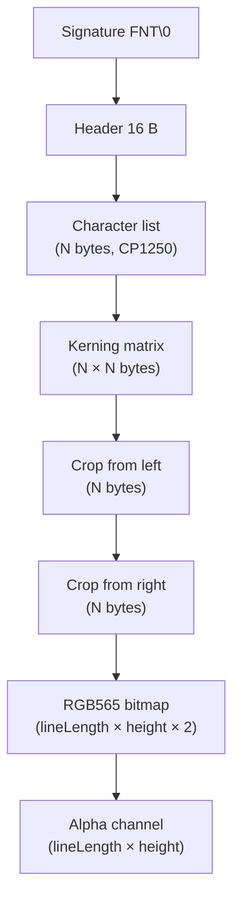
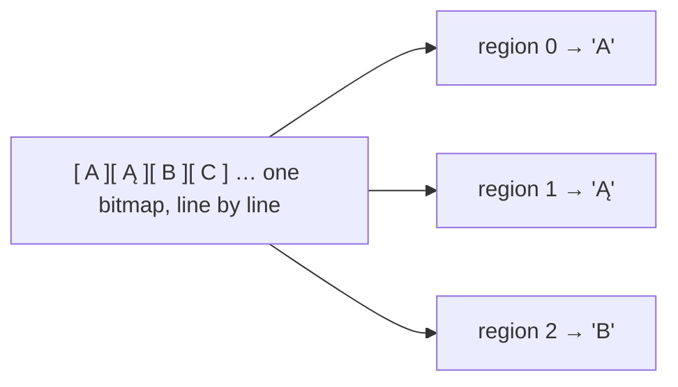

# FNT format — fonts

The `.FNT` file holds a **bitmap** font: a set of fixed-height characters, their metrics, and one shared bitmap with all the glyphs. It is the format of [`FONT`](../reference/FONT.md) objects used by [`TEXT`](../reference/TEXT.md). Numbers are **little-endian**. The layout matches the `FontLoader` parser.

!!! warning "Format not fully figured out"
    `.FNT` is still being analysed. The split into sections and how the parser reads them is certain, but some details remain open — among them the **exact semantics of the kerning matrix** (how the values translate into spacing), the interpretation of the `lineLength` field as a count of "cells", and the small **`+1` px gap** when cutting out glyphs. Treat those spots as provisional.

## File structure



## Header

The signature `FNT\0` (4 bytes), followed by a 16-byte block:

| Offset | Field | Type | Description |
|---:|---|---|---|
| 0 | magic | `char[4]` | `46 4E 54 00` (`FNT\0`) |
| 4 | `lineLength` | `uint32` | the length of one bitmap line in "cells" (total across all characters) |
| 8 | character height | `uint32` | in pixels |
| 12 | character width | `uint32` | in pixels |
| 16 | character count `N` | `uint32` | size of the set |

## Variable-length sections

The header is followed, in order, by (where `N` = character count):

| Section | Size | Description |
|---|---|---|
| character list | `N` B | character codes in **CP1250** encoding (one byte per character) |
| kerning matrix | `N × N` B | an "each with each" relation |
| crop from left | `N` B | how many pixels to cut from each character's left edge |
| crop from right | `N` B | how many pixels to cut from the right edge |
| bitmap | `lineLength × height × 2` B | RGB565 colour data |
| alpha channel | `lineLength × height` B | one transparency byte per pixel |

!!! tip "Refinement over the old notes"
    The crop parameters are read as **two separate blocks** (first all the left values, then all the right ones), not as interleaved `L,R,L,R` pairs. This is the behaviour of the `FontLoader` parser.

## Quirk: one long bitmap

Glyphs are not stored as separate images. All characters form **one long bitmap**, read line by line — within each line, fragments of all characters in sequence. The alpha data has an identical layout, but one byte per pixel (instead of two).

When building per-character textures, the engine cuts regions of `character width` out of this bitmap, with a small gap between characters:

```
region of character i = x: i × width + i × 2 + 1, width: character width
```



## See also

- [`FONT`](../reference/FONT.md) — the scripting object based on `.FNT`.
- [`TEXT`](../reference/TEXT.md) — displaying text with a font.
