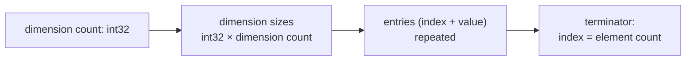
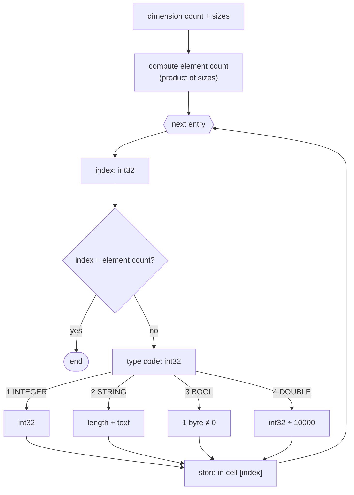

# MAR format — multi-dimensional arrays

The `.MAR` file is a binary dump of a multi-dimensional array ([`MULTIARRAY`](../reference/MULTIARRAY.md)). Unlike [`ARR`](ARR.md), it is **dimension-aware** and **sparse**: it stores a header with the dimension sizes, followed by only the cells that actually hold a value. All numbers are **little-endian**. The layout matches the `MultiArrayLoader` parser (the V2 variant — the one the emulator reads).

## File structure

## Header

| Field | Type | Description |
|---|---|---|
| dimension count | `int32` | how many dimensions the array has |
| dimension sizes | `int32 × dimension count` | the size of each dimension |

The total number of cells is the product of all dimension sizes (`element count`). It is needed to recognise the terminator.

## Entries

The header is followed by a sequence of entries. Each starts with an **index** (`int32`):

- if `index == element count` → this is the **terminator**, end of data,
- if `index` is outside the range `[0, element count)` → the file is corrupt and loading stops,
- otherwise the index is followed by a **value** (type + data).

The index is **flat** (one-dimensional) and maps multi-dimensional coordinates in row-major order.

!!! note "Sparse format"
    Only the cells that were assigned a value are stored. Cells absent from the file remain unset. This is the key difference from the dense [`ARR`](ARR.md), which stores every element in sequence.

## Data types

Each value starts with a **type code** (`int32`), followed by the data:

| Code | Type | Data |
|---:|---|---|
| `1` | `INTEGER` | `int32` |
| `2` | `STRING` | `int32` length, then that many bytes of text (UTF-8) |
| `3` | `BOOL` | `1 byte` — `TRUE` when `≠ 0` |
| `4` | `DOUBLE` | `int32` — the real value is the number ÷ `10000` (fixed-point) |

!!! warning "BOOL is 1 byte here"
    In `MAR` a boolean takes **one byte**, whereas in [`ARR`](ARR.md) it is an `int32` (4 bytes). The type codes are otherwise shared between the two formats.

## Decoding

## See also

- [`MULTIARRAY`](../reference/MULTIARRAY.md) — a multi-dimensional array with automatic growth.
- [ARR format](ARR.md) — the dense, one-dimensional counterpart for [`ARRAY`](../reference/ARRAY.md).
