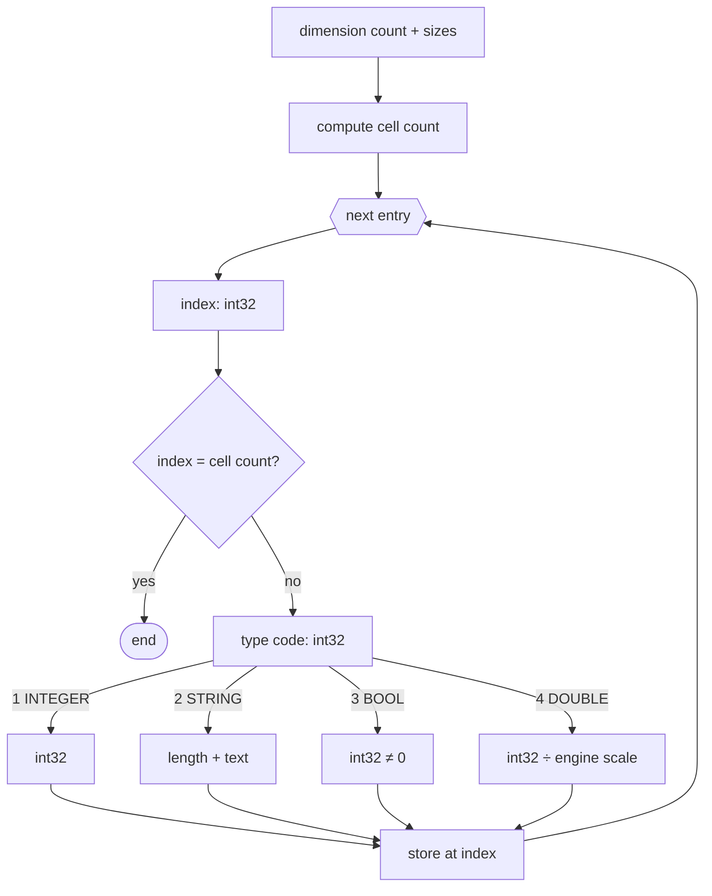

# MAR format — multi-dimensional arrays

A `.MAR` file is a binary dump of a
[`MULTIARRAY`](../reference/MULTIARRAY.md). It is dimension-aware and
sparse: it stores a header followed only by cells that hold a value.
All integers are little-endian.

## Header

| Field | Type | Description |
|---|---|---|
| dimension count | `int32` | number of array dimensions |
| dimension sizes | `int32 × dimension count` | size of each dimension |

The total cell count is the product of all dimension sizes.

## Entries

Each entry starts with a flat index (`int32`):

- an index equal to the cell count is the terminator,
- an out-of-range index indicates a corrupt file,
- a valid index is followed by a type code and value.

Only assigned cells are stored.

## Data types

Value encoding is shared with [`ARR`](ARR.md):

| Code | Type | Value |
|---:|---|---|
| `1` | `INTEGER` | `int32` |
| `2` | `STRING` | `int32` length followed by exactly that many text bytes; no `NUL` terminator |
| `3` | `BOOL` | `int32`; `TRUE` when non-zero |
| `4` | `DOUBLE` | fixed-point `int32`, divided by the engine-specific scale |

BlooMoo uses scale `10000`, while Piklib 8 uses `1000`. In the
original engines, `ARRAY` and `MULTIARRAY` delegate to the same
variable store and restore methods.

## Decoding

## See also

- [`MULTIARRAY`](../reference/MULTIARRAY.md)
- [ARR format](ARR.md)
