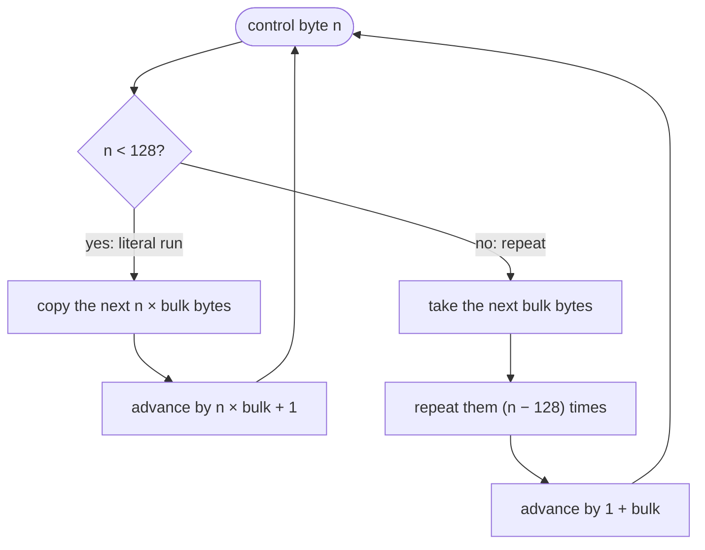
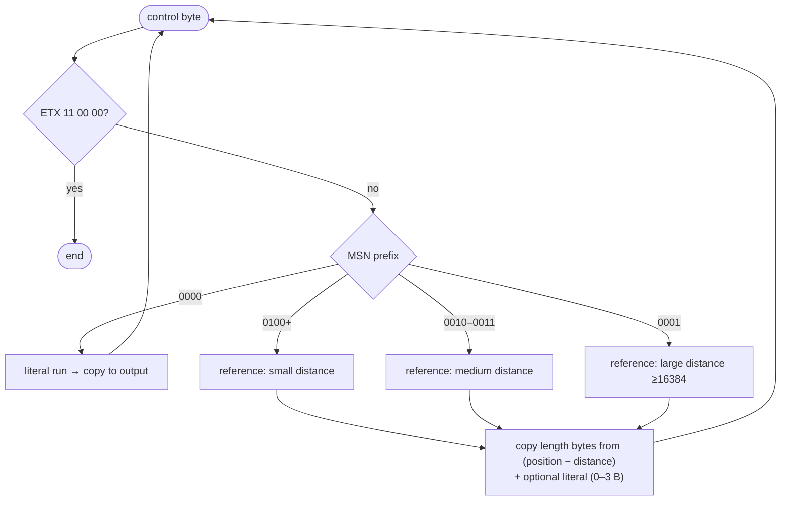

# Compression

The engine's graphics data (images [`IMG`](IMG.md), animation frames [`ANN`](ANN.md)) may be compressed with one of two algorithms: **CRLE** (an RLE variant) and **CLZW2** (the **LZO1X** encoding from the LZ77 family). They may also be combined. The compression type is stored in the file's metadata.

!!! note "Decompression only"
    Rex-EMoolator (like this description) deals only with **reading**. Compression on the engine side is not re-implemented — `CLZW2Compression.compress()` deliberately throws "Not implemented". The CLZW2 algorithm was reconstructed from reverse-engineering by Dove6.

## Type table

The compression-type values found in file headers:

| Value | Meaning | Decoding |
|---:|---|---|
| `0` | none | data read directly |
| `2` | CLZW2 | `CLZW2` |
| `3` | CRLE + CLZW2 | first `CLZW2`, then `CRLE` |
| `4` | CRLE (in `IMG` treated as `0`) | `CRLE` |
| `5` | JPEG | standard JPEG |

!!! tip "IMG quirk"
    In [`IMG`](IMG.md) files, type `4` is normalized to `0` (no compression), not to CRLE. In [`ANN`](ANN.md), `4` means CRLE.

## CRLE

CRLE is RLE with an extra parameter, **`bulk`** — the size of the group of bytes copied at once (`1` by default; `2` for 16-bit color pixels). The algorithm reads a control byte and, based on it, either copies or repeats data:



- **`n < 128`** — the next `n × bulk` bytes are literal data; copied unchanged.
- **`n ≥ 128`** — the next `bulk` bytes are a pattern repeated `n − 128` times.

!!! example "Example (bulk = 1)"
    `03 41 42 43` → the byte `0x03 < 128`, so 3 literal bytes are copied: `41 42 43`.
    `83 FF` → the byte `0x83 ≥ 128`, `0x83 − 0x80 = 3`, so the byte `FF` is repeated 3 times: `FF FF FF`.

## CLZW2

Despite its library name (`CLZWCompression2`), this is not a variant of LZW. Reverse-engineering the encoder in the DLL showed it to be specifically **LZO1X-1** — an LZ77-family algorithm, the same one used by the [LZO](https://www.oberhumer.com/opensource/lzo/) library by Markus F. X. J. Oberhumer. There is no dynamic dictionary; the stream consists of literal runs and **back-references** (distance + length) into already-decoded data. The symbol type is recognized by a prefix (the most significant bits of the control byte), which optimizes the encoding of different distance ranges.

### Header

The 8-byte header is a **container layer added by `CLZWCompression2`**, not part of LZO itself. All little-endian:

| Offset | Field | Type | Description |
|---|---|---|---|
| `+0x00` | `originalSize` | `uint32` LE | size of the data after decompression |
| `+0x04` | `compressedSize` | `uint32` LE | length of the raw LZO stream |
| `+0x08` | data | … | raw **LZO1X** stream |

The LZO stream itself ends with an **ETX** marker: bytes `11 00 00`.

### Symbols

The symbol type is recognized by the **most significant nibble** of the control byte. After the first literal run, three classes of back-reference are available, optimized for different distance ranges:

| Prefix (MSN) | Symbol | Distance range |
|---|---|---|
| `0000` | literal run (with length extension via zero bytes) | — |
| `0100`–`1111` | back-reference, **small** distance | up to ~2 KB |
| `0010`–`0011` | back-reference, **medium** distance | up to 16 KB |
| `0001` | back-reference, **large** distance | ≥ 16384 |

Each reference carries the **length** of the copied fragment, the **distance** back into the already-decoded buffer, and optionally a short literal run right after it (0–3 bytes). Very long runs and distances are encoded with an extension via runs of zero bytes. The first symbol in the stream (with a prefix ≠ `0000`) is treated specially as an initial long literal.



!!! abstract "Full bit-level specification"
    The exact bit layout (how length, distance, and the count of following literal bytes are extracted from the control byte) is complex — refer to the `CLZW2Compression.decompress` implementation and the [original decoder by Dove6](https://gist.github.com/Dove6/0d21e763919daa8b5049e20b6bdacfaa).

## Pixel decoding

After decompression the color data is still in **hi-color** format and must be expanded to RGBA8888. The color bits are expanded by replicating the most significant bits:

=== "RGB565 (16 bits)"

    ```
    r8 = (r5 << 3) | (r5 >> 2)   // (1)
    g8 = (g6 << 2) | (g6 >> 4)
    b8 = (b5 << 3) | (b5 >> 2)
    ```

    1. 5 bits R, 6 bits G, 5 bits B. Replicating the top bits gives the full 0–255 range without "gaps".

=== "RGB555 (15 bits)"

    ```
    r8 = (r5 << 3) | (r5 >> 2)
    g8 = (g5 << 3) | (g5 >> 2)
    b8 = (b5 << 3) | (b5 >> 2)
    ```

The **alpha** channel is stored separately (one byte per pixel) and merged into each pixel after the color is expanded. If the file has no alpha data, the pixels are fully opaque (`α = 255`).

## See also

- [Script encryption](encryption.md) — the cipher for text scripts (a separate mechanism).
- [ANN format](ANN.md) and [IMG format](IMG.md) — where these compressions are used.
- [Rendering](../internals/rendering.md) — what happens to the finished bitmap.
