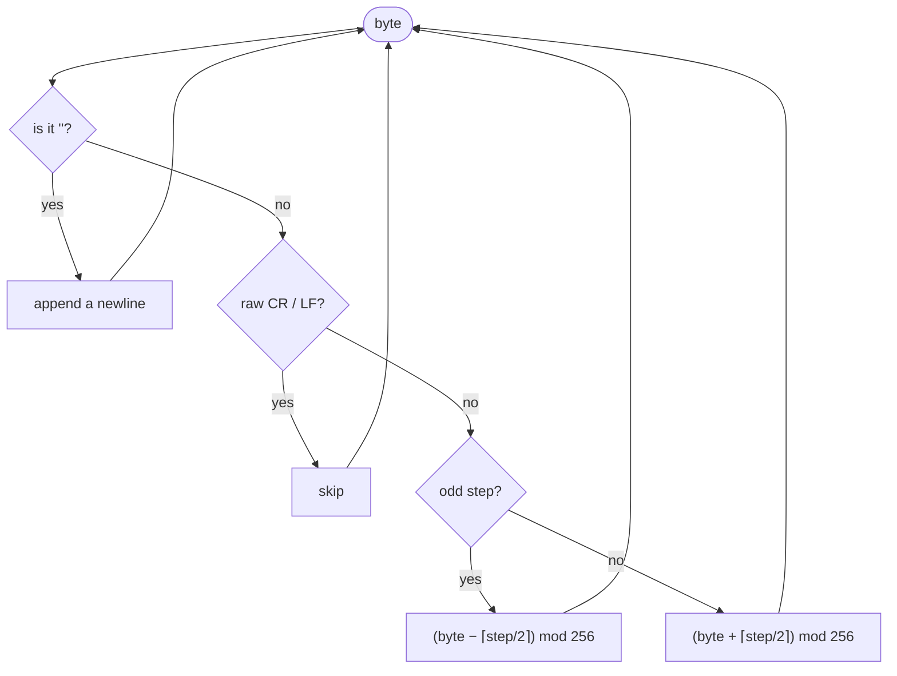

# Script encryption

The engine's scripts (`CNV`, `DEF`, `CLASS`, `SEQ`) sit in the game directory as text files, so they were protected with a simple **variable-shift transposition cipher**. This is a separate mechanism from the [compression](compression.md) of graphics data — it concerns only the script text.

## Detection

An encrypted file starts with a header on its first line:

```
{<C:6>}
```

The parser ([`CNVParser`](../engine/scripts.md)) takes it apart, stripping `{<` and `>}` and splitting the rest on the colon:

| Field | Meaning |
|---|---|
| direction | the letter `C` or `D` |
| offset | a number (e.g. `6`) |

Direction `D` **negates** the offset (`offset = -offset`). Files without this header are read directly, as plain text.

!!! note "In practice"
    Game scripts were encrypted with the parameters `{<C:6>}` — that is, offset `6`.

## Algorithm

Decryption works **byte by byte** — the cipher operates in byte space, not on characters:

- raw `\r`/`\n` in the file are **skipped** (they are formatting, not ciphertext),
- the `<E>` marker means a newline (`\n`),
- every other byte advances a step counter and is shifted: **odd steps subtract**, **even steps add** a shift of `⌈step / 2⌉`, with the step counter wrapping at `offset`,
- the result is taken **modulo 256** (byte wrap),
- direction `D` flips the sign of the shift,
- the decrypted bytes are interpreted as **windows-1250**.



For the most common `{<C:6>}` the effective shift sequence repeats every six bytes:

```
−1, +1, −2, +2, −3, +3,  −1, +1, −2, +2, −3, +3, …
```

!!! tip "Why modulo 256"
    The key to correctness is byte-space arithmetic: the ciphertext is read as **raw bytes** and every result is wrapped **modulo 256**. This makes the decoder platform-independent. An earlier implementation ran the math on charset-decoded characters (where arithmetic does not wrap at 256), which produced platform-specific artifacts — different bad values on Windows and Linux — "fixed" by hand with magic-number remaps. Working on bytes makes those workarounds unnecessary.

## See also

- [Scripts](../engine/scripts.md) — the syntax and loading of decrypted scripts.
- [Compression](compression.md) — an independent mechanism for graphics data.
