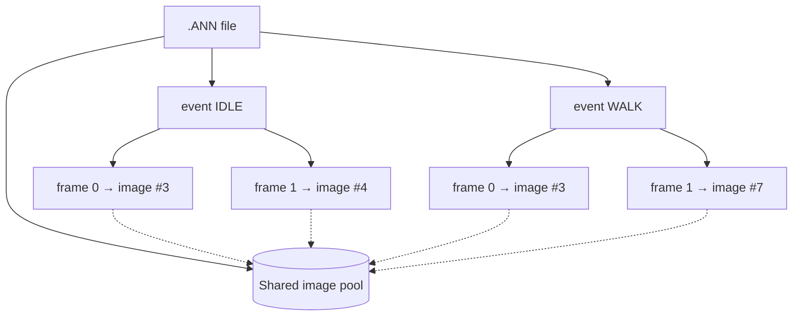
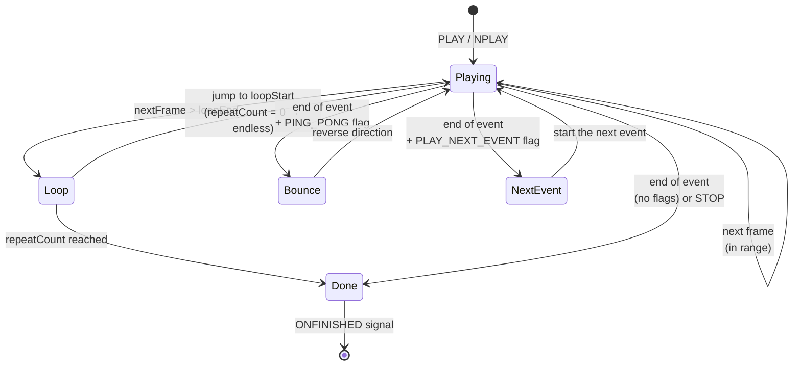

# Animation system

An animation ([`ANIMO`](../reference/ANIMO.md)) is the engine's most elaborate graphical object. It is loaded from an [`.ANN`](../formats/ANN.md) file and played back on the [engine clock](loop.md#engine-clock), frame by frame. This chapter describes the animation data model, its playback clock, the state machine, and how an animation reaches the screen.

## Data model: events and frames

An animation consists of **events**, and each event is a sequence of **frames**. An "event" is in practice a named sequence — e.g. `IDLE`, `WALK`, `SPI` — that a script plays back by name.



!!! note "Frames share images"
    Frames don't store their own bitmaps — each points to an **index** in one shared image pool for the file. The same image can be used in multiple events and multiple times within one event. Hence two kinds of numbering:

    - **global index** — the image's position in the whole-file pool (returned by [`GETFRAME`](../reference/ANIMO.md#getframe)),
    - **in-event index** — the frame's position within the current event, counted from `0` (returned by [`GETCFRAMEINEVENT`](../reference/ANIMO.md#getcframeinevent)).

The binary layout of these structures is described in [the `.ANN` file format](../formats/ANN.md).

## Playback clock

The animation's pace is set by the **FPS** field (default `15`, changed via [`SETFPS`](../reference/ANIMO.md#setfps)). The duration of one frame is:

```java
framePeriodMs = 1000 / fps   // (1)
```

1. **Integer** division — at 15 FPS a frame lasts `66 ms` (not `66.67`), at 30 FPS `33 ms`, at 60 FPS `16 ms`. The small rounding errors accumulate the same way as in the original engine.

On each update step the engine checks whether at least `framePeriodMs` has elapsed since the last frame change:

- if **yes** — it advances by **exactly one** frame and records the current [engine time](loop.md#engine-clock) (no remainder carry-over),
- if **no** — it does nothing.

!!! tip "Behaviour matching the original (`CAnimationManager::domodal`)"
    The classes `CAnimationManager` and `CAnimo`/`CAnimo6` and their `domodal` methods exist in `bloomoodll.dll` (confirmed by decompilation) — the description below mirrors their behaviour. [`PLAY`](../reference/ANIMO.md#play) **does not reset the animation clock**. So a "cold start" (first playback) ticks immediately, while a `PLAY` issued right after the previous one waits out the current frame window. At most one frame advances per update step — the animation never "skips" several frames at once, even if the render frame took a long time.

## Playback state machine

After computing the next frame, the engine decides whether to loop, bounce, move to the next event, or finish:



Behaviour at an event boundary is driven by **flags** stored in the `.ANN` file (the event's `flags` field):

| Flag | Value | Meaning |
|---|---|---|
| `FLAG_PING_PONG` | `0x20000` | after reaching the end, the sequence plays backward ("there and back") |
| `FLAG_PLAY_NEXT_EVENT` | `0x800000` | after finishing, the next event in the file starts automatically |
| `FLAG_WAIT_FOR_SFX` | `0x100000` | synchronisation with the sound attached to frames |

Looping is in turn controlled by the `loopStart`, `loopEnd`, and `repeatCount` fields:

- the loop activates when the next frame would **exceed** `loopEnd` (going forward) — then it jumps to `loopStart`,
- `repeatCount = 0` means an **endless loop**; a positive value bounds the number of repeats, after which the event finishes.

## Frame position on screen

The renderer draws the current frame in a rectangle computed from **three** components:

```
position = base position (SETPOSITION)
         + frame offset   (per-frame, from .ANN)
         + image offset   (per-image, from .ANN)
```

- **Base position** — set from scripts ([`SETPOSITION`](../reference/ANIMO.md#setposition), [`MOVE`](../reference/ANIMO.md#move)).
- **Frame offset** — an offset stored with a specific frame of an event; lets the animation "walk" across the screen without moving the base position.
- **Image offset** — an offset stored with the image itself in the pool.

!!! warning "The anchor subtracts, it doesn't add"
    [`SETANCHOR`](../reference/ANIMO.md#setanchor) **subtracts** the anchor coordinates from the `SETPOSITION` arguments (rather than adding them, as you might expect). This is established behaviour of the original engine — most likely an original sign mistake, which the offsets in `.ANN` files and the game scripts were adjusted to. More in [Coordinates and anchors](coordinates.md#anchors).

The computed position is passed to the renderer, which additionally performs the [Y-axis flip](rendering.md#coordinate-system-and-y-axis-flip).

## Sound attached to frames

A frame can have a list of sound files attached (the SFX field in `.ANN`). If a frame has a non-zero "seed", the engine picks an effect from the list to play when the frame is shown — hence, for example, randomly-sounding character footsteps. The `FLAG_WAIT_FOR_SFX` flag lets animation progress be synchronised with sound playback.

## Lifecycle and signals

During playback an animation emits signals a script can attach handlers to:

| Signal | When |
|---|---|
| [`ONSTARTED`](../reference/ANIMO.md#onstarted) | after an event's playback starts |
| [`ONFIRSTFRAME`](../reference/ANIMO.md#onfirstframe) | after the event's first frame is shown |
| [`ONFRAMECHANGED`](../reference/ANIMO.md#onframechanged) | on every frame change |
| [`ONFINISHED`](../reference/ANIMO.md#onfinished) | after an event finishes (parameterised by its name) |
| [`ONDONE`](../reference/ANIMO.md#ondone) | after all of the animation's events are exhausted |

`ONFINISHED` is [parameterised by the event name](../engine/events.md#parameterised-signals), so you can attach a handler for a specific sequence:

```
ANIMATION:ONFINISHED^IDLE=BEHAFTERIDLE
```

## Animation as an interactive element

An animation can also act as a button and take part in collision detection:

- [`SETASBUTTON`](../reference/ANIMO.md#setasbutton) turns it into a clickable element (`ONCLICK`, `ONFOCUSON`, `ONFOCUSOFF`, `ONRELEASE`),
- [`MONITORCOLLISION`](../reference/ANIMO.md#monitorcollision-1) includes it in collision checks against other objects (`ONCOLLISION`, `ONCOLLISIONFINISHED`), optionally accounting for the alpha channel.

Collisions are computed in the [loop's](loop.md#fixed-timestep) update step, after animation frames have been recomputed.

## Related topics

- [`ANIMO`](../reference/ANIMO.md) — full reference of fields, methods, and signals.
- [`.ANN` format](../formats/ANN.md) — the binary layout of events, frames, and images.
- [Rendering](rendering.md) — how the frame bitmap reaches the canvas.
- [Game loop and engine clock](loop.md) — the time source for animations.
