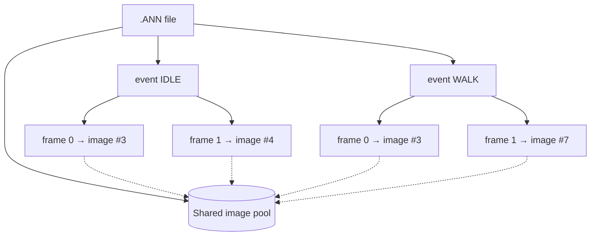
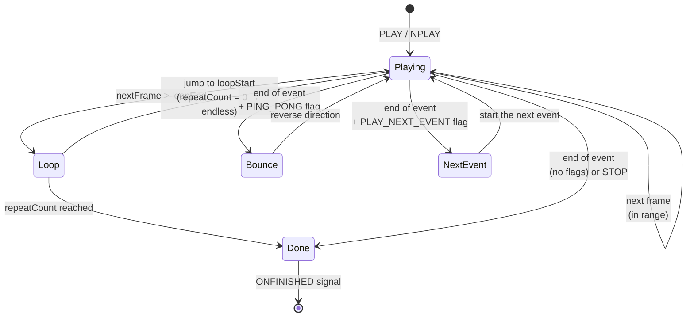

# Animation system

An animation ([`ANIMO`](../reference/ANIMO.md)) is the engine's most elaborate graphical object. It is loaded from an [`.ANN`](../formats/ANN.md) file and played back on the [engine clock](loop.md#engine-clock), frame by frame. This chapter describes the animation data model, its playback clock, the state machine, and how an animation reaches the screen.

## Data model: events and frames

An animation consists of **events**, and each event is a sequence of **frames**. An "event" is in practice a named sequence — e.g. `IDLE`, `WALK`, `SPI` — that a script plays back by name.



!!! note "Frames share images"
    Frames don't store their own bitmaps — each points to an **index** in one shared image pool for the file. The same image can be used in multiple events and multiple times within one event. Hence two kinds of numbering:

    - **global index** — the image's position in the whole-file pool (returned by [`GETFRAME`](../reference/ANIMO.md#getframe)),
    - **in-event index** — the frame's position within the current event, counted from `0` (returned by [`GETCFRAMEINEVENT`](../reference/ANIMO.md#getcframeinevent)).

The binary layout of these structures is described in [the `.ANN` file format](../formats/ANN.md).

## Playback clock

The animation's pace is set by the **FPS** field (default `15`, changed via [`SETFPS`](../reference/ANIMO.md#setfps)). The duration of one frame is:

```java
framePeriodMs = 1000 / fps   // (1)
```

1. **Integer** division — at 15 FPS a frame lasts `66 ms` (not `66.67`), at 30 FPS `33 ms`, at 60 FPS `16 ms`. The small rounding errors accumulate the same way as in the original engine.

On each update step the engine checks whether at least `framePeriodMs` has elapsed since the last frame change:

- if **yes** — it advances by **exactly one** frame and records the current [engine time](loop.md#engine-clock) (no remainder carry-over),
- if **no** — it does nothing.

!!! tip "Behaviour matching the original (`CAnimationManager::domodal`)"
    The classes `CAnimationManager` and `CAnimo`/`CAnimo6` and their `domodal` methods exist in `bloomoodll.dll` (confirmed by decompilation) — the description below mirrors their behaviour. [`PLAY`](../reference/ANIMO.md#play) **does not reset the animation clock**. So a "cold start" (first playback) ticks immediately, while a `PLAY` issued right after the previous one waits out the current frame window. At most one frame advances per update step — the animation never "skips" several frames at once, even if the render frame took a long time.

## Playback state machine

After computing the next frame, the engine decides whether to loop, bounce, move to the next event, or finish:



Behaviour at an event boundary is driven by **flags** stored in the `.ANN` file (the event's `flags` field):

| Flag | Value | Meaning |
|---|---|---|
| `FLAG_PING_PONG` | `0x20000` | after reaching the end, the sequence plays backward ("there and back") |
| `FLAG_PLAY_NEXT_EVENT` | `0x800000` | after finishing, the next event in the file starts automatically |
| `FLAG_WAIT_FOR_SFX` | `0x100000` | synchronisation with the sound attached to frames |

Looping is in turn controlled by the `loopStart`, `loopEnd`, and `repeatCount` fields:

- the loop activates when the next frame would **exceed** `loopEnd` (going forward) — then it jumps to `loopStart`,
- `repeatCount = 0` means an **endless loop**; a positive value bounds the number of repeats, after which the event finishes.

## Frame position on screen

The renderer draws the current frame in a rectangle computed from **three** components:

```
position = base position (SETPOSITION)
         + frame offset   (per-frame, from .ANN)
         + image offset   (per-image, from .ANN)
```

- **Base position** — set from scripts ([`SETPOSITION`](../reference/ANIMO.md#setposition), [`MOVE`](../reference/ANIMO.md#move)).
- **Frame offset** — an offset stored with a specific frame of an event; lets the animation "walk" across the screen without moving the base position.
- **Image offset** — an offset stored with the image itself in the pool.

<figure markdown="span">
  <svg viewBox="0 0 470 250" role="img" aria-label="Composing a frame's position: base position, plus frame offset, plus image offset" xmlns="http://www.w3.org/2000/svg" style="max-width:560px;width:100%;height:auto">
    <defs>
      <marker id="ah-fo" markerWidth="7" markerHeight="7" refX="5.5" refY="3" orient="auto"><path d="M0,0 L6,3 L0,6 Z" fill="#5c6bc0"/></marker>
      <marker id="ah-io" markerWidth="7" markerHeight="7" refX="5.5" refY="3" orient="auto"><path d="M0,0 L6,3 L0,6 Z" fill="#26a69a"/></marker>
      <path id="kretes-ghost" d="M 0.74507214,40.688014 C 1.1289475,39.741905 2.818539,40.04673 6.6035738,39.549394 11.264745,38.936938 14.476931,36.13692 14.506204,34.984042 c 3.572923,-7.942741 6.045754,-14.303637 7.6888,-17.351059 0,0 2.700106,-6.70481 7.520766,-10.5380545 2.463876,-1.9591999 4.935091,-3.8143736 12.034417,-3.993779 7.099326,-0.1794053 10.994985,4.0238056 10.994985,4.0238056 3.519893,3.3661149 1.602621,0.9562311 6.048523,6.0997819 0,0 6.143,5.789653 6.198655,9.574001 3.444597,-0.891304 5.717261,-0.605289 8.598799,-0.350016 3.241701,0.52546 13.420062,3.364453 20.185833,6.948126 6.865818,3.636666 7.894588,7.893835 7.894588,7.893835 0,0 0.76888,4.280099 -0.35881,7.893836 -1.12769,3.613736 -7.996351,18.760672 -16.069592,20.887908 0.783452,13.755538 0.584732,36.518103 -26.565404,49.949753 -1.053476,0.60079 -3.110607,0.43752 -4.192374,-0.78132 0,0 -2.191685,1.36898 -4.100694,1.22141 -1.705753,-0.13185 -2.04777,-1.19396 -2.04777,-1.19396 0,0 -2.699048,1.07433 -3.588107,0.0124 -0.922656,-1.10206 0.153776,-2.63983 0.153776,-2.63983 0,0 3.972547,-6.20229 3.126779,-8.94463 -0.864779,-2.80398 -2.819227,-5.023349 -9.892923,-4.61328 -7.073697,0.41007 -11.486037,4.94641 -13.50666,6.30481 -1.037215,0.69729 -2.05107,1.65875 -4.049435,1.23021 -1.383958,-0.29678 -1.281466,-1.87094 -1.281466,-1.87094 0,0 -2.472721,1.88161 -4.895203,1.11487 -0.835933,-0.26457 -1.601835,-1.62746 -1.601835,-1.62746 0,0 -4.1328057,1.31933 -3.4215154,-1.20457 0.7945094,-2.81919 8.0476114,-9.35467 8.0476114,-9.35467 0,0 -3.554688,-3.51137 -5.871576,-8.260247 C 9.7674577,81.748272 8.7690434,76.669123 9.482854,73.146123 8.0476118,72.787311 4.664539,68.891652 4.1519523,63.099423 4.5589027,57.550099 8.3530081,52.186801 9.8481952,50.330599 7.1662777,48.978329 4.8154204,47.010356 3.2842709,45.770502 1.2806093,43.936445 -0.02526998,42.586621 0.74507214,40.688014 Z"/>
      <g id="kretes">
        <path style="fill:#b5b6b5;stroke:#000;stroke-width:1" d="M 0.74507214,40.688014 C 1.1289475,39.741905 2.818539,40.04673 6.6035738,39.549394 11.264745,38.936938 14.476931,36.13692 14.506204,34.984042 c 3.572923,-7.942741 6.045754,-14.303637 7.6888,-17.351059 0,0 2.700106,-6.70481 7.520766,-10.5380545 2.463876,-1.9591999 4.935091,-3.8143736 12.034417,-3.993779 7.099326,-0.1794053 10.994985,4.0238056 10.994985,4.0238056 3.519893,3.3661149 1.602621,0.9562311 6.048523,6.0997819 0,0 6.143,5.789653 6.198655,9.574001 3.444597,-0.891304 5.717261,-0.605289 8.598799,-0.350016 3.241701,0.52546 13.420062,3.364453 20.185833,6.948126 6.865818,3.636666 7.894588,7.893835 7.894588,7.893835 0,0 0.76888,4.280099 -0.35881,7.893836 -1.12769,3.613736 -7.996351,18.760672 -16.069592,20.887908 0.783452,13.755538 0.584732,36.518103 -26.565404,49.949753 -1.053476,0.60079 -3.110607,0.43752 -4.192374,-0.78132 0,0 -2.191685,1.36898 -4.100694,1.22141 -1.705753,-0.13185 -2.04777,-1.19396 -2.04777,-1.19396 0,0 -2.699048,1.07433 -3.588107,0.0124 -0.922656,-1.10206 0.153776,-2.63983 0.153776,-2.63983 0,0 3.972547,-6.20229 3.126779,-8.94463 -0.864779,-2.80398 -2.819227,-5.023349 -9.892923,-4.61328 -7.073697,0.41007 -11.486037,4.94641 -13.50666,6.30481 -1.037215,0.69729 -2.05107,1.65875 -4.049435,1.23021 -1.383958,-0.29678 -1.281466,-1.87094 -1.281466,-1.87094 0,0 -2.472721,1.88161 -4.895203,1.11487 -0.835933,-0.26457 -1.601835,-1.62746 -1.601835,-1.62746 0,0 -4.1328057,1.31933 -3.4215154,-1.20457 0.7945094,-2.81919 8.0476114,-9.35467 8.0476114,-9.35467 0,0 -3.554688,-3.51137 -5.871576,-8.260247 C 9.7674577,81.748272 8.7690434,76.669123 9.482854,73.146123 8.0476118,72.787311 4.664539,68.891652 4.1519523,63.099423 4.5589027,57.550099 8.3530081,52.186801 9.8481952,50.330599 7.1662777,48.978329 4.8154204,47.010356 3.2842709,45.770502 1.2806093,43.936445 -0.02526998,42.586621 0.74507214,40.688014 Z"/>
        <path style="fill:none;stroke:#000;stroke-linecap:round" d="m 17.7355,99.031751 c -0.615104,0.999549 -2.793597,4.023799 -5.305272,5.305269"/>
        <path style="fill:none;stroke:#000;stroke-linecap:round" d="m 23.245807,100.59514 c -1.127691,1.48651 -3.152408,3.66499 -4.100694,4.30573"/>
        <path style="fill:none;stroke:#000;stroke-linecap:round" d="m 53.257758,107.43817 c -0.38444,1.20458 -3.690624,7.02244 -5.074608,7.84258"/>
        <path style="fill:none;stroke:#000;stroke-linecap:round" d="m 59.126876,109.41163 c -0.538216,1.35835 -3.87003,5.3309 -4.972091,6.0229"/>
        <path style="fill:none;stroke:#000;stroke-linecap:round" d="m 71.3671,54.295539 c 1.413569,0.108736 8.173612,0.275456 10.837361,-0.144986 3.172367,-0.500722 5.654275,-1.957249 6.487918,-2.899629"/>
        <path style="fill:none;stroke:#000" d="m 85.240009,66.102463 c -0.0091,-1.902881 -1.567611,-10.97328 -2.727462,-12.169377"/>
        <path style="fill:#8b8b8b;stroke:#000;stroke-linecap:round" d="m 62.407431,24.860455 c 0.102517,-0.845768 1.076432,-1.742794 2.511675,-2.050347"/>
        <path style="fill:none;stroke:#000;stroke-linecap:round" d="m 9.6366299,50.207867 c 3.9469171,1.640277 7.7119131,2.358329 10.8412091,2.332269 4.393718,-0.03659 10.431139,-2.332268 12.045787,-3.229295 1.172741,-0.651523 8.057018,-6.044488 9.147097,-7.796516 1.280874,-2.058683 2.001664,-4.915635 2.052923,-7.119757"/>
        <ellipse style="fill:#000;stroke:#000" cx="21.96434" cy="41.058193" rx="1.1020614" ry="1.0251734"/>
        <ellipse style="fill:#000;stroke:#000" cx="28.294786" cy="41.750187" rx="0.97391474" ry="0.9208346"/>
        <ellipse style="fill:#000;stroke:#000" cx="24.860455" cy="45.389553" rx="0.82013869" ry="0.74325073"/>
        <ellipse style="fill:#000;stroke:#000" cx="20.990425" cy="45.927769" rx="0.89960259" ry="0.80770129"/>
        <path style="fill:none;stroke:#000;stroke-linecap:round" d="m 32.344221,55.026182 c 0.435699,0.717622 0.45862,1.367079 1.768424,1.94783 1.206958,0.535149 2.101605,0.35881 2.716709,0.307552"/>
        <path style="fill:#000;stroke:#000;stroke-linecap:round" d="m 3.1780375,45.671475 c 0.8585827,-0.730436 2.2681963,-4.767056 2.1913082,-5.95882 -2.0887908,0.243479 -3.7961632,0.127816 -4.36980163,0.666362 -1.53450986,1.440636 0.44851333,3.87003 2.17849343,5.292458 z"/>
        <path style="fill:#000;stroke:#000;stroke-linecap:round;stroke-linejoin:round" d="m 32.675186,49.329925 c 0.289963,0.779275 1.232342,2.645911 1.993494,3.062733 0.761152,0.416822 3.464445,0.189317 4.349442,-0.144981 1.30224,-0.491906 3.649808,-2.316142 4.440057,-4.838755 0.506046,-1.615388 1.132191,-7.15974 1.413568,-8.19145 0.380579,-1.395446 1.576673,-3.425186 1.902882,-4.077602 0,0 -0.761153,0.199349 -1.449815,0.108736 -0.910881,-0.119853 -0.924256,-0.380577 -1.576673,-0.815521 -0.174865,1.419087 -0.642602,5.088338 -2.011617,6.977231 -1.431691,1.975372 -5.076869,4.783693 -6.342936,5.835502 -1.177974,0.978625 -2.718402,2.084107 -2.718402,2.084107 z"/>
        <path style="fill:#f5683f;stroke:none" d="m 34.649269,51.611184 c -0.977895,-0.98278 0.143317,-1.630479 0.768282,-1.962556 0.466793,-0.248033 1.104573,-0.409316 1.715813,-0.209966 0.408452,0.133213 1.193707,0.172772 1.367619,-0.103805 0.283744,-0.451246 0.420693,-1.132454 0.770324,-1.558551 0.385884,-0.470278 1.349399,-1.467732 2.161529,-1.61474 0.559227,-0.101228 1.073116,-0.146112 1.481662,0.05126 0.526536,0.254373 -0.08573,1.257633 -0.308085,1.830391 -0.125805,0.324065 -0.541062,1.169854 -1.729694,2.270265 -1.034258,0.957494 -1.2858,1.495765 -3.330552,1.670773 -1.987546,0.170111 -2.493203,0.03264 -2.896898,-0.373071 z"/>
        <path style="fill:none;stroke:#000;stroke-linecap:round" d="M 9.5053439,73.115939 C 10.550995,65.78284 14.000439,57.019443 19.354706,52.596405"/>
        <path style="fill:none;stroke:#000;stroke-linecap:round" d="m 26.141922,3.5624776 c 1.794054,0.4100694 6.279187,2.8448562 7.432507,4.0494349"/>
        <path style="fill:none;stroke:#000;stroke-linecap:round" d="m 30.370762,1.5377601 c 1.53776,0.38444 5.459048,2.4860455 6.227928,3.2549256"/>
        <path style="fill:none;stroke:#000;stroke-linecap:round" d="M 38.495261,0.30755202 C 39.904874,1.3583548 41.109453,2.6910802 41.468264,3.4599602"/>
        <path style="fill:#004574;stroke:#000;stroke-linecap:round" d="M 12.90437,33.843537 C 3.4964357,31.789527 7.8844285,19.446345 11.379425,17.581723 c 4.185696,-2.233118 9.175302,0.768881 12.148305,-0.05126 2.973002,-0.820139 9.937963,-6.982549 13.269776,-7.6489121 3.331814,-0.6663628 7.773729,1.1577171 8.798903,2.3879251 1.025173,1.230208 5.394333,5.485541 1.536693,13.001046 -3.631639,7.075206 -13.21701,7.410208 -15.627676,6.687435 -3.356037,-1.006216 -4.107667,-1.664085 -8.362137,-1.407791 -4.07404,0.245424 -5.726739,4.278501 -10.238919,3.293369 z"/>
        <path style="fill:#101c42;stroke:#000;stroke-linecap:round" d="m 46.321561,12.975836 c 0.761153,-0.978625 5.481712,-4.4156088 7.776827,-6.2810616 0.867701,-0.7052615 3.785441,3.3451886 3.64046,4.7950026 -0.144981,1.449814 -7.937733,6.524163 -9.025094,6.814126 0.335271,-1.3592 -2.392193,-5.328067 -2.392193,-5.328067 z"/>
        <path style="fill:none;stroke:#000;stroke-linecap:round" d="M 31.940196,12.412745 C 46.813229,9.7469822 48.427435,25.010002 38.746283,31.470029"/>
        <ellipse style="fill:#8ccef7;stroke:#000" cx="34.010128" cy="21.96434" rx="6.2279286" ry="6.099782"/>
        <ellipse style="fill:#8ccef7;stroke:#000" cx="16.454033" cy="25.693409" rx="4.6645389" ry="4.7542415"/>
        <path style="fill:none;stroke:#000;stroke-linecap:round" d="m 31.370306,20.272804 c -1.204578,0.897026 -1.409613,3.101149 0.07689,4.25447"/>
        <path style="fill:none;stroke:#000;stroke-linecap:round" d="m 33.395024,23.040772 c -0.02563,1.53776 1.460872,2.255382 1.460872,2.255382"/>
        <path style="fill:none;stroke:#000;stroke-linecap:round" d="m 36.547432,23.066402 c 0.205034,1.51213 2.486045,2.229752 2.486045,2.229752"/>
        <path style="fill:none;stroke:#000;stroke-linecap:round" d="m 14.583092,24.347868 c -0.486958,1.768424 0.845768,3.383073 0.845768,3.383073"/>
        <path style="fill:none;stroke:#000;stroke-linecap:round" d="m 17.479206,26.910802 c 0.486958,0.973915 2.306641,1.896571 2.306641,1.896571"/>
      </g>
    </defs>
    <!-- ghosts: previous positions -->
    <use href="#kretes-ghost" transform="translate(70,55) scale(0.6)" fill="currentColor" fill-opacity="0.10" stroke="currentColor" stroke-opacity="0.35" stroke-width="2" stroke-dasharray="6 4"/>
    <use href="#kretes-ghost" transform="translate(162,135) scale(0.6)" fill="currentColor" fill-opacity="0.10" stroke="currentColor" stroke-opacity="0.35" stroke-width="2" stroke-dasharray="6 4"/>
    <!-- frame bounding boxes (anchor = top-left corner) -->
    <rect x="70" y="55" width="63.6" height="70.2" fill="none" stroke="currentColor" stroke-opacity="0.45" stroke-width="1.5" stroke-dasharray="5 4"/>
    <rect x="162" y="135" width="63.6" height="70.2" fill="none" stroke="currentColor" stroke-opacity="0.45" stroke-width="1.5" stroke-dasharray="5 4"/>
    <rect x="202" y="107" width="63.6" height="70.2" fill="none" stroke="#26a69a" stroke-width="2"/>
    <!-- offset vectors -->
    <line x1="70" y1="55" x2="162" y2="135" stroke="#5c6bc0" stroke-width="2.5" marker-end="url(#ah-fo)"/>
    <line x1="162" y1="135" x2="202" y2="107" stroke="#26a69a" stroke-width="2.5" marker-end="url(#ah-io)"/>
    <circle cx="70" cy="55" r="3" fill="currentColor"/>
    <circle cx="162" cy="135" r="3" fill="#5c6bc0"/>
    <circle cx="202" cy="107" r="3" fill="#26a69a"/>
    <!-- labels -->
    <text x="40" y="44" font-size="12" fill="currentColor">base position (SETPOSITION)</text>
    <text x="96" y="92" font-size="12" fill="#5c6bc0" font-weight="bold">+ frame offset</text>
    <text x="150" y="100" font-size="12" fill="#26a69a" font-weight="bold">+ image offset</text>
    <!-- frame at its final position -->
    <use href="#kretes" transform="translate(202,107) scale(0.6)"/>
  </svg>
  <figcaption>Frame draw position = base position + frame offset + image offset. The dashed rectangles are the frame's bounding box at each stage (anchor = top-left corner, marked with a dot); the solid rectangle is the final draw position.</figcaption>
</figure>

!!! warning "The anchor subtracts, it doesn't add"
    [`SETANCHOR`](../reference/ANIMO.md#setanchor) **subtracts** the anchor coordinates from the `SETPOSITION` arguments (rather than adding them, as you might expect). This is established behaviour of the original engine — most likely an original sign mistake, which the offsets in `.ANN` files and the game scripts were adjusted to. More in [Coordinates and anchors](coordinates.md#anchors).

The computed position is passed to the renderer, which additionally performs the [Y-axis flip](rendering.md#coordinate-system-and-y-axis-flip).

## Sound attached to frames

A frame can have a list of sound files attached (the SFX field in `.ANN`). If a frame has a non-zero "seed", the engine picks an effect from the list to play when the frame is shown — hence, for example, randomly-sounding character footsteps. The `FLAG_WAIT_FOR_SFX` flag lets animation progress be synchronised with sound playback.

## Lifecycle and signals

During playback an animation emits signals a script can attach handlers to:

| Signal | When |
|---|---|
| [`ONSTARTED`](../reference/ANIMO.md#onstarted) | after an event's playback starts |
| [`ONFIRSTFRAME`](../reference/ANIMO.md#onfirstframe) | after the event's first frame is shown |
| [`ONFRAMECHANGED`](../reference/ANIMO.md#onframechanged) | on every frame change |
| [`ONFINISHED`](../reference/ANIMO.md#onfinished) | after an event finishes (parameterised by its name) |
| [`ONDONE`](../reference/ANIMO.md#ondone) | after all of the animation's events are exhausted |

`ONFINISHED` is [parameterised by the event name](../engine/events.md#parameterised-signals), so you can attach a handler for a specific sequence:

```
ANIMATION:ONFINISHED^IDLE=BEHAFTERIDLE
```

## Animation as an interactive element

An animation can also act as a button and take part in collision detection:

- [`SETASBUTTON`](../reference/ANIMO.md#setasbutton) turns it into a clickable element (`ONCLICK`, `ONFOCUSON`, `ONFOCUSOFF`, `ONRELEASE`),
- [`MONITORCOLLISION`](../reference/ANIMO.md#monitorcollision-1) includes it in collision checks against other objects (`ONCOLLISION`, `ONCOLLISIONFINISHED`), optionally accounting for the alpha channel.

Collisions are computed in the [loop's](loop.md#fixed-timestep) update step, after animation frames have been recomputed.

## Related topics

- [`ANIMO`](../reference/ANIMO.md) — full reference of fields, methods, and signals.
- [`.ANN` format](../formats/ANN.md) — the binary layout of events, frames, and images.
- [Rendering](rendering.md) — how the frame bitmap reaches the canvas.
- [Game loop and engine clock](loop.md) — the time source for animations.
