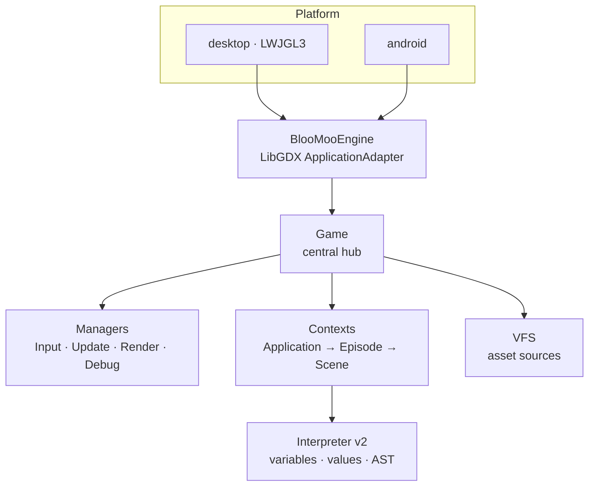
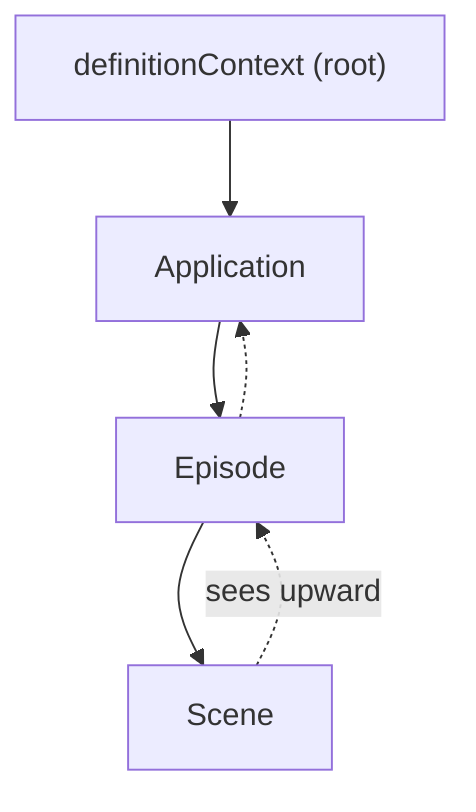
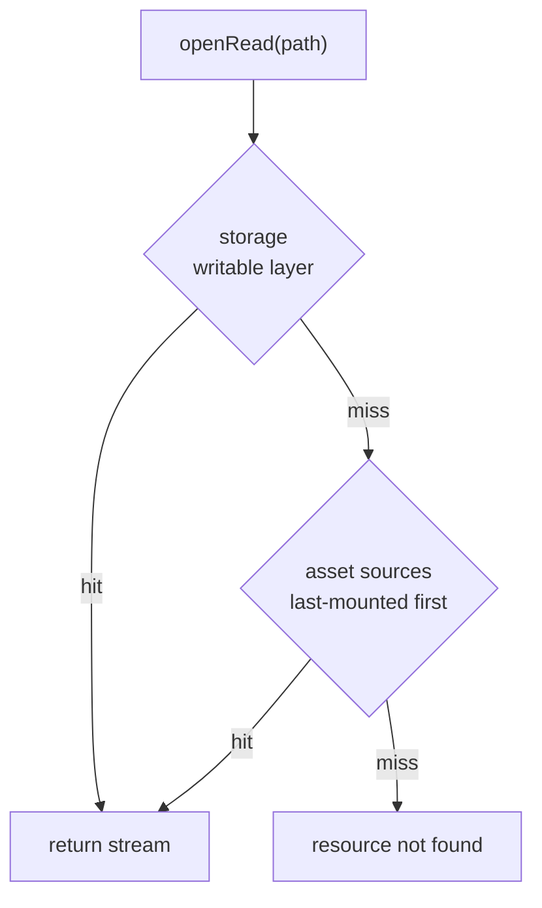
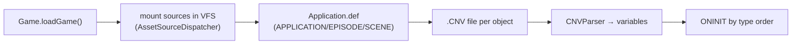

# Architecture

This chapter is the big-picture map: which layers Rex-EMoolator is built from, how responsibilities are split, and how data flows from a file on disk to an object on screen. Each subsystem has its own chapter — here we stay at the bird's-eye view.

## Layers

The project splits into three Gradle modules:

| Module | Role |
|---|---|
| **core** | all emulator logic (Java 21) — interpreter, managers, loaders, VFS |
| **desktop** | LWJGL3 launcher |
| **android** | Android launcher (API 24+) |

The engine layer (`engine/`) deliberately **does not depend** on concrete interpreter classes — it talks to the interpreter through the [`GameContext`](#contexts-and-hierarchy) interface and the `EngineVariable` type. This lets managers operate on game objects without knowing their internal representation.

## Bootstrap and the loop

`BlooMooEngine` (a LibGDX `ApplicationAdapter`) sets up a `SpriteBatch`, an orthographic camera, and an 800×600 [viewport](rendering.md) in `create()`, then creates `Game` and the four managers. Every frame is one pass of `render()`: **Input → Update → Render → Debug**, with game state advanced on a [fixed 60 Hz step](loop.md).

The frame rhythm is detailed in [Game loop and engine clock](loop.md).

## Game — the central hub

The `Game` class ties together everything that makes up a running game. It is the owner of state:

- :material-folder-network: **Assets** — the [VFS](#vfs-virtual-filesystem) instance and the current data directory (`DANE`).
- :material-file-tree: **Contexts** — the `definitionContext` (root) and the current Application / Episode / Scene contexts.
- :material-map-marker-path: **Scene state** — the current episode and scene, the `APPLICATION`/`EPISODE`/`SCENE` variables, background, language (`POL` by default).
- :material-clock-outline: **Clock** — the monotonic [engine clock](loop.md#engine-clock) (`engineTimeMsAccum`).
- :material-vector-intersection: **Collisions** — the `QuadTree` (800×600), the set of monitored objects, and the collision map.
- :material-music: **Audio and canvas** — the music cache, [pasted graphics](rendering.md), and the last-frame snapshot for `CANVAS_OBSERVER`.

## Managers

Frame logic is split across managers with clear responsibilities (a pattern close to MVC):

| Manager | Responsibility |
|---|---|
| `InputManager` | mouse and keyboard → signals |
| `UpdateManager` | advancing game state; delegates to sub-managers |
| `RenderManager` | drawing the scene (see [Rendering](rendering.md)) |
| `DebugManager` | diagnostic overlay |

`UpdateManager` splits each step's work across four sub-managers: **Timer**, **Animation**, **Collision**, **Audio** — run in that order after the [clock](loop.md#engine-clock) advances.

## Contexts and hierarchy

Variables (objects defined in scripts) live in **contexts** arranged hierarchically. A lower-level context sees its own variables plus those of all ancestors — but not the other way around:

Each `Context` is built by **composition** of specialised parts:

| Part | Role |
|---|---|
| `ExecutionContext` | call stack, local variables (`THIS`, `$1`–`$N`, `_I_`) |
| `VariableStore` | objects declared in this context |
| `VariableResolver` | lookup logic across the hierarchy + cached type views |
| `AttributeStore` | raw attributes read from the script |
| `CloneRegistry` | registry of cloned objects (`CLONE`) |

Variable lookup goes: execution locals → local `VariableStore` → additional contexts → parent chain. For the managers, `VariableResolver` maintains **cached views** that account for the whole hierarchy — e.g. "all graphical objects in the scene", "all timers" — so render and update don't have to walk the tree every frame.

Script loading order and object initialisation are described in [Scripts](../engine/scripts.md#script-loading-order).

## Variables and values (interpreter v2)

Data representation in scripts is built on **sealed interfaces** with exhaustive pattern matching:

- **`Variable`** — every scripting type ([`INTEGER`](../reference/INTEGER.md), [`STRING`](../reference/STRING.md), [`ANIMO`](../reference/ANIMO.md), [`TIMER`](../reference/TIMER.md), …). Variables are **immutable** — `withValue()` returns a new instance (with exceptions for internally-marked mutable state, such as animation or timer state).
- **`Value`** — primitive values (`IntValue`, `DoubleValue`, `StringValue`, `BoolValue`) with type-conversion methods.
- **`MethodSpec` / `MethodResult` / `MethodContext`** — declarative method definitions (`MethodSpec` wraps a `VariableMethod`). A method receives a **`MethodContext`** — a view onto the runtime (access to variables, the `Game` instance, running behaviours, the clone registry) — and mutates the world directly through it. `MethodResult` carries the return value plus control-flow info (`BREAK` / `ONE_BREAK`) needed to propagate `@BREAK` / `@ONEBREAK` across procedure boundaries.

Scripts are parsed by ANTLR into an AST, which is executed by `ASTInterpreter`. The language syntax is covered in [Scripts](../engine/scripts.md), and the full type list in the [Type reference](../reference/index.md).

## VFS — virtual filesystem

Access to game assets goes through the `VFS`, which layers several sources and hides where a file actually comes from:

- **Asset sources** are mounted by `AssetSourceDispatcher` depending on type: directory → `LocalFileSystem`, `.iso` file → `IsoFileSystem`, `.zip` → `ZipFileSystem`. Sources mounted later have higher priority.
- **Storage** is the only writable layer (save games, temporary files); it overrides game data on read.
- **Language** — if set, every layer is first probed with `<language>/<path>` and only then with the bare path. This mirrors the original engine's localisation convention (see [`APPLICATION.SETLANGUAGE`](../reference/APPLICATION.md)).

## Game loading pipeline

Loading starts from `Application.def` in the `DANE` directory, then loads the `.CNV` files for the application, the first episode, and the first scene. The full order (and the `ONINIT` / `__ONINIT__` initialisation phases) is described in [Scripts → Loading order](../engine/scripts.md#script-loading-order).

!!! note "GameLoader is currently an empty stub"
    Despite its name, the loading logic lives in `Game` (`scanGameDirectory`, `CNVParser`), not in the `loader/GameLoader` class. That's a spot for a future refactor, not a separate subsystem.

## Related topics

- [Game loop and engine clock](loop.md) — frame dynamics.
- [Rendering](rendering.md), [Animation system](animation.md), [Time and timers](timers.md) — the individual subsystems.
- [Scripts](../engine/scripts.md) — the language, hierarchy, and loading order.
