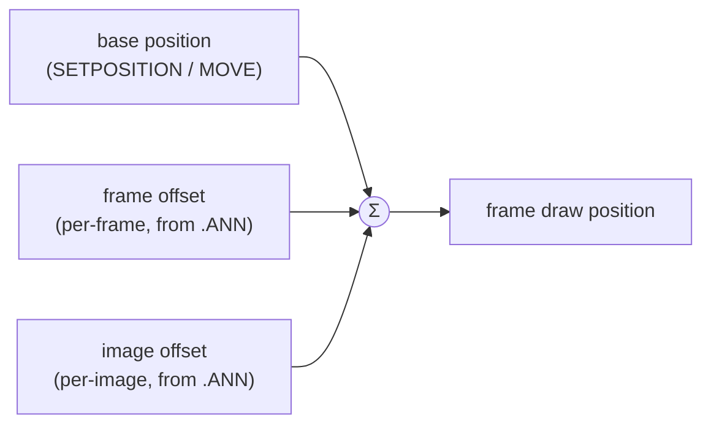

# Coordinates and anchors

Every graphical and interactive object in the engine lives in one fixed coordinate system. This chapter describes that system, the two positioning modes (absolute and relative), and **anchors** — a mechanism that behaves counter-intuitively in Piklib/BlooMoo and is a frequent source of mistakes.

## The canvas and coordinate system

The reference unit is a **fixed 800×600 px virtual canvas**. The origin `(0, 0)` is in the **top-left corner**, and the Y axis grows **downward** — as in most 2D APIs of the era.

```
(0,0) ────────────── x → 799
  │  ┌───────────┐
  │  │  ▢ object  │
  y  └───────────┘
  ↓
 599
```

All coordinates at the script level — `SETPOSITION`, `GETPOSITIONX`, mouse position, a button's `RECT` — are expressed in this system. The fact that the renderer flips the Y axis when drawing (LibGDX has its origin in the bottom-left corner) is purely an implementation detail and does not surface in scripts — see [the Y-axis flip](rendering.md#coordinate-system-and-y-axis-flip).

## Absolute and relative positioning

The engine combines two ways of placing objects:

=== "Absolute"

    A position directly on the canvas — the base for further calculations. Used by:

    - [`SETPOSITION(x, y)`](../reference/ANIMO.md#setposition) in [`ANIMO`](../reference/ANIMO.md) and [`IMAGE`](../reference/IMAGE.md),
    - a button's `RECT` ([`BUTTON`](../reference/BUTTON.md)),
    - reading the [`MOUSE`](../reference/MOUSE.md) position.

=== "Relative"

    Offsets relative to where an object "should" be. Used mainly by [`ANIMO`](../reference/ANIMO.md): they let an animation move across the screen during playback, without calling `SETPOSITION`.

## Composing an animation's position

The position at which the renderer draws an animation frame is the **sum of three** components:



- **Base position** — set from scripts; the object's anchor point on the canvas.
- **Frame offset** — an offset stored with a given frame of an event ([`.ANN`](../formats/ANN.md)); this is what creates the sense of motion "within" an animation.
- **Image offset** — an offset stored with the image itself in the pool.

Playback details are described in [Animation system](animation.md#frame-position-on-screen).

!!! note "IMAGE: the offset is the start position"
    In [`IMAGE`](../reference/IMAGE.md) the offset from the [`.IMG`](../formats/IMG.md) header works differently than in animation — it becomes the image's **absolute start position** and no longer affects further positioning.

## Anchors

By default an object is positioned relative to its **top-left corner** — `SETPOSITION(400, 300)` places exactly that corner there. An anchor ([`SETANCHOR`](../reference/ANIMO.md#setanchor)) lets you move the attachment point elsewhere, e.g. to the object's centre.

!!! warning "The anchor is subtracted, not added"
    This is the key gotcha. `SETANCHOR` does not *add* an offset to the position — its coordinates are **subtracted** from the `SETPOSITION` arguments:

    ```
    posX = x − anchorX
    posY = y − anchorY
    ```

    Example: after `SETANCHOR(200, 300)`, a call to `SETPOSITION(400, 500)` places the object at `(200, 200)`, not `(600, 800)`. This is established behaviour of the original engine — most likely an original sign mistake, which the offsets in `.ANN` files and the game scripts were adjusted to.

### Named anchors

The `SETANCHOR(name)` variant computes the anchor point from the **bounding box of the current frame**:

| Name | Anchor point |
|---|---|
| `CENTER` | centre |
| `LEFTUPPER` | top-left corner |
| `RIGHTUPPER` | top-right corner |
| `LEFTLOWER` | bottom-left corner |
| `RIGHTLOWER` | bottom-right corner |
| `LEFT` | centre of the left edge |
| `RIGHT` | centre of the right edge |
| `TOP` | centre of the top edge |
| `BOTTOM` | centre of the bottom edge |

The `SETANCHOR(x, y)` variant sets the anchor coordinates directly.

!!! tip "Lower anchors can be tricky"
    Anchors that reference the bottom edge (`LEFTLOWER`, `RIGHTLOWER`, `BOTTOM`) interact with the Y-axis flip in render space. In practice the most reliable and most commonly used are `CENTER` and `LEFTUPPER`; for the lower ones it's worth verifying the result visually.

## Mouse and buttons

The cursor position ([`MOUSE`](../reference/MOUSE.md)) is reported in the same 800×600 top-left-origin space as object positions — which is why mouse coordinates can be passed straight to `SETPOSITION`. A button's clickable area ([`BUTTON`](../reference/BUTTON.md)) is defined by a `RECT` rectangle in the same space.

## Related topics

- [Rendering](rendering.md#coordinate-system-and-y-axis-flip) — the Y-axis flip when drawing.
- [Animation system](animation.md#frame-position-on-screen) — frame and image offsets.
- Reference: [`ANIMO`](../reference/ANIMO.md), [`IMAGE`](../reference/IMAGE.md), [`MOUSE`](../reference/MOUSE.md), [`BUTTON`](../reference/BUTTON.md).
