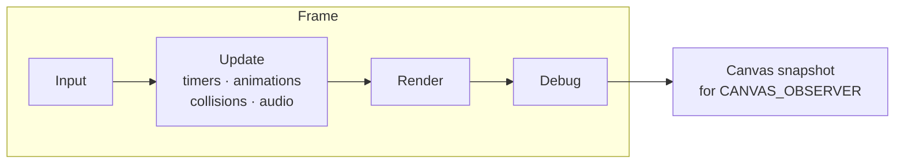

# Engine internals

This section describes **how the engine works under the hood** — as opposed to the [Engine](../engine/index.md) section, which covers the scripting language as seen by the content author. You'll find here a description of the game loop, rendering, the animation system, and time and timers, based on Rex-EMoolator's actual implementation and — where possible — compared with the original engine's behaviour.

## One frame in a nutshell

Everything revolves around a single loop called once per frame. Four managers process it in a fixed order, and game state is advanced on a [fixed 60 Hz step](loop.md#fixed-timestep):

## Chapters

-   :material-sitemap-outline:{ .lg .middle } __Architecture__

    ---

    The big-picture map: layers and modules, the central `Game` hub, managers, contexts, the variable system, and the VFS, plus the game loading pipeline.

    [:octicons-arrow-right-24: Read](architecture.md)

-   :material-sync:{ .lg .middle } __Game loop and engine clock__

    ---

    The fixed 60 Hz step, the time accumulator, the MVC model, and the monotonic engine clock. The foundation the rest of the section rests on.

    [:octicons-arrow-right-24: Read](loop.md)

-   :material-image-multiple:{ .lg .middle } __Rendering__

    ---

    The frame drawing pipeline, priorities, the Y-axis flip, clipping, and alpha masks — and how rendering worked in the original (DirectDraw, dirty rects).

    [:octicons-arrow-right-24: Read](rendering.md)

-   :material-crosshairs-gps:{ .lg .middle } __Coordinates and anchors__

    ---

    The 800×600 canvas, absolute and relative positioning, composing an animation's position, and anchors (and their counter-intuitive subtraction).

    [:octicons-arrow-right-24: Read](coordinates.md)

-   :material-animation-play:{ .lg .middle } __Animation system__

    ---

    The event-and-frame model, the playback clock, the state machine (loops, ping-pong, event chains), and frame positioning.

    [:octicons-arrow-right-24: Read](animation.md)

-   :material-timer-outline:{ .lg .middle } __Time and timers__

    ---

    How `TIMER` counts time on the engine clock, the `ONTICK` signal logic, and the pitfalls of the `ENABLE`/`SET`/`SETELAPSE` methods.

    [:octicons-arrow-right-24: Read](timers.md)

## See also

- [File formats](../formats/index.md) — how the data these systems load is encoded on disk.
- [Type reference](../reference/index.md) — the full list of objects available in scripts.
