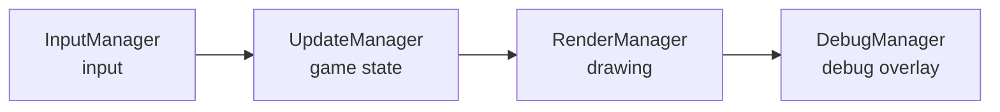
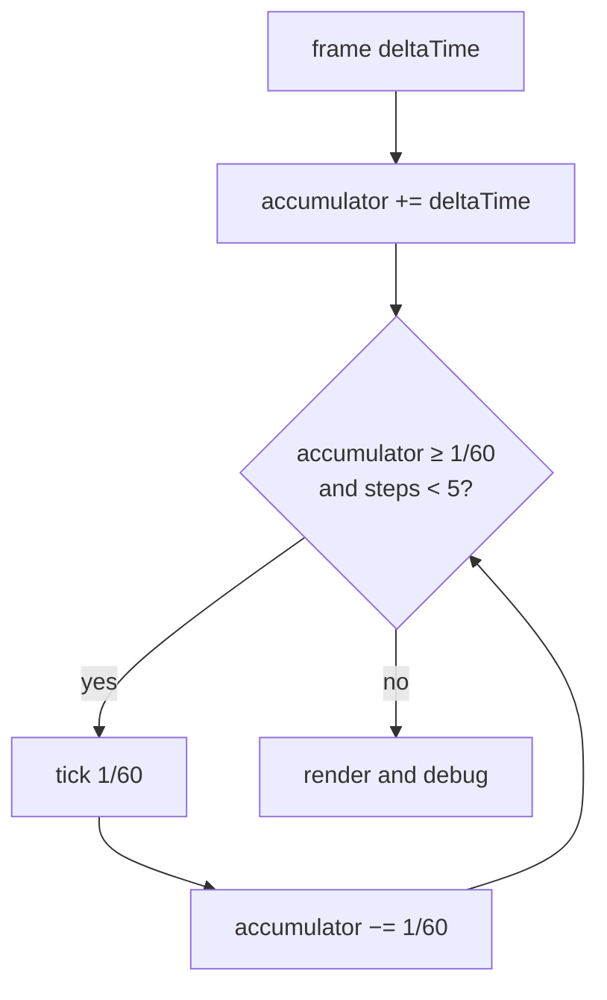

# Game loop and engine clock

The whole game is driven by one loop: LibGDX calls `render()` once per frame, and that routes control through four subsystems in a fixed order. This chapter describes that loop, how the engine keeps a **frame-rate-independent** game clock, and the pause and stepping modes.

## The MVC model

Each frame is a pass through four managers — in this order:



1. **Input** — process mouse and keyboard, emit the signals they produce.
2. **Update** — advance game state: [timers](timers.md), [animations](animation.md), collisions, and audio.
3. **Render** — draw the scene (see [Rendering](rendering.md)).
4. **Debug** — optional diagnostic overlay (FPS, object inspection).

At the end of the frame a screenshot is taken for [`CANVAS_OBSERVER`](../reference/CANVAS_OBSERVER.md), which exposes the current canvas image to scripts.

## Fixed timestep

The loop's key design decision: **input and rendering run at the monitor's frame rate, but game state is updated on a fixed 60 Hz step** (`TICK = 1/60 s`).

!!! info "Why not just `deltaTime`?"
    A fixed step gives **determinism and reproducibility** — game state evolves identically regardless of frame rate, which makes tests and bug reproduction easier. If Rex-EMoolator advanced state directly by the frame's variable `deltaTime`, animations and timers would drift apart on faster and slower hardware.

!!! quote "And how did the original do it?"
    Differently than you might expect. Decompilation of `bloomoodll.dll` shows the engine measured the **real time of each frame** with a high-resolution clock (`QueryPerformanceCounter`, class `CHiResTimer` — globals `appTime`, `frameTime`, `fps`) and advanced logic by that **variable delta**. Scheduled events and script [timers](timers.md) were handled by a separate Win32 multimedia-timer mechanism (`timeSetEvent`, classes `CXTimer`/`CTimerNotificator`). The fixed 60 Hz step is therefore a **deliberate emulator choice** for determinism, not a recreation of a rigid tick — the original had none.

This is implemented by the classic **accumulator** (the *"Fix Your Timestep!"* pattern): each frame's time is added to an accumulator, from which the engine "pays out" full `1/60 s` steps.



- **`MAX_STEPS = 5`** — at most 5 update steps run per frame. If a frame stalls badly (e.g. a system hiccup), the excess time is **dropped** rather than caught up. This guards against the *spiral of death*, where ever-longer frames generate ever more steps to catch up on.
- At a typical 60 FPS exactly one step runs per frame; at 144 FPS a step runs on roughly every second or third frame; at a drop to 30 FPS, two steps run per frame.

## Engine clock

Updates **do not use wall-clock time** (system time). Each step adds `TICK` to a monotonic **engine clock**, measured in milliseconds:

```java
public void tick(float fixedDt) {
    game.advanceEngineTime(fixedDt);      // (1)
    updateTimers(game.getEngineTimeMs()); // (2)
    updateAnimations(game.getEngineTimeMs());
    updateCollisions();
    updateAudio(fixedDt);
}
```

1. Advances the engine clock by a fixed step (~16.67 ms).
2. [Timers](timers.md) and [animations](animation.md) receive the **current engine time**, not system time — so they are fully deterministic and stop together with the pause.

The order within a step is fixed: **time → timers → animations → collisions → audio**.

!!! tip "Consequence for scripts"
    Because everything is measured by the same clock, a [timer](../reference/TIMER.md) set to `1000 ms` will emit `ONTICK` after exactly 60 steps — regardless of whether the game runs at 30 or 240 FPS.

## Pause and stepping

The loop supports two diagnostic modes controlled by `EngineConfig`:

| Mode | Behaviour |
|---|---|
| **Pause** (`paused`) | `deltaTime` is zeroed — game state stands still, but frames keep rendering (you can move the debug camera, inspect the scene). |
| **Frame step** (`stepFrame`) | Forces exactly **one** `TICK` step and falls back into pause. Lets you scrub the game frame by frame. |

In step mode the accumulator is bypassed — a single, isolated `tick(TICK)` runs, which makes analysing a single state change easier.

## Related topics

- [Rendering](rendering.md) — what happens in the "Render" step.
- [Animation system](animation.md) — how animations use the engine clock.
- [Time and timers](timers.md) — `TIMER` and the `ONTICK` signal on the engine clock.
