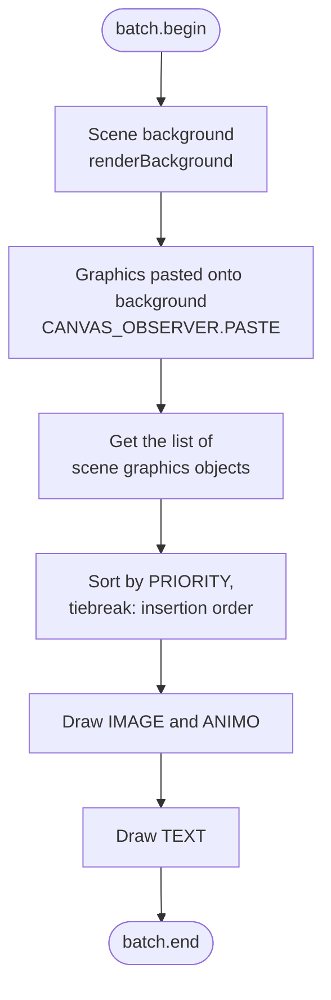
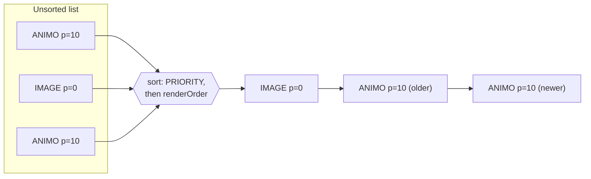
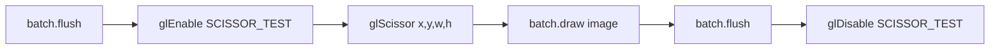

# Rendering

The engine redraws the entire scene **from scratch every frame** (immediate mode). There is no notion of a persistent "object on screen" that the engine moves around — instead, every frame it walks the list of graphical objects, sorts them, and draws them one by one onto a cleared buffer. This chapter describes the full rendering pipeline in Rex-EMoolator and how it differed from the original engine.

!!! info "Where this happens"
    Rendering is the third step of the [frame loop](loop.md) — after input processing and game-state update. All the logic lives in `RenderManager` and the helper classes `GraphicsRenderer`, `TextRenderer`, `MaskRenderer`, and `AlphaMaskRenderer`.

## A single frame's pipeline

`RenderManager.render()` always performs the same steps in the same order:



The order matters — together with priorities, it decides what ends up "on top":

1. **Scene background** — a single background image for the current scene, drawn first (deepest).
2. **Pasted graphics** — bitmaps "burned" onto the background via [`CANVAS_OBSERVER^PASTE`](../reference/CANVAS_OBSERVER.md). They become part of the background layer and are no longer sorted.
3. **Graphics objects** — all visible [`IMAGE`](../reference/IMAGE.md) and [`ANIMO`](../reference/ANIMO.md) of the scene, sorted (see below).
4. **Text** — [`TEXT`](../reference/TEXT.md) objects, drawn last, always above graphics.

!!! note "Blend mode"
    Standard alpha blending (`GL_SRC_ALPHA`, `GL_ONE_MINUS_SRC_ALPHA`) is set before drawing. Rendering of [alpha masks](#alpha-masks) temporarily changes this function and restores it afterwards.

## Coordinate system and Y-axis flip

This is the most common source of confusion when reading the renderer code, so it's worth understanding once and for all.

The Piklib/BlooMoo engine works on a **fixed 800×600 px virtual canvas** with the origin in the **top-left corner** — the Y axis grows downward, as in most 2D APIs of that era. LibGDX (and OpenGL underneath) uses an orthographic camera with the origin in the **bottom-left corner** — the Y axis grows upward.

That's why every vertical coordinate is flipped when drawing:

```java
screenY = 600 - top - height   // (1)
```

1. `600` is the fixed canvas height (`VIRTUAL_HEIGHT`), `top` is the object's top edge in engine coordinates, and `height` is the bitmap height. The result is the position of the sprite's **bottom-left** corner in LibGDX coordinates.

=== "Engine space (scripts)"

    <svg viewBox="0 0 340 210" role="img" aria-label="Engine space: origin in the top-left corner, Y axis grows downward" xmlns="http://www.w3.org/2000/svg" style="max-width:340px;width:100%;height:auto">
      <defs>
        <marker id="ah-eng" markerWidth="8" markerHeight="8" refX="5" refY="3" orient="auto">
          <path d="M0,0 L6,3 L0,6 Z" fill="currentColor"/>
        </marker>
      </defs>
      <rect x="50" y="30" width="240" height="150" fill="currentColor" fill-opacity="0.04" stroke="currentColor" stroke-opacity="0.35"/>
      <line x1="50" y1="30" x2="305" y2="30" stroke="currentColor" stroke-width="1.5" marker-end="url(#ah-eng)"/>
      <line x1="50" y1="30" x2="50" y2="195" stroke="currentColor" stroke-width="1.5" marker-end="url(#ah-eng)"/>
      <line x1="110" y1="30" x2="110" y2="62" stroke="currentColor" stroke-opacity="0.5" stroke-dasharray="3 3"/>
      <rect x="110" y="62" width="74" height="46" rx="3" fill="currentColor" fill-opacity="0.12" stroke="currentColor" stroke-opacity="0.65"/>
      <text x="147" y="89" font-size="11" fill="currentColor" text-anchor="middle">object</text>
      <text x="106" y="50" font-size="11" fill="currentColor" text-anchor="end">top=50</text>
      <text x="45" y="26" font-size="11" fill="currentColor" text-anchor="end">(0,0)</text>
      <text x="305" y="22" font-size="11" fill="currentColor" text-anchor="end">x → 799</text>
      <text x="58" y="196" font-size="11" fill="currentColor">y ↓ 599</text>
    </svg>

=== "Renderer space (LibGDX)"

    <svg viewBox="0 0 340 210" role="img" aria-label="Renderer space (LibGDX): origin in the bottom-left corner, Y axis grows upward" xmlns="http://www.w3.org/2000/svg" style="max-width:340px;width:100%;height:auto">
      <defs>
        <marker id="ah-gdx" markerWidth="8" markerHeight="8" refX="5" refY="3" orient="auto">
          <path d="M0,0 L6,3 L0,6 Z" fill="currentColor"/>
        </marker>
      </defs>
      <rect x="50" y="30" width="240" height="150" fill="currentColor" fill-opacity="0.04" stroke="currentColor" stroke-opacity="0.35"/>
      <line x1="50" y1="180" x2="305" y2="180" stroke="currentColor" stroke-width="1.5" marker-end="url(#ah-gdx)"/>
      <line x1="50" y1="180" x2="50" y2="15" stroke="currentColor" stroke-width="1.5" marker-end="url(#ah-gdx)"/>
      <rect x="110" y="118" width="74" height="46" rx="3" fill="currentColor" fill-opacity="0.12" stroke="currentColor" stroke-opacity="0.65"/>
      <text x="147" y="145" font-size="11" fill="currentColor" text-anchor="middle">object</text>
      <text x="45" y="28" font-size="11" fill="currentColor" text-anchor="end">(0,600)</text>
      <text x="45" y="184" font-size="11" fill="currentColor" text-anchor="end">(0,0)</text>
      <text x="298" y="196" font-size="11" fill="currentColor" text-anchor="end">(800,0)</text>
      <text x="305" y="172" font-size="11" fill="currentColor" text-anchor="end">x → 799</text>
      <text x="58" y="24" font-size="11" fill="currentColor">y ↑ 599</text>
      <text x="194" y="145" font-size="11" fill="currentColor">y = 600−top−h</text>
    </svg>

!!! tip "Practical upshot"
    In scripts and in the [type reference](../reference/index.md) all coordinates are in engine space (top-left origin). The flip is purely a renderer implementation detail — it does not surface at the script level.

## Priorities and draw order

Graphics objects are sorted before drawing by two keys:

| Key | Field | Behaviour |
|---|---|---|
| Primary | `PRIORITY` | ascending — **lower priority is drawn earlier** (deeper), higher ends up on top |
| Secondary (tiebreak) | insertion order (`renderOrder`) | an object added to the scene later is drawn later (above an older one) |

In other words: priority behaves like a `Z` coordinate. Two objects with the same priority keep the relative order in which they entered the scene.



Priority is changed from scripts with [`SETPRIORITY`](../reference/ANIMO.md#setpriority) / [`GETPRIORITY`](../reference/ANIMO.md#getpriority).

## Visibility

An object is skipped during drawing if:

- it is not visible (`VISIBLE = FALSE`, e.g. after [`HIDE`](../reference/ANIMO.md#hide)), or
- for an animation, its graphics object is not a member of the canvas ([`TOCANVAS = FALSE`](../reference/ANIMO.md#tocanvas)) — the engine **still plays** such an animation and emits its events, but does not draw the base object, or
- it has no texture loaded yet (the frame/image bitmap).

`TOCANVAS` controls membership in the `CRefreshScreen` list; it does not select a second rendering layer. One important exception is `CMC_Animo::clone`: the cloned graphics object is always added through `CRefreshScreen::put`. When the template was not on the canvas, `GetPriority` returns `-1` and the clone code substitutes priority `0`. This is why the common resource pattern `VISIBLE=FALSE, TOCANVAS=FALSE` can define an invisible template whose clones are later revealed by script calls to `SHOW`.

## Clipping

[`IMAGE^SETCLIPPING(x1, y1, x2, y2)`](../reference/IMAGE.md) limits drawing of the image to a rectangle. The renderer does this with the GPU **scissor test** (`glScissor`): the command buffer is flushed, `GL_SCISSOR_TEST` is enabled, the rectangle is set (with the [Y-axis flip](#coordinate-system-and-y-axis-flip)), the image is drawn, and the test is disabled.



## Alpha masks

[`IMAGE^MERGEALPHA(x, y, mask)`](../reference/IMAGE.md) draws an image through a transparency mask, where the alpha channel comes from **another** image. The renderer first writes the mask's alpha into the destination buffer's alpha channel (`glColorMask(false,false,false,true)`), then draws the actual image modulated by that alpha (`GL_DST_ALPHA` / `GL_ONE_MINUS_DST_ALPHA`). A mask can be combined with clipping.

!!! warning "Operation order matters"
    An alpha mask requires two drawing passes with a forced buffer flush between them. That makes masked objects more expensive than plain sprites — in practice they're used sparingly (transitions, vignettes, fades).

## Filters

[`IMAGE`](../reference/IMAGE.md) and [`ANIMO`](../reference/ANIMO.md) objects can have a graphics filter attached ([`STATICFILTER`](../reference/STATICFILTER.md): rotation, scaling). If a filter is present, the renderer delegates drawing to it instead of calling `batch.draw` directly.

!!! note "Implementation status"
    Currently the renderer applies only the **first** attached filter. Combining multiple filters on one object is not yet supported.

## How it worked in the original

The original Piklib/BlooMoo is a turn-of-the-century engine running on 32-bit Windows and hardware without ubiquitous 3D acceleration. Its rendering model was, of necessity, different from the modern "draw everything on the GPU every frame" approach.

=== "Rex-EMoolator (today)"

    - Full **redraw of the whole canvas** every frame.
    - Drawing via the GPU (LibGDX `SpriteBatch` → OpenGL).
    - RGBA8888 textures in video memory.
    - Roughly constant per-frame cost, independent of how much changed.

=== "Original (bloomoodll.dll)"

    - **Back buffer** and blitting via **DirectDraw** (`DirectDrawCreateEx`, class `CDirectDrawSurface`).
    - Frame presentation via `CSurface::Flip` — swapping the primary ↔ back surface.
    - Blits are done by **rectangle**: `CDirectDrawSurface::Blt(source, CXPoint, CXRect*)`.
    - **Dirty rectangles** — only the regions that actually changed were redrawn. This was handled by the `CRefreshScreen` class with a `CValidationQuene`/`CValidationElement` queue and `CInvalidateObserver`: invalidating a graphical object (`CRefreshScreen::Invalidate(CGraphicsObject*)`) queued its rectangle for refresh.
    - **Hi-color** surfaces: RGB565 or RGB555 (15/16 bits) — follows from the [`IMG`/`ANN` formats](../formats/index.md).
    - A fixed **800×600** canvas.

!!! quote "Confirmed by decompilation"
    The above was **confirmed by decompiling `bloomoodll.dll`** (Ghidra): the `DirectDrawCreateEx` import, the classes `CDirectDrawSurface`, `CSurface::Flip`, `CRefreshScreen` with `CValidationQuene`/`CInvalidateObserver`, and blits taking a `CXRect*`. The RGB565/555 colour depth and the 800×600 canvas follow from the [asset formats](../formats/index.md) and engine constants.

The key conceptual difference: the original saved work by redrawing and blitting **only the dirty rectangles**, whereas Rex-EMoolator redraws the **whole canvas** every frame and leaves optimisation to the GPU. On today's hardware a full 800×600 redraw is cheaper than bookkeeping dirty regions, and the code is much simpler for it.

## Related topics

- [Game loop and engine clock](loop.md) — when and how often `render()` is called.
- [Animation system](animation.md) — where the frame bitmap the renderer draws comes from.
- [File formats](../formats/index.md) — how images and animations are encoded on disk.
- Reference: [`IMAGE`](../reference/IMAGE.md), [`ANIMO`](../reference/ANIMO.md), [`TEXT`](../reference/TEXT.md), [`CANVAS_OBSERVER`](../reference/CANVAS_OBSERVER.md), [`STATICFILTER`](../reference/STATICFILTER.md).
