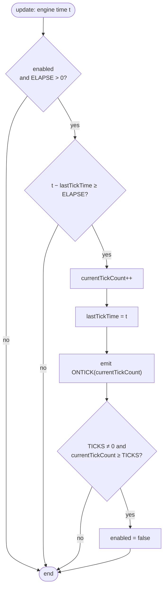

# Time and timers

A [`TIMER`](../reference/TIMER.md) object is a cyclic time counter: every set interval it emits an `ONTICK` signal, to which a script attaches a handler. Timers are the basic tool for delays, script-driven animated transitions, and repeated actions. This chapter describes how timers count time and how their methods behave.

## Time measured by the engine clock

Timers **do not use the wall clock** (system time). They tick on the [monotonic engine clock](loop.md#engine-clock), advanced by a fixed `1/60 s` step in every [loop](loop.md) update step:

- the clock is held as an accumulator in milliseconds (a step adds `16.666… ms`),
- `getEngineTimeMs()` returns its integer part.

!!! tip "Determinism and pause"
    Thanks to this, timers are fully deterministic and **stop together with the [pause](loop.md#pause-and-stepping)** — time does not flow while the game stands still. A timer set to `1000 ms` will emit `ONTICK` after exactly 60 engine steps (`60 × 16.666… = 1000`), regardless of the frame rate.

## Timer fields

| Field | Meaning |
|---|---|
| `ELAPSE` | the interval between ticks, in milliseconds |
| `TICKS` | the maximum number of ticks; `0` means **no limit** |
| `enabled` | whether the timer is currently ticking |
| `currentTickCount` | how many ticks have already occurred (the value carried by `ONTICK`) |
| `lastTickTime` | the engine time of the last tick (the interval accumulator) |

## Tick logic

On every update step the engine calls `update()` on the timer:

Key details:

- after a tick, `lastTickTime` is set to the **current** engine time (no remainder carry-over), so the next tick's window counts from scratch,
- when `TICKS` is positive and the counter reaches it, the timer **disables itself** after the last tick,
- with `TICKS = 0` the timer ticks forever, until `DISABLE`.

!!! note "Granularity"
    The check happens once per step (~16.67 ms), so the interval is effectively rounded up to the nearest step boundary. Intervals that are multiples of `1/60 s` (e.g. 50, 100, 1000 ms) land exactly; the rest fall on the first step that crosses the threshold.

## Methods and their pitfalls

Some methods have behaviour that's easy to overlook — it was mirrored directly from the original BlooMooDLL:

| Method | Action | Note |
|---|---|---|
| [`ENABLE`](../reference/TIMER.md) | enables the timer, zeroes the counter, restarts the interval window | **a no-op if the timer is already enabled** — it does not zero the counter then |
| [`DISABLE`](../reference/TIMER.md) | stops ticking | keeps `currentTickCount` |
| [`RESET`](../reference/TIMER.md) | zeroes `currentTickCount` and restarts the interval window | does not change `enabled` |
| [`SET`](../reference/TIMER.md) | sets `TICKS` **and** zeroes the slot (counter + window) | not just the limit |
| [`SETELAPSE`](../reference/TIMER.md) | changes `ELAPSE` | **keeps the accumulator** (`lastTickTime`) — retuning the interval on the fly no longer loses the time already counted |
| [`GETTICKS`](../reference/TIMER.md) | returns `currentTickCount` | |

!!! warning "`ENABLE` on an enabled timer does nothing"
    To restart an already-ticking timer (zero the counter and the countdown), use [`RESET`](../reference/TIMER.md) or `DISABLE` + `ENABLE`. `ENABLE` alone will be ignored.

## How it differs from the original

In `bloomoodll.dll` timers were driven by **Win32 multimedia timers** (`timeSetEvent`, classes `CXTimer`/`CTimerNotificator`), not by the render loop. Rex-EMoolator instead ticks them on the [engine clock](loop.md#engine-clock) at a `1/60 s` step. The tick logic itself, however, is the same.

!!! quote "Confirmed by decompilation"
    The `CMC_Timer::onTimer` method in the original library does exactly what's described above: it checks the "enabled" flag, increments the tick counter, disables the timer once the `TICKS` limit is reached, and then emits the parameterised `ONTICK^<count>` signal followed by `ONTICK`. So the logic described on this page mirrors the original's behaviour, not just the emulator's implementation.

## Related topics

- [`TIMER`](../reference/TIMER.md) — reference of methods and signals.
- [Game loop and engine clock](loop.md) — the time source for timers.
- [Events and signals](../engine/events.md) — how `ONTICK` propagates through the call tree.
