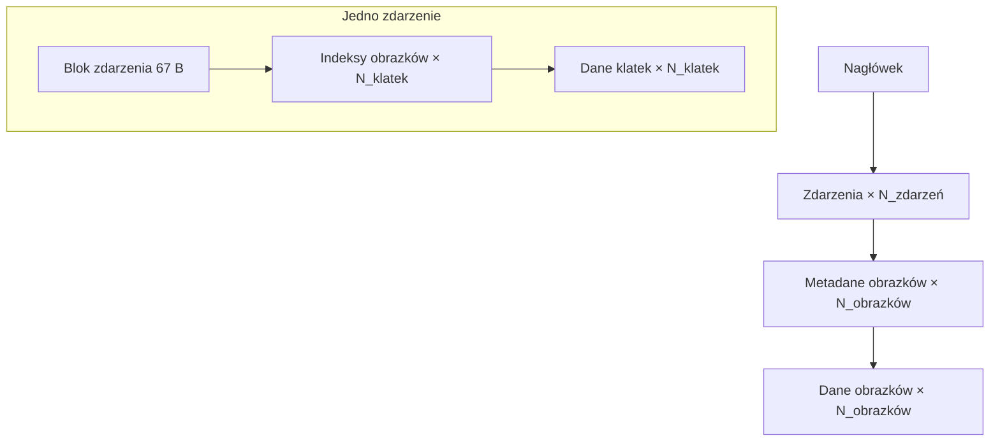

# Format ANN — animacje

Plik `.ANN` przechowuje [animację](../internals/animation.md): zestaw nazwanych **zdarzeń**, z których każde jest sekwencją **klatek** odwołujących się do wspólnej puli **obrazków**. Wszystkie liczby są **little-endian**.

!!! tip "Tabele uzgodnione z kodem"
    Poniższy układ odpowiada parserowi `AnimoLoader` z Rex-EMoolatora. Pola, które wcześniejsze notatki opisywały jako „nieznane" czy „dziwne liczby", są tu rozszyfrowane — m.in. blok sterujący pętlą i flagi zdarzenia.

## Struktura pliku

## Nagłówek

Sygnatura `NVP\0` (4 bajty), a po niej blok 44 bajtów:

| Offset | Pole | Typ | Opis |
|---:|---|---|---|
| 0 | magic | `char[4]` | `4E 56 50 00` (`NVP\0`) |
| 4 | liczba obrazków | `uint16` | rozmiar wspólnej puli obrazków |
| 6 | głębia kolorów | `uint16` | `15` (RGB555) lub `16` (RGB565) |
| 8 | liczba zdarzeń | `uint16` | ile bloków zdarzeń następuje |
| 10 | opis | `char[13]` | tekst zakończony `\0` (dalej mogą być śmieci) |
| 23 | FPS | `uint32` | domyślne tempo odtwarzania |
| 27 | — | 4 B | nieużywane / offset |
| 31 | przezroczystość | `uint8` | `0`–`255` |
| 32 | — | 12 B | nieużywane |
| 44 | długość podpisu | `uint32` | długość pola „podpis" |

Bezpośrednio po nagłówku:

| Pole | Typ | Opis |
|---|---|---|
| podpis | `char[długość podpisu]` | np. nazwisko autora |
| padding | 4 B | wyrównanie |

## Blok zdarzenia

Dla każdego zdarzenia — blok 67 bajtów:

| Offset | Pole | Typ | Opis |
|---:|---|---|---|
| 0 | nazwa zdarzenia | `char[32]` | `\0`-terminowana, wczytywana wielkimi literami |
| 32 | liczba klatek | `uint16` | długość zdarzenia |
| 34 | — | 4 B | nieużywane |
| 38 | `loopStart` | `uint16` | indeks klatki, do której wraca pętla |
| 40 | `loopEnd` | `uint16` | ostatnia klatka pętli (`0` = brak pętli) |
| 42 | `repeatCount` | `uint16` | liczba powtórzeń pętli (`0` = bez końca) |
| 44 | `repeatCounter` | `uint16` | bieżący licznik powtórzeń |
| 46 | — | 4 B | nieużywane |
| 50 | `flags` | `uint32` | flagi zachowania (patrz niżej) |
| 54 | przezroczystość | `uint8` | `0`–`255` |
| 55 | — | 12 B | nieużywane |

Po bloku następuje **tablica indeksów obrazków** (`uint16` × liczba klatek) — każda klatka wskazuje obrazek we wspólnej puli — a po niej **dane klatek** (po jednym bloku na klatkę).

### Flagi zdarzenia

Pole `flags` steruje zachowaniem na granicy zdarzenia (interpretacja z [systemu animacji](../internals/animation.md#maszyna-stanow-odtwarzania)):

| Flaga | Wartość | Znaczenie |
|---|---|---|
| `FLAG_PING_PONG` | `0x20000` | po końcu sekwencja gra wstecz |
| `FLAG_WAIT_FOR_SFX` | `0x100000` | synchronizacja postępu z dźwiękiem klatki |
| `FLAG_PLAY_NEXT_EVENT` | `0x800000` | po zakończeniu startuje kolejne zdarzenie |

## Blok danych klatki

Dla każdej klatki — blok 34 bajtów, a po nim zmiennej długości nazwa i (opcjonalnie) opis SFX:

| Offset | Pole | Typ | Opis |
|---:|---|---|---|
| 0 | bajty startowe | 4 B | przeznaczenie nieustalone |
| 4 | — | 4 B | nieużywane |
| 8 | offset X | `int16` | przesunięcie klatki względem pozycji bazowej |
| 10 | offset Y | `int16` | przesunięcie klatki względem pozycji bazowej |
| 12 | — | 4 B | nieużywane |
| 16 | seed SFX | `uint32` | `> 0` → obecny opis SFX (patrz niżej) |
| 20 | — | 4 B | nieużywane |
| 24 | przezroczystość | `uint8` | `0`–`255` |
| 25 | — | 5 B | nieużywane |
| 30 | długość nazwy | `uint32` | długość pola „nazwa klatki" |

Następnie:

| Pole | Warunek | Opis |
|---|---|---|
| nazwa klatki | zawsze | `char[długość nazwy]`, `\0`-terminowana |
| długość opisu SFX | `seed SFX > 0` | `uint32` |
| opis SFX | `seed SFX > 0` | lista plików `.wav` rozdzielona `;` |

!!! note "Per-klatkowy offset i SFX"
    Offsety X/Y pozwalają animacji „przemieszczać się" w trakcie odtwarzania bez ruszania pozycji bazowej — patrz [pozycja klatki na ekranie](../internals/animation.md#pozycja-klatki-na-ekranie). Seed SFX powiązany jest z losowym wyborem efektu dźwiękowego klatki.

## Metadane obrazka

Po wszystkich zdarzeniach — dla każdego obrazka z puli blok 52 bajtów:

| Offset | Pole | Typ | Opis |
|---:|---|---|---|
| 0 | szerokość | `uint16` | w pikselach |
| 2 | wysokość | `uint16` | w pikselach |
| 4 | offset X | `int16` | przesunięcie obrazka |
| 6 | offset Y | `int16` | przesunięcie obrazka |
| 8 | typ kompresji | `uint16` | patrz tabela kompresji |
| 10 | rozmiar danych obrazka | `uint32` | długość bloku koloru |
| 14 | — | 14 B | nieużywane |
| 28 | rozmiar danych alfa | `uint32` | długość bloku przezroczystości |
| 32 | nazwa | `char[20]` | `\0`-terminowana |

## Dane obrazków

Na końcu pliku, dla każdego obrazka kolejno: blok danych koloru (`rozmiar danych obrazka` bajtów), a po nim blok danych alfa (`rozmiar danych alfa` bajtów). Oba mogą być skompresowane.

### Typy kompresji

| Wartość | Kompresja |
|---:|---|
| `0` | brak |
| `2` | CLZW2 |
| `3` | CRLE, a wynik dodatkowo CLZW2 |
| `4` | CRLE |
| `5` | JPEG |

Algorytmy CRLE i CLZW2 oraz dekodowanie pikseli RGB565/555 → RGBA opisuje rozdział [Kompresja](compression.md). Tu istotny jest wyłącznie **typ** zapisany w metadanych.

## Zobacz też

- [System animacji](../internals/animation.md) — jak silnik odtwarza te dane.
- [`ANIMO`](../reference/ANIMO.md) — obiekt skryptowy oparty na `.ANN`.
- [Format IMG](IMG.md) — pokrewny format pojedynczego obrazu.
- [Kompresja](compression.md) — CRLE, CLZW2 i dekodowanie pikseli.
