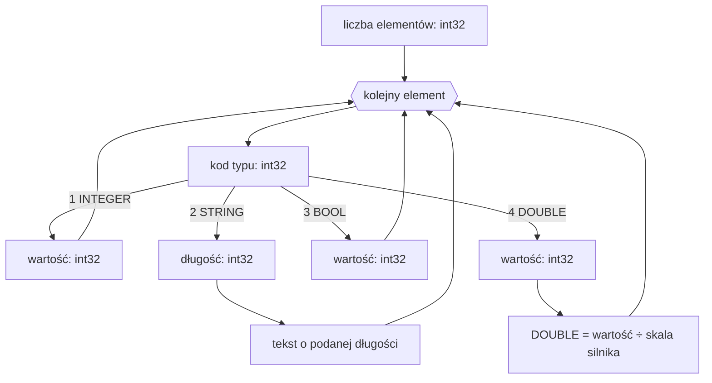

# Format ARR — tablice

Plik `.ARR` to binarny zrzut tablicy [`ARRAY`](../reference/ARRAY.md):
liczba elementów, a po niej elementy, każdy poprzedzony kodem swojego
typu. Liczby są zapisane ze znakiem, little-endian.

## Struktura pliku

| Pole | Typ | Opis |
|---|---|---|
| liczba elementów | `int32` | ile elementów następuje |
| elementy | — | po jednym bloku na element |

Każdy element zaczyna się od kodu typu (`int32`):

| Kod | Typ | Wartość |
|---:|---|---|
| `1` | `INTEGER` | `int32` |
| `2` | `STRING` | `int32` długość i dokładnie tyle bajtów tekstu; bez terminatora `NUL` |
| `3` | `BOOL` | `int32`; `TRUE`, gdy wartość jest niezerowa |
| `4` | `DOUBLE` | stałoprzecinkowy `int32`, dzielony przez skalę silnika |

## Skala DOUBLE

Skala jest częścią wariantu silnika, a nie samego rozszerzenia pliku:

| Silnik | Zapis | Odczyt | Precyzja |
|---|---:|---:|---:|
| BlooMoo | `DOUBLE × 10000` | `int32 ÷ 10000` | 4 miejsca |
| Piklib 8 | `DOUBLE × 1000` | `int32 ÷ 1000` | 3 miejsca |

Typ `4` nie jest IEEE 754. W BlooMoo surowe `12345` oznacza `1.2345`,
natomiast Piklib 8 odczyta te same bajty jako `12.345`.

## Dekodowanie

## Zobacz też

- [`ARRAY`](../reference/ARRAY.md) — tablica jednowymiarowa.
- [`MULTIARRAY`](../reference/MULTIARRAY.md) — tablica wielowymiarowa.
