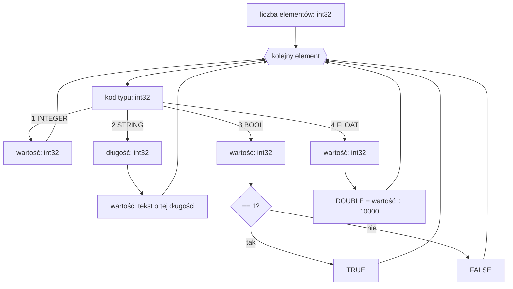

# Format ARR — tablice

Plik `.ARR` to binarny zrzut tablicy [`ARRAY`](../reference/ARRAY.md): liczba elementów, a po niej elementy, każdy poprzedzony kodem swojego typu. Liczby są **little-endian**, całkowite ze znakiem.

## Struktura pliku

| Pole | Typ | Opis |
|---|---|---|
| liczba elementów | `int32` | ile elementów następuje |
| elementy | — | po jednym bloku na element (min. 8 bajtów) |

Każdy element zaczyna się od **kodu typu** (`int32`), po którym następuje wartość zależna od typu:

| Kod | Typ | Wartość |
|---:|---|---|
| `1` | `INTEGER` | `int32` — odczytywany bez zmian |
| `2` | `STRING` | `int32` długość, a po niej tyle bajtów tekstu |
| `3` | `BOOL` | `int32` — `TRUE`, gdy `== 1` |
| `4` | `FLOAT` | `int32` — wartość rzeczywista to liczba ÷ `10000` (stałoprzecinkowo, 4 miejsca) |

## Dekodowanie

!!! note "FLOAT jest stałoprzecinkowy"
    Typ `4` to nie IEEE 754 — to liczba całkowita przechowująca wartość przemnożoną przez `10000`. Stąd ograniczenie do **czterech** miejsc po przecinku: `12345` na dysku oznacza `1.2345`.

## Zobacz też

- [`ARRAY`](../reference/ARRAY.md) — tablica jednowymiarowa.
- [`MULTIARRAY`](../reference/MULTIARRAY.md) — tablica wielowymiarowa.
