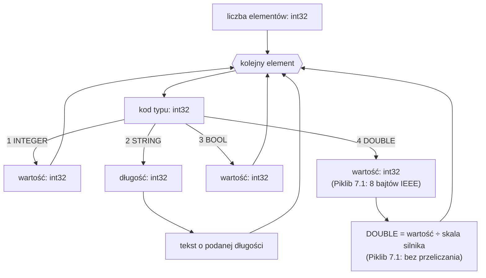

# Format ARR — tablice

Plik `.ARR` to binarny zrzut tablicy [`ARRAY`](../reference/ARRAY.md):
liczba elementów, a po niej elementy, każdy poprzedzony kodem swojego
typu. Liczby są zapisane ze znakiem, little-endian.

## Struktura pliku

| Pole | Typ | Opis |
|---|---|---|
| liczba elementów | `int32` | ile elementów następuje |
| elementy | — | po jednym bloku na element |

Każdy element zaczyna się od kodu typu (`int32`):

| Kod | Typ | Wartość |
|---:|---|---|
| `1` | `INTEGER` | `int32` |
| `2` | `STRING` | `int32` długość i dokładnie tyle bajtów tekstu; bez terminatora `NUL` |
| `3` | `BOOL` | `int32`; `TRUE`, gdy wartość jest niezerowa |
| `4` | `DOUBLE` | zależnie od silnika: stałoprzecinkowy `int32` albo surowe 8 bajtów |

## Zapis DOUBLE

Sposób zapisu jest częścią wariantu silnika, a nie samego rozszerzenia pliku:

| Silnik | Zapis | Odczyt | Precyzja |
|---|---:|---:|---:|
| BlooMoo od „Reksia i Kapitana Nemo” | `int32 = DOUBLE × 10000` | `int32 ÷ 10000` | 4 miejsca |
| Piklib 7.2 i 8, BlooMoo z „Reksia i Wehikułu Czasu” | `int32 = DOUBLE × 1000` | `int32 ÷ 1000` | 3 miejsca |
| Piklib 7.1 | 8 bajtów IEEE 754 | 8 bajtów IEEE 754 | pełna |
| Piklib 6.1 | — | — | brak binarnego zapisu tablic |

W wariantach stałoprzecinkowych typ `4` nie jest IEEE 754. W nowszym BlooMoo surowe
`12345` oznacza `1.2345`, natomiast Piklib 8 odczyta te same bajty jako `12.345`.
„Reksio i Wehikuł Czasu” ma już BlooMoo, ale zapisuje jeszcze w skali Pikliba.

Piklib 7.1 zapisuje `DOUBLE` tą samą procedurą co 64-bitową liczbę całkowitą, więc
element zajmuje 8 bajtów zamiast 4; skala pojawia się dopiero w 7.2.

!!! warning "STRING w Piklib 7.1"
    Oryginalny Piklib 7.1 zapisuje długość tekstu wadliwie: poprawny jest tylko
    najmłodszy bajt, pozostałe trzy to przypadkowe dane, a sam odczyt bierze całe
    4 bajty. Tablicy z tekstami zapisanej przez 7.1 nie odczyta więc poprawnie nawet
    oryginał. Emulator zapisuje i czyta czystą długość `int32`.

## Dekodowanie

```mermaid
flowchart TD
    A["liczba elementów: int32"] --> B{{kolejny element}}
    B --> C["kod typu: int32"]
    C -->|1 INTEGER| D["wartość: int32"]
    C -->|2 STRING| E["długość: int32"]
    E --> F["tekst o podanej długości"]
    C -->|3 BOOL| G["wartość: int32"]
    C -->|4 DOUBLE| K["wartość: int32<br/>(Piklib 7.1: 8 bajtów IEEE)"]
    K --> L["DOUBLE = wartość ÷ skala silnika<br/>(Piklib 7.1: bez przeliczania)"]
    D & F & G & L --> B
```

## Zobacz też

- [`ARRAY`](../reference/ARRAY.md) — tablica jednowymiarowa.
- [`MULTIARRAY`](../reference/MULTIARRAY.md) — tablica wielowymiarowa.
