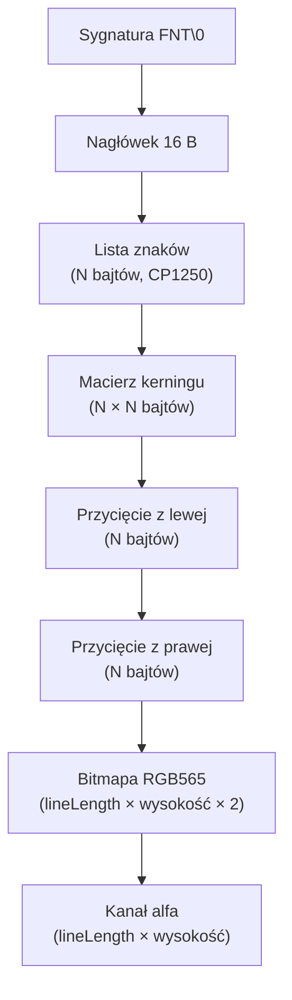
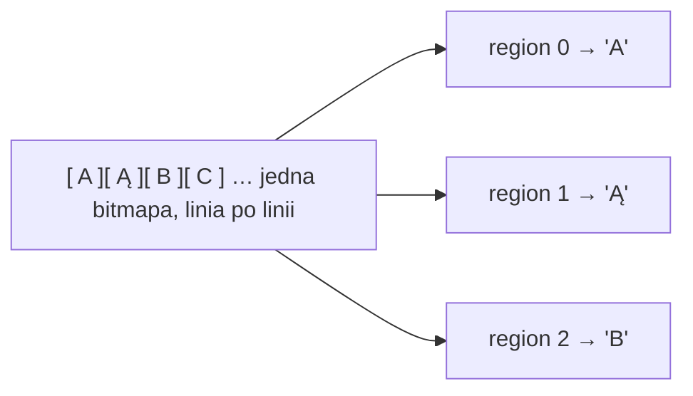

# Format FNT — czcionki

Plik `.FNT` przechowuje **bitmapową** czcionkę: zestaw znaków o stałej wysokości, ich metryki oraz jedną wspólną bitmapę ze wszystkimi glifami. To format obiektów [`FONT`](../reference/FONT.md) używanych przez [`TEXT`](../reference/TEXT.md). Liczby są **little-endian**. Układ odpowiada parserowi `FontLoader`.

!!! warning "Format nie do końca rozpracowany"
    `.FNT` jest jeszcze analizowany. Pewny jest podział na sekcje i to, jak parser je czyta, ale część szczegółów pozostaje otwarta — m.in. **dokładna semantyka macierzy kerningu** (jak wartości przekładają się na odstępy), interpretacja pola `lineLength` jako liczby „komórek" oraz drobny **odstęp `+1` px** przy wycinaniu glifów. Te miejsca traktuj jako robocze.

## Struktura pliku



## Nagłówek

Sygnatura `FNT\0` (4 bajty), a po niej blok 16 bajtów:

| Offset | Pole | Typ | Opis |
|---:|---|---|---|
| 0 | magic | `char[4]` | `46 4E 54 00` (`FNT\0`) |
| 4 | `lineLength` | `uint32` | długość jednej linii bitmapy w „komórkach" (łącznie dla wszystkich znaków) |
| 8 | wysokość znaku | `uint32` | w pikselach |
| 12 | szerokość znaku | `uint32` | w pikselach |
| 16 | liczba znaków `N` | `uint32` | rozmiar zestawu |

## Sekcje zmiennej długości

Po nagłówku następują kolejno (gdzie `N` = liczba znaków):

| Sekcja | Rozmiar | Opis |
|---|---|---|
| lista znaków | `N` B | kody znaków w kodowaniu **CP1250** (jeden bajt na znak) |
| macierz kerningu | `N × N` B | relacja „każdy z każdym" |
| przycięcie z lewej | `N` B | ile pikseli uciąć z lewej krawędzi każdego znaku |
| przycięcie z prawej | `N` B | ile pikseli uciąć z prawej krawędzi |
| bitmapa | `lineLength × wysokość × 2` B | dane koloru RGB565 |
| kanał alfa | `lineLength × wysokość` B | jeden bajt przezroczystości na piksel |

!!! tip "Refinement względem dawnych notatek"
    Parametry przycięcia czytane są jako **dwa osobne bloki** (najpierw wszystkie wartości lewe, potem wszystkie prawe), a nie jako przeplatane pary `L,R,L,R`. To zachowanie parsera `FontLoader`.

## Kwirk: jedna długa bitmapa

Glify nie są zapisywane jako osobne obrazki. Wszystkie znaki tworzą **jedną długą bitmapę**, odczytywaną linia po linii — w obrębie każdej linii kolejno fragmenty wszystkich znaków. Dane alfa mają identyczny układ, ale jeden bajt na piksel (zamiast dwóch).

Przy budowaniu tekstur poszczególnych znaków silnik wycina z tej bitmapy regiony o szerokości `szerokość znaku`, z niewielkim odstępem między znakami:

```
region znaku i = x: i × szerokość + i × 2 + 1, szerokość: szerokość znaku
```



## Zobacz też

- [`FONT`](../reference/FONT.md) — obiekt skryptowy oparty na `.FNT`.
- [`TEXT`](../reference/TEXT.md) — wyświetlanie tekstu czcionką.
