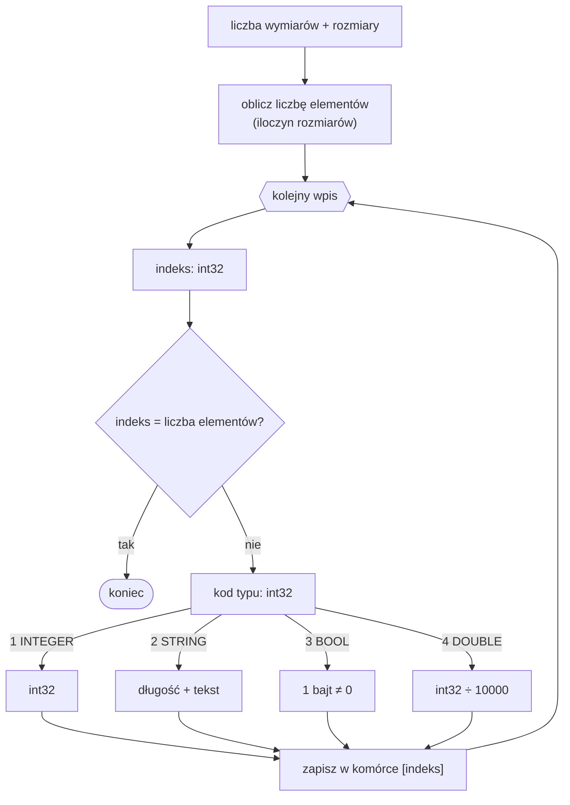

# Format MAR — tablice wielowymiarowe

Plik `.MAR` to binarny zrzut tablicy wielowymiarowej ([`MULTIARRAY`](../reference/MULTIARRAY.md)). W odróżnieniu od [`ARR`](ARR.md) jest **świadomy wymiarów** i **rzadki** (ang. *sparse*): zapisuje nagłówek z rozmiarami wymiarów, a następnie tylko te komórki, które faktycznie mają wartość. Wszystkie liczby są **little-endian**. Układ odpowiada parserowi `MultiArrayLoader` (wariant V2 — ten, który czyta emulator).

## Struktura pliku

## Nagłówek

| Pole | Typ | Opis |
|---|---|---|
| liczba wymiarów | `int32` | ile wymiarów ma tablica |
| rozmiary wymiarów | `int32 × liczba wymiarów` | rozmiar każdego wymiaru |

Łączna liczba komórek to iloczyn rozmiarów wszystkich wymiarów (`liczba elementów`). Jest ona potrzebna do rozpoznania terminatora.

## Wpisy

Po nagłówku następuje ciąg wpisów. Każdy zaczyna się od **indeksu** (`int32`):

- jeżeli `indeks == liczba elementów` → to **terminator**, koniec danych,
- jeżeli `indeks` jest poza zakresem `[0, liczba elementów)` → plik jest uszkodzony, wczytywanie się zatrzymuje,
- w przeciwnym razie po indeksie następuje **wartość** (typ + dane).

Indeks jest **płaski** (jednowymiarowy) i odwzorowuje współrzędne wielowymiarowe w porządku wierszowym (row-major).

!!! note "Format rzadki"
    Zapisywane są wyłącznie komórki, którym nadano wartość. Komórki nieobecne w pliku pozostają niewypełnione. To kluczowa różnica względem gęstego [`ARR`](ARR.md), który przechowuje wszystkie elementy po kolei.

## Typy danych

Każda wartość zaczyna się od **kodu typu** (`int32`), po którym następują dane:

| Kod | Typ | Dane |
|---:|---|---|
| `1` | `INTEGER` | `int32` |
| `2` | `STRING` | `int32` długość, a po niej tyle bajtów tekstu (UTF-8) |
| `3` | `BOOL` | `1 bajt` — `TRUE`, gdy `≠ 0` |
| `4` | `DOUBLE` | `int32` — wartość rzeczywista to liczba ÷ `10000` (stałoprzecinkowo) |

!!! warning "BOOL ma tu 1 bajt"
    W `MAR` wartość logiczna zajmuje **jeden bajt**, podczas gdy w [`ARR`](ARR.md) jest to `int32` (4 bajty). Poza tym kody typów są wspólne dla obu formatów.

## Dekodowanie

## Zobacz też

- [`MULTIARRAY`](../reference/MULTIARRAY.md) — tablica wielowymiarowa z automatycznym rozszerzaniem.
- [Format ARR](ARR.md) — gęsty, jednowymiarowy odpowiednik dla [`ARRAY`](../reference/ARRAY.md).
