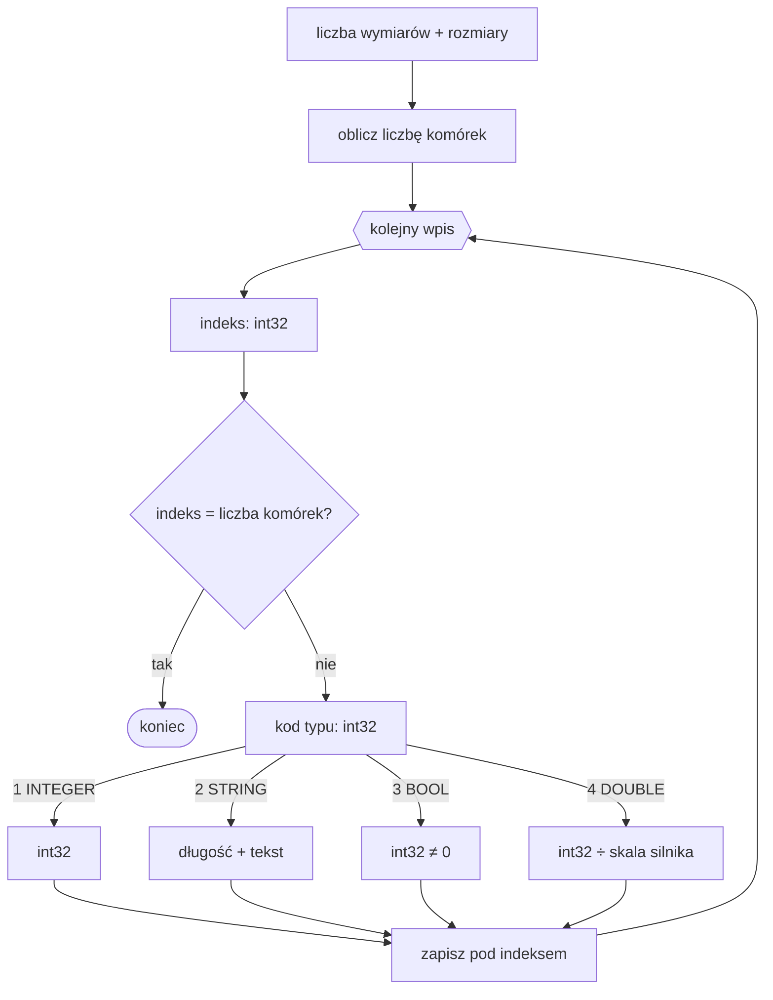

# Format MAR — tablice wielowymiarowe

Plik `.MAR` to binarny zrzut [`MULTIARRAY`](../reference/MULTIARRAY.md).
Jest świadomy wymiarów i rzadki: zapisuje nagłówek, a następnie tylko
komórki mające wartość. Wszystkie liczby są little-endian.

## Nagłówek

| Pole | Typ | Opis |
|---|---|---|
| liczba wymiarów | `int32` | liczba wymiarów tablicy |
| rozmiary | `int32 × liczba wymiarów` | rozmiar każdego wymiaru |

Łączna liczba komórek jest iloczynem rozmiarów.

## Wpisy

Każdy wpis zaczyna się płaskim indeksem (`int32`):

- indeks równy liczbie komórek jest terminatorem,
- indeks spoza zakresu oznacza uszkodzony plik,
- po poprawnym indeksie następuje kod typu i wartość.

Zapisywane są wyłącznie ustawione komórki.

## Typy danych

Kodowanie wartości jest wspólne z [`ARR`](ARR.md):

| Kod | Typ | Wartość |
|---:|---|---|
| `1` | `INTEGER` | `int32` |
| `2` | `STRING` | `int32` długość i dokładnie tyle bajtów tekstu; bez terminatora `NUL` |
| `3` | `BOOL` | `int32`; `TRUE`, gdy wartość jest niezerowa |
| `4` | `DOUBLE` | stałoprzecinkowy `int32`, dzielony przez skalę silnika |

BlooMoo używa skali `10000`, a Piklib 8 skali `1000`. `ARRAY` i
`MULTIARRAY` korzystają w oryginalnych silnikach z tych samych metod
zapisu i odczytu zmiennych.

## Dekodowanie

## Zobacz też

- [`MULTIARRAY`](../reference/MULTIARRAY.md)
- [Format ARR](ARR.md)
