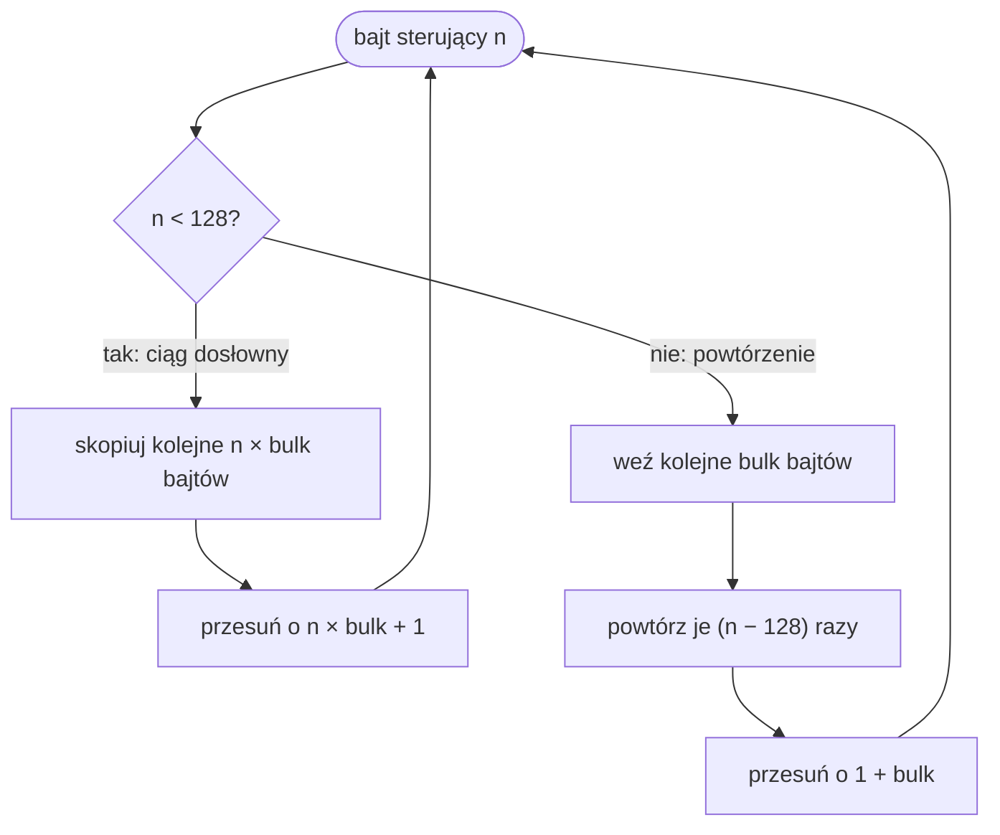
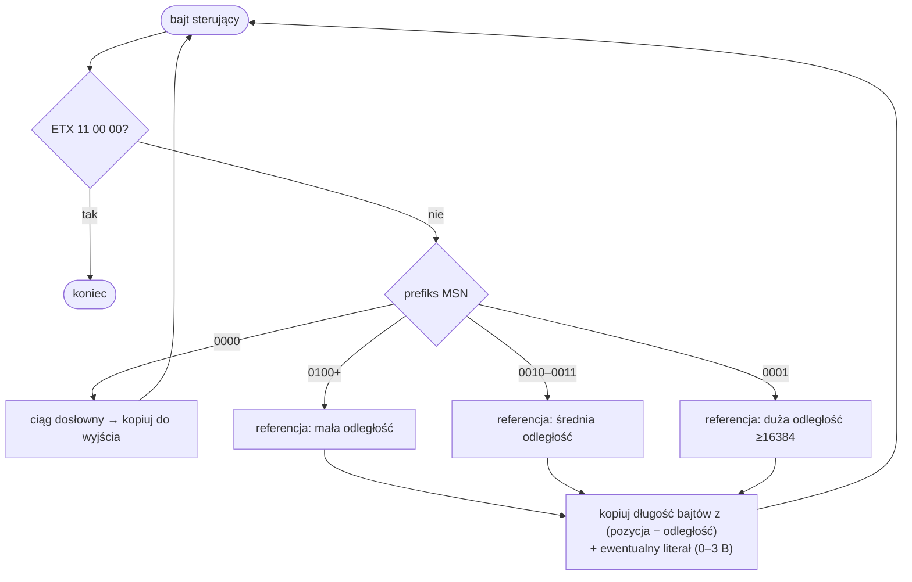

# Kompresja

Dane graficzne silnika (obrazy [`IMG`](IMG.md), klatki [`ANN`](ANN.md)) bywają kompresowane jednym z dwóch algorytmów: **CRLE** (wariant RLE) oraz **CLZW2** (schemat z rodziny LZ77). Bywają też łączone. Typ kompresji zapisany jest w metadanych pliku.

!!! note "Tylko dekompresja"
    Rex-EMoolator (jak i ten opis) zajmuje się wyłącznie **odczytem**. Kompresja po stronie silnika nie jest reimplementowana — `CLZW2Compression.compress()` celowo rzuca wyjątek „Not implemented". Algorytm CLZW2 odtworzono na podstawie reverse-engineeringu autorstwa Dove6.

## Tabela typów

Wartości typu kompresji spotykane w nagłówkach plików:

| Wartość | Znaczenie | Dekodowanie |
|---:|---|---|
| `0` | brak | dane czytane wprost |
| `2` | CLZW2 | `CLZW2` |
| `3` | CRLE + CLZW2 | najpierw `CLZW2`, potem `CRLE` |
| `4` | CRLE (w `IMG` traktowane jak `0`) | `CRLE` |
| `5` | JPEG | standardowy JPEG |

!!! tip "Kwirk IMG"
    W plikach [`IMG`](IMG.md) typ `4` jest normalizowany do `0` (brak kompresji), nie do CRLE. W [`ANN`](ANN.md) `4` oznacza CRLE.

## CRLE

CRLE to RLE z dodatkowym parametrem **`bulk`** — rozmiarem grupy bajtów kopiowanych jednorazowo (`1` domyślnie; `2` dla 16-bitowych pikseli koloru). Algorytm czyta bajt sterujący i na jego podstawie kopiuje albo powtarza dane:



- **`n < 128`** — następne `n × bulk` bajtów to dane dosłowne; kopiowane bez zmian.
- **`n ≥ 128`** — następne `bulk` bajtów stanowią wzorzec powtarzany `n − 128` razy.

!!! example "Przykład (bulk = 1)"
    `03 41 42 43` → bajt `0x03 < 128`, więc kopiowane są 3 dosłowne bajty: `41 42 43`.
    `83 FF` → bajt `0x83 ≥ 128`, `0x83 − 0x80 = 3`, więc bajt `FF` powtarzany jest 3 razy: `FF FF FF`.

## CLZW2

Wbrew nazwie z biblioteki (`CLZWCompression2`) algorytm bliższy jest **LZ77** niż klasycznemu LZW: nie ma dynamicznego słownika, a strumień składa się z ciągów dosłownych oraz **referencji wstecz** (odległość + długość) do już zdekodowanych danych. Dodatkowo używa prefiksów (nibble'i) do rozróżniania typów symboli, co optymalizuje kodowanie różnych zakresów odległości.

### Nagłówek

| Pole | Typ | Opis |
|---|---|---|
| długość zdekodowana | `uint32` LE | rozmiar danych po dekompresji |
| długość zakodowana | `uint32` LE | rozmiar skompresowanego strumienia |

Strumień kończy się znacznikiem **ETX**: bajty `11 00 00`.

!!! note "Górny limit"
    Przy 8-bajtowym nagłówku (dwa `uint32`) maksymalny rozmiar danych to `2³²` B (4 GiB) — w praktyce nieosiągalny dla zasobów gry.

### Symbole

Typ symbolu rozpoznawany jest po **najbardziej znaczącym nibble'u** bajtu sterującego. Po pierwszym ciągu dosłownym dostępne są trzy klasy referencji wstecz, zoptymalizowane pod różne zakresy odległości:

| Prefiks (MSN) | Symbol | Zakres odległości |
|---|---|---|
| `0000` | ciąg dosłowny (z rozszerzaniem długości przez zerowe bajty) | — |
| `0100`–`1111` | referencja wstecz, **mała** odległość | do ~2 KB |
| `0010`–`0011` | referencja wstecz, **średnia** odległość | do 16 KB |
| `0001` | referencja wstecz, **duża** odległość | ≥ 16384 |

Każda referencja niesie **długość** kopiowanego fragmentu, **odległość** wstecz w już zdekodowanym buforze oraz opcjonalnie krótki ciąg dosłowny tuż po niej (0–3 bajty). Bardzo długie ciągi i odległości kodowane są z rozszerzeniem przez serie bajtów zerowych. Pierwszy symbol w strumieniu (z prefiksem ≠ `0000`) traktowany jest specjalnie jako początkowy długi literał.



!!! abstract "Pełna specyfikacja bitowa"
    Dokładny układ bitów (jak z bajtu sterującego wyłuskiwane są długość, odległość i liczba kolejnych bajtów dosłownych) jest złożony — odsyłamy do implementacji `CLZW2Compression.decompress` oraz [oryginalnego dekodera Dove6](https://gist.github.com/Dove6/0d21e763919daa8b5049e20b6bdacfaa).

## Dekodowanie pikseli

Po dekompresji dane koloru są wciąż w formacie **hi-color** i trzeba je rozwinąć do RGBA8888. Bity koloru rozszerzane są przez replikację najstarszych bitów:

=== "RGB565 (16 bitów)"

    ```
    r8 = (r5 << 3) | (r5 >> 2)   // (1)
    g8 = (g6 << 2) | (g6 >> 4)
    b8 = (b5 << 3) | (b5 >> 2)
    ```

    1. 5 bitów R, 6 bitów G, 5 bitów B. Replikacja górnych bitów daje pełny zakres 0–255 bez „dziur".

=== "RGB555 (15 bitów)"

    ```
    r8 = (r5 << 3) | (r5 >> 2)
    g8 = (g5 << 3) | (g5 >> 2)
    b8 = (b5 << 3) | (b5 >> 2)
    ```

Kanał **alfa** zapisany jest osobno (jeden bajt na piksel) i dołączany do każdego piksela po rozwinięciu koloru. Jeśli pliku brak danych alfa, piksele są w pełni nieprzezroczyste (`α = 255`).

## Zobacz też

- [Szyfrowanie skryptów](encryption.md) — szyfr plików tekstowych (osobny mechanizm).
- [Format ANN](ANN.md) i [Format IMG](IMG.md) — gdzie używane są te kompresje.
- [Renderowanie](../internals/rendering.md) — co dzieje się z gotową bitmapą.
