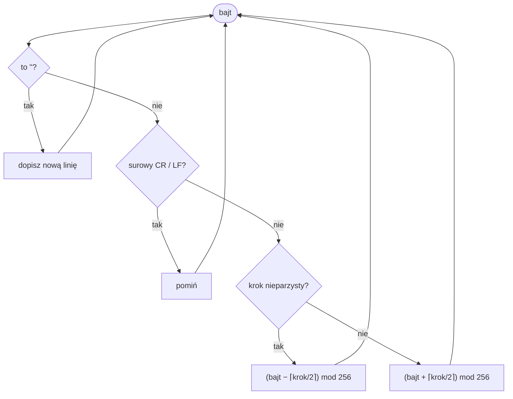

# Szyfrowanie skryptów

Skrypty silnika (`CNV`, `DEF`, `CLASS`, `SEQ`) leżą w katalogu gry jako pliki tekstowe, więc zostały zabezpieczone prostym **szyfrem przestawieniowym o zmiennym przesunięciu**. To osobny mechanizm od [kompresji](compression.md) danych graficznych — dotyczy wyłącznie tekstu skryptów.

## Wykrywanie

Plik zaszyfrowany rozpoczyna się nagłówkiem w pierwszej linii:

```
{<C:6>}
```

Parser ([`CNVParser`](../engine/scripts.md)) rozbiera go, usuwając `{<` i `>}` i dzieląc resztę na dwukropku:

| Pole | Znaczenie |
|---|---|
| kierunek | litera `C` lub `D` |
| offset | liczba (np. `6`) |

Kierunek `D` powoduje **negację** offsetu (`offset = -offset`). Pliki bez tego nagłówka czytane są bezpośrednio, jako zwykły tekst.

!!! note "W praktyce"
    Skrypty gier były szyfrowane z parametrami `{<C:6>}` — czyli offset `6`.

## Algorytm

Deszyfrowanie działa **bajt po bajcie** — szyfr operuje w przestrzeni bajtów, nie znaków:

- surowe `\r`/`\n` w pliku są **pomijane** (to formatowanie, nie szyfrogram),
- znacznik `<E>` oznacza znak nowej linii (`\n`),
- każdy pozostały bajt zwiększa licznik kroku i jest przesuwany: kroki **nieparzyste odejmują**, **parzyste dodają** przesunięcie o wartości `⌈krok / 2⌉`, a licznik kroku zawija się przy `offset`,
- wynik brany jest **modulo 256** (zawinięcie do bajtu),
- kierunek `D` odwraca znak przesunięcia,
- odszyfrowane bajty interpretowane są jako **windows-1250**.



Dla najczęstszego `{<C:6>}` efektywna sekwencja przesunięć powtarza się co sześć bajtów:

```
−1, +1, −2, +2, −3, +3,  −1, +1, −2, +2, −3, +3, …
```

!!! tip "Dlaczego modulo 256"
    Sekret poprawności to arytmetyka w przestrzeni bajtów: szyfrogram czytany jest jako **surowe bajty**, a każdy wynik zawijany **modulo 256**. Dzięki temu dekoder jest niezależny od platformy. Wcześniejsza implementacja liczyła na znakach zdekodowanych charsetem (gdzie arytmetyka nie zawija się na 256), przez co powstawały platformowe artefakty — inne błędne wartości na Windows i Linux — „naprawiane" ręcznym remapowaniem magicznych liczb. Przy operowaniu na bajtach te obejścia są zbędne.

## Zobacz też

- [Skrypty](../engine/scripts.md) — składnia i wczytywanie odszyfrowanych skryptów.
- [Kompresja](compression.md) — niezależny mechanizm dla danych graficznych.
