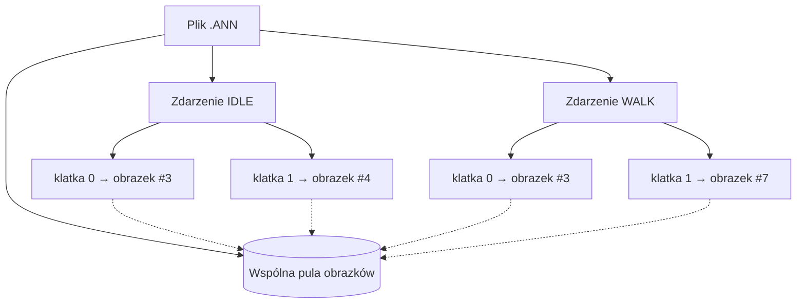
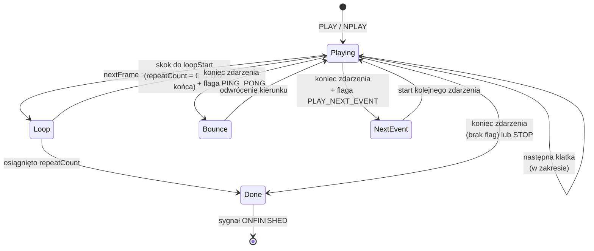

# System animacji

Animacja ([`ANIMO`](../reference/ANIMO.md)) to najbardziej rozbudowany obiekt graficzny silnika. Wczytywana jest z pliku [`.ANN`](../formats/ANN.md) i odtwarzana na [zegarze silnika](loop.md#zegar-silnika), klatka po klatce. Ten rozdział opisuje model danych animacji, jej zegar odtwarzania, maszynę stanów oraz sposób, w jaki animacja trafia na ekran.

## Model danych: zdarzenia i klatki

Animacja składa się ze **zdarzeń** (ang. *events*), a każde zdarzenie to sekwencja **klatek** (ang. *frames*). „Zdarzenie" to w praktyce nazwana sekwencja — np. `IDLE`, `WALK`, `SPI` — którą skrypt odtwarza po nazwie.



!!! note "Klatki współdzielą obrazki"
    Klatki nie przechowują własnych bitmap — każda wskazuje **indeks** w jednej, wspólnej puli obrazków pliku. Ten sam obrazek może być użyty w wielu zdarzeniach i wielokrotnie w jednym zdarzeniu. Stąd dwa rodzaje numeracji:

    - **indeks globalny** — pozycja obrazka w puli całego pliku (zwraca go [`GETFRAME`](../reference/ANIMO.md#getframe)),
    - **indeks w zdarzeniu** — pozycja klatki wewnątrz aktualnego zdarzenia, liczona od `0` (zwraca go [`GETCFRAMEINEVENT`](../reference/ANIMO.md#getcframeinevent)).

Szczegóły binarnego układu tych struktur opisuje [format pliku `.ANN`](../formats/ANN.md).

## Zegar odtwarzania

Tempo animacji określa pole **FPS** (domyślnie `15`, zmieniane przez [`SETFPS`](../reference/ANIMO.md#setfps)). Czas trwania jednej klatki to:

```java
framePeriodMs = 1000 / fps   // (1)
```

1. Dzielenie **całkowite** — przy 15 FPS klatka trwa `66 ms` (a nie `66,67`), przy 30 FPS `33 ms`, przy 60 FPS `16 ms`. Drobne błędy zaokrąglenia kumulują się tym samym co w oryginalnym silniku.

Co krok aktualizacji silnik sprawdza, czy od ostatniej zmiany klatki minęło co najmniej `framePeriodMs`:

- jeśli **tak** — przesuwa o **dokładnie jedną** klatkę i zapamiętuje bieżący [czas silnika](loop.md#zegar-silnika) (bez przenoszenia reszty),
- jeśli **nie** — nic nie robi.

!!! tip "Zachowanie zgodne z oryginałem (`CAnimationManager::domodal`)"
    Klasy `CAnimationManager` oraz `CAnimo`/`CAnimo6` i ich metody `domodal` istnieją w `bloomoodll.dll` (potwierdzone dekompilacją) — poniższy opis odwzorowuje ich zachowanie. [`PLAY`](../reference/ANIMO.md#play) **nie zeruje zegara animacji**. Dzięki temu „zimny start" (pierwsze odtworzenie) tyka natychmiast, a `PLAY` wywołane tuż po poprzednim odczekuje do końca bieżącego okna klatki. Na jeden krok silnika przypada najwyżej jedno przejście klatki — animacja nigdy nie „przeskakuje" kilku klatek naraz, nawet jeśli klatka renderowania trwała długo.

## Maszyna stanów odtwarzania

Po wyznaczeniu kolejnej klatki silnik decyduje, czy zapętlić, odbić, przejść do następnego zdarzenia, czy zakończyć:



Zachowanie na granicy zdarzenia sterowane jest **flagami** zapisanymi w pliku `.ANN` (pole `flags` zdarzenia):

| Flaga | Wartość | Znaczenie |
|---|---|---|
| `FLAG_PING_PONG` | `0x20000` | po dojściu do końca sekwencja gra wstecz (efekt „tam i z powrotem") |
| `FLAG_PLAY_NEXT_EVENT` | `0x800000` | po zakończeniu zdarzenia automatycznie startuje kolejne zdarzenie z pliku |
| `FLAG_WAIT_FOR_SFX` | `0x100000` | synchronizacja z dźwiękiem przypisanym do klatek |

Zapętlanie sterują z kolei pola `loopStart`, `loopEnd` i `repeatCount`:

- pętla aktywuje się, gdy następna klatka **przekroczy** `loopEnd` (idąc do przodu) — wtedy następuje skok do `loopStart`,
- `repeatCount = 0` oznacza **pętlę nieskończoną**; wartość dodatnia ogranicza liczbę powtórzeń, po czym zdarzenie się kończy.

## Pozycja klatki na ekranie

Renderer rysuje aktualną klatkę w prostokącie wyliczanym z **trzech** składników:

```
pozycja = pozycja_bazowa (SETPOSITION)
        + offset_klatki   (per-frame, z pliku .ANN)
        + offset_obrazka  (per-image, z pliku .ANN)
```

- **Pozycja bazowa** — ustawiana skryptem ([`SETPOSITION`](../reference/ANIMO.md#setposition), [`MOVE`](../reference/ANIMO.md#move)).
- **Offset klatki** — przesunięcie zapisane przy konkretnej klatce zdarzenia; pozwala animacji „chodzić" po ekranie bez ruszania pozycji bazowej.
- **Offset obrazka** — przesunięcie zapisane przy samym obrazku w puli.

!!! warning "Kotwica odejmuje, nie dodaje"
    [`SETANCHOR`](../reference/ANIMO.md#setanchor) **odejmuje** współrzędne kotwicy od argumentów `SETPOSITION` (a nie dodaje, jak można by oczekiwać). To utrwalone zachowanie oryginalnego silnika — najpewniej pierwotnie pomyłka znaku, do której dostosowano skrypty i offsety w plikach. Szerzej w opisie [`SETANCHOR`](../reference/ANIMO.md#setanchor).

Wyliczona pozycja trafia do renderera, który dokonuje jeszcze [odbicia osi Y](rendering.md#uklad-wspolrzednych-i-odbicie-osi-y).

## Dźwięk przypisany do klatek

Klatka może mieć przypisaną listę plików dźwiękowych (pole SFX w `.ANN`). Jeśli klatka ma niezerowy „seed", silnik wybiera z listy efekt do odtworzenia w momencie pokazania klatki — stąd np. losowo brzmiące kroki postaci. Flaga `FLAG_WAIT_FOR_SFX` pozwala zsynchronizować postęp animacji z odtwarzaniem dźwięku.

## Cykl życia i sygnały

W trakcie odtwarzania animacja emituje sygnały, do których skrypt może podpiąć obsługę:

| Sygnał | Kiedy |
|---|---|
| [`ONSTARTED`](../reference/ANIMO.md#onstarted) | po rozpoczęciu odtwarzania zdarzenia |
| [`ONFIRSTFRAME`](../reference/ANIMO.md#onfirstframe) | po pokazaniu pierwszej klatki zdarzenia |
| [`ONFRAMECHANGED`](../reference/ANIMO.md#onframechanged) | przy każdej zmianie klatki |
| [`ONFINISHED`](../reference/ANIMO.md#onfinished) | po zakończeniu zdarzenia (parametryzowany jego nazwą) |
| [`ONDONE`](../reference/ANIMO.md#ondone) | po wyczerpaniu wszystkich zdarzeń animacji |

`ONFINISHED` jest [parametryzowany nazwą zdarzenia](../engine/events.md#sygnaly-parametryzowane), więc można podpiąć obsługę dla konkretnej sekwencji:

```
ANIMACJA:ONFINISHED^IDLE=BEHAFTERIDLE
```

## Animacja jako element interaktywny

Animacja może też pełnić rolę przycisku i uczestniczyć w detekcji kolizji:

- [`SETASBUTTON`](../reference/ANIMO.md#setasbutton) zamienia ją w klikalny element (`ONCLICK`, `ONFOCUSON`, `ONFOCUSOFF`, `ONRELEASE`),
- [`MONITORCOLLISION`](../reference/ANIMO.md#monitorcollision-1) włącza ją do sprawdzania kolizji z innymi obiektami (`ONCOLLISION`, `ONCOLLISIONFINISHED`), opcjonalnie z uwzględnieniem kanału alfa.

Kolizje liczone są w kroku aktualizacji [pętli](loop.md#staly-krok-czasowy), po przeliczeniu klatek animacji.

## Powiązane tematy

- [`ANIMO`](../reference/ANIMO.md) — pełna referencja pól, metod i sygnałów.
- [Format `.ANN`](../formats/ANN.md) — binarny układ zdarzeń, klatek i obrazków.
- [Renderowanie](rendering.md) — jak bitmapa klatki trafia na kanwę.
- [Pętla i zegar silnika](loop.md) — źródło czasu dla animacji.
