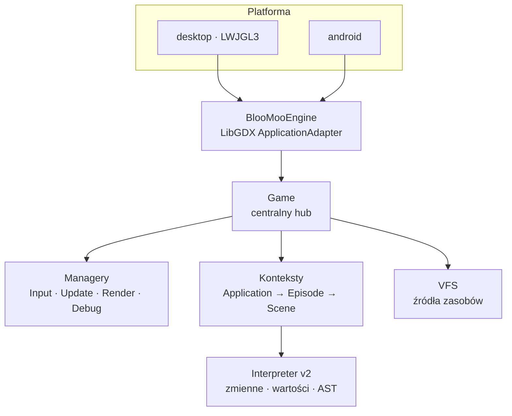
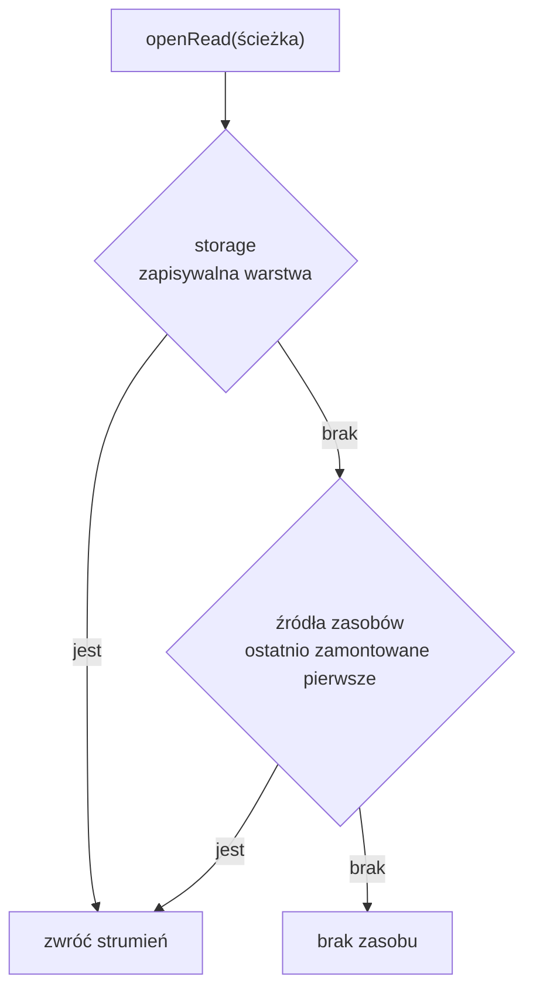
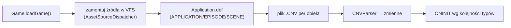

# Architektura

Ten rozdział daje mapę całości: z jakich warstw zbudowany jest Rex-EMoolator, jak rozdzielone są odpowiedzialności i jak dane płyną od pliku na dysku do obiektu na ekranie. Szczegóły poszczególnych podsystemów mają własne rozdziały — tu chodzi o obraz z lotu ptaka.

## Warstwy



Projekt dzieli się na trzy moduły Gradle:

| Moduł | Rola |
|---|---|
| **core** | cała logika emulatora (Java 21) — interpreter, managery, loadery, VFS |
| **desktop** | launcher na LWJGL3 |
| **android** | launcher na Androida (API 24+) |

Warstwa silnika (`engine/`) celowo **nie zależy** od konkretnych klas interpretera — rozmawia z nim przez interfejs [`GameContext`](#konteksty-i-hierarchia) i typ `EngineVariable`. Dzięki temu managery operują na obiektach gry, nie znając ich wewnętrznej reprezentacji.

## Bootstrap i pętla

`BlooMooEngine` (klasa `ApplicationAdapter` LibGDX) w `create()` stawia `SpriteBatch`, kamerę ortograficzną i [viewport](rendering.md) 800×600, po czym tworzy `Game` oraz cztery managery. Każda klatka to przejście `render()`: **Input → Update → Render → Debug**, ze stanem gry posuwanym [stałym krokiem 60 Hz](loop.md).

Szczegóły rytmu klatki opisuje [Pętla i zegar silnika](loop.md).

## Game — centralny hub

Klasa `Game` spina wszystko, co składa się na działającą grę. To ona jest „właścicielem" stanu:

<div class="grid cards" markdown>

- :material-folder-network: **Zasoby** — instancja [VFS](#vfs-wirtualny-system-plikow) i bieżący katalog danych (`DANE`).
- :material-file-tree: **Konteksty** — `definitionContext` (root) oraz bieżące konteksty Application / Episode / Scene.
- :material-map-marker-path: **Stan sceny** — aktualny epizod i scena, zmienne `APPLICATION`/`EPISODE`/`SCENE`, tło, język (`POL` domyślnie).
- :material-clock-outline: **Zegar** — monotoniczny [zegar silnika](loop.md#zegar-silnika) (`engineTimeMsAccum`).
- :material-vector-intersection: **Kolizje** — `QuadTree` (800×600), zbiór monitorowanych obiektów i mapa kolizji.
- :material-music: **Audio i kanwa** — cache muzyki, [grafiki wklejone](rendering.md), zrzut ostatniej klatki dla `CANVAS_OBSERVER`.

</div>

## Managery

Logika klatki rozdzielona jest na managery o jasnych odpowiedzialnościach (wzorzec zbliżony do MVC):

| Manager | Odpowiedzialność |
|---|---|
| `InputManager` | mysz i klawiatura → sygnały |
| `UpdateManager` | postęp stanu gry; deleguje do pod-managerów |
| `RenderManager` | rysowanie sceny (patrz [Renderowanie](rendering.md)) |
| `DebugManager` | nakładka diagnostyczna |

`UpdateManager` dzieli pracę kroku na cztery pod-managery: **Timer**, **Animation**, **Collision**, **Audio** — wykonywane w tej kolejności po posunięciu [zegara](loop.md#zegar-silnika).

## Konteksty i hierarchia

Zmienne (obiekty zdefiniowane w skryptach) żyją w **kontekstach** ułożonych hierarchicznie. Kontekst niższego poziomu widzi swoje zmienne oraz zmienne wszystkich przodków — ale nie odwrotnie:

```mermaid
flowchart TD
    A["definitionContext (root)"] --> APP["Application"]
    APP --> EP["Episode"]
    EP --> SC["Scene"]
    SC -. "widzi w górę" .-> EP -. .-> APP
```

Każdy `Context` zbudowany jest przez **kompozycję** wyspecjalizowanych części:

| Część | Rola |
|---|---|
| `ExecutionContext` | stos wywołań, zmienne lokalne (`THIS`, `$1`–`$N`, `_I_`) |
| `VariableStore` | obiekty zadeklarowane w tym kontekście |
| `VariableResolver` | logika wyszukiwania w hierarchii + buforowane widoki typów |
| `AttributeStore` | surowe atrybuty wczytane ze skryptu |
| `CloneRegistry` | rejestr sklonowanych obiektów (`CLONE`) |

Wyszukanie zmiennej idzie: zmienne lokalne wykonania → lokalny `VariableStore` → konteksty dodatkowe → łańcuch rodziców. Dla managerów `VariableResolver` utrzymuje **buforowane widoki** zbiorące pod uwagę całą hierarchię — np. „wszystkie obiekty graficzne sceny", „wszystkie timery" — żeby render i update nie musiały co klatkę przeszukiwać drzewa.

Kolejność wczytywania skryptów i inicjalizacji obiektów opisuje rozdział [Skrypty](../engine/scripts.md#kolejnosc-wczytywania-skryptow).

## Zmienne i wartości (interpreter v2)

Reprezentacja danych w skryptach opiera się na **interfejsach zapieczętowanych** (sealed) z wyczerpującym dopasowaniem wzorców:

- **`Variable`** — każdy typ skryptowy ([`INTEGER`](../reference/INTEGER.md), [`STRING`](../reference/STRING.md), [`ANIMO`](../reference/ANIMO.md), [`TIMER`](../reference/TIMER.md), …). Zmienne są **niemutowalne** — `withValue()` zwraca nową instancję (z wyjątkami stanu mutowalnego oznaczonego wewnętrznie, jak stan animacji czy timera).
- **`Value`** — wartości prymitywne (`IntValue`, `DoubleValue`, `StringValue`, `BoolValue`) z metodami konwersji typów.
- **`MethodSpec` / `MethodResult`** — deklaratywne definicje metod. Metoda zamiast bezpośrednio zmieniać świat zwraca **efekty** (np. `CloneEffect`, `AddBehaviourEffect`), które wykonuje runtime.

Skrypty parsowane są przez ANTLR do drzewa AST, które wykonuje `ASTInterpreter`. Składnię języka opisuje rozdział [Skrypty](../engine/scripts.md), a pełny spis typów — [Referencja typów](../reference/index.md).

## VFS — wirtualny system plików

Dostęp do zasobów gry idzie przez `VFS`, który warstwuje kilka źródeł i ukrywa, skąd faktycznie pochodzi plik:



- **Źródła zasobów** montowane są przez `AssetSourceDispatcher` w zależności od typu: katalog → `LocalFileSystem`, plik `.iso` → `IsoFileSystem`, `.zip` → `ZipFileSystem`. Źródła zamontowane później mają wyższy priorytet.
- **Storage** to jedyna warstwa zapisywalna (zapisy gry, pliki tymczasowe); nadpisuje dane gry przy odczycie.
- **Język** — jeśli ustawiony, każda warstwa jest najpierw sprawdzana ze ścieżką `<język>/<ścieżka>`, a dopiero potem z gołą ścieżką. Odtwarza to konwencję lokalizacji oryginału (zobacz [`APPLICATION.SETLANGUAGE`](../reference/APPLICATION.md)).

## Potok ładowania gry



Ładowanie startuje od `Application.def` w katalogu `DANE`, a następnie wczytuje pliki `.CNV` dla aplikacji, pierwszego epizodu i pierwszej sceny. Pełną kolejność (i fazy inicjalizacji `ONINIT` / `__ONINIT__`) opisuje [Skrypty → Kolejność wczytywania](../engine/scripts.md#kolejnosc-wczytywania-skryptow).

!!! note "GameLoader to dziś pusty stub"
    Mimo nazwy, logika ładowania mieszka w `Game` (`scanGameDirectory`, `CNVParser`), a nie w klasie `loader/GameLoader`. To miejsce na przyszły refaktor, nie osobny podsystem.

## Powiązane tematy

- [Pętla i zegar silnika](loop.md) — dynamika klatki.
- [Renderowanie](rendering.md), [System animacji](animation.md), [Czas i timery](timers.md) — poszczególne podsystemy.
- [Skrypty](../engine/scripts.md) — język, hierarchia i kolejność wczytywania.
