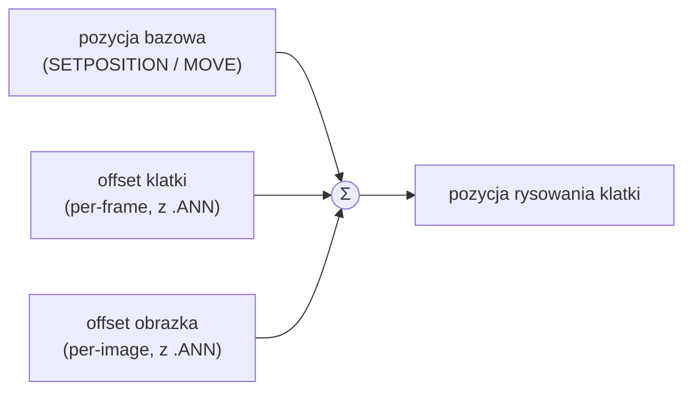

# Współrzędne i kotwice

Wszystkie obiekty graficzne i interaktywne silnika żyją w jednym, stałym układzie współrzędnych. Ten rozdział opisuje ten układ, dwa sposoby pozycjonowania (bezwzględny i względny) oraz **kotwice** — mechanizm, który w Piklib/BlooMoo zachowuje się nieintuicyjnie i bywa źródłem pomyłek.

## Kanwa i układ współrzędnych

Jednostką odniesienia jest **wirtualna kanwa 800×600 px** o stałym rozmiarze. Początek układu `(0, 0)` leży w **lewym górnym rogu**, a oś Y rośnie **w dół** — tak jak w większości API 2D z epoki.

```
(0,0) ────────────── x → 799
  │  ┌───────────┐
  │  │  ▢ obiekt  │
  y  └───────────┘
  ↓
 599
```

Wszystkie współrzędne na poziomie skryptu — `SETPOSITION`, `GETPOSITIONX`, pozycja myszy, `RECT` przycisku — wyrażone są w tym układzie. To, że renderer odbija oś Y przy rysowaniu (LibGDX ma początek w lewym dolnym rogu), jest wyłącznie szczegółem implementacyjnym i nie ujawnia się w skryptach — patrz [odbicie osi Y](rendering.md#uklad-wspolrzednych-i-odbicie-osi-y).

## Pozycjonowanie bezwzględne i względne

Silnik łączy dwa sposoby umiejscawiania obiektów:

=== "Bezwzględne"

    Pozycja wprost na kanwie — baza do dalszych obliczeń. Używane przez:

    - [`SETPOSITION(x, y)`](../reference/ANIMO.md#setposition) w [`ANIMO`](../reference/ANIMO.md) i [`IMAGE`](../reference/IMAGE.md),
    - prostokąt `RECT` przycisku ([`BUTTON`](../reference/BUTTON.md)),
    - odczyt pozycji [`MOUSE`](../reference/MOUSE.md).

=== "Względne"

    Przesunięcia względem miejsca, gdzie obiekt „powinien" być. Używane głównie przez [`ANIMO`](../reference/ANIMO.md): pozwalają animacji przemieszczać się po ekranie w trakcie odtwarzania, bez wywoływania `SETPOSITION`.

## Składanie pozycji animacji

Pozycja, w której renderer rysuje klatkę animacji, to **suma trzech** składników:



- **Pozycja bazowa** — ustawiana skryptem; punkt zaczepienia obiektu na kanwie.
- **Offset klatki** — przesunięcie zapisane przy danej klatce zdarzenia ([`.ANN`](../formats/ANN.md)); to ono daje wrażenie ruchu „wewnątrz" animacji.
- **Offset obrazka** — przesunięcie zapisane przy samym obrazku w puli.

Szczegóły odtwarzania opisuje [System animacji](animation.md#pozycja-klatki-na-ekranie).

!!! note "IMAGE: offset to pozycja startowa"
    W [`IMAGE`](../reference/IMAGE.md) offset z nagłówka [`.IMG`](../formats/IMG.md) działa inaczej niż w animacji — staje się **bezwzględną pozycją startową** obrazu i nie wpływa już na dalsze pozycjonowanie.

## Kotwice

Domyślnie obiekt pozycjonowany jest względem swojego **lewego górnego rogu** — `SETPOSITION(400, 300)` umieszcza tam właśnie ten róg. Kotwica ([`SETANCHOR`](../reference/ANIMO.md#setanchor)) pozwala przenieść punkt zaczepienia w inne miejsce, np. środek obiektu.

!!! warning "Kotwica jest odejmowana, nie dodawana"
    To najważniejszy haczyk. `SETANCHOR` nie *dodaje* przesunięcia do pozycji — jej współrzędne są **odejmowane** od argumentów `SETPOSITION`:

    ```
    posX = x − anchorX
    posY = y − anchorY
    ```

    Przykład: po `SETANCHOR(200, 300)` wywołanie `SETPOSITION(400, 500)` ustawia obiekt na `(200, 200)`, a nie `(600, 800)`. To utrwalone zachowanie oryginalnego silnika — najpewniej pierwotnie pomyłka znaku, do której dostosowano offsety w plikach `.ANN` i w skryptach gry.

### Kotwice nazwane

Wariant `SETANCHOR(nazwa)` wylicza punkt kotwicy z **bounding boxa bieżącej klatki**:

| Nazwa | Punkt kotwicy |
|---|---|
| `CENTER` | środek |
| `LEFTUPPER` | lewy górny róg |
| `RIGHTUPPER` | prawy górny róg |
| `LEFTLOWER` | lewy dolny róg |
| `RIGHTLOWER` | prawy dolny róg |
| `LEFT` | środek lewej krawędzi |
| `RIGHT` | środek prawej krawędzi |
| `TOP` | środek górnej krawędzi |
| `BOTTOM` | środek dolnej krawędzi |

Wariant `SETANCHOR(x, y)` ustawia współrzędne kotwicy wprost.

!!! tip "Kotwice dolne bywają kłopotliwe"
    Kotwice odwołujące się do dolnej krawędzi (`LEFTLOWER`, `RIGHTLOWER`, `BOTTOM`) wchodzą w interakcję z odbiciem osi Y w przestrzeni renderowania. W praktyce najpewniejsze i najczęściej używane są `CENTER` oraz `LEFTUPPER`; przy dolnych warto zweryfikować wynik wizualnie.

## Mysz i przyciski

Pozycja kursora ([`MOUSE`](../reference/MOUSE.md)) raportowana jest w tym samym układzie 800×600 z początkiem w lewym górnym rogu, co pozycje obiektów — dlatego współrzędne myszy można podawać wprost do `SETPOSITION`. Obszar klikalny przycisku ([`BUTTON`](../reference/BUTTON.md)) definiuje prostokąt `RECT` w tej samej przestrzeni.

## Powiązane tematy

- [Renderowanie](rendering.md#uklad-wspolrzednych-i-odbicie-osi-y) — odbicie osi Y przy rysowaniu.
- [System animacji](animation.md#pozycja-klatki-na-ekranie) — offsety klatek i obrazków.
- Referencja: [`ANIMO`](../reference/ANIMO.md), [`IMAGE`](../reference/IMAGE.md), [`MOUSE`](../reference/MOUSE.md), [`BUTTON`](../reference/BUTTON.md).
