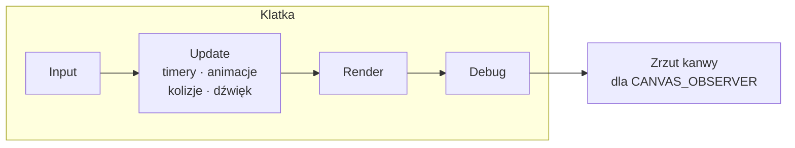

# Wnętrze silnika

Ten dział opisuje, **jak silnik działa pod spodem** — w odróżnieniu od działu [Silnik](../engine/index.md), który dotyczy języka skryptowego widzianego przez autora treści. Znajdziesz tu opis pętli gry, renderowania, systemu animacji oraz czasu i timerów, oparty na faktycznej implementacji Rex-EMoolatora i — tam, gdzie to możliwe — zestawiony z zachowaniem oryginalnego silnika.

## Jedna klatka w pigułce

Wszystko kręci się wokół jednej pętli wywoływanej raz na klatkę. Cztery managery przetwarzają ją w stałej kolejności, a stan gry posuwany jest [stałym krokiem 60 Hz](loop.md#staly-krok-czasowy):

## Rozdziały

-   :material-sync:{ .lg .middle } __Pętla i zegar silnika__

    ---

    Stały krok 60 Hz, akumulator czasu, model MVC i monotoniczny zegar silnika. Fundament, na którym opiera się reszta działu.

    [:octicons-arrow-right-24: Czytaj](loop.md)

-   :material-image-multiple:{ .lg .middle } __Renderowanie__

    ---

    Potok rysowania klatki, priorytety, odbicie osi Y, przycinanie i maski alfa — oraz jak render działał w oryginale (DirectDraw, dirty rects).

    [:octicons-arrow-right-24: Czytaj](rendering.md)

-   :material-animation-play:{ .lg .middle } __System animacji__

    ---

    Model zdarzeń i klatek, zegar odtwarzania, maszyna stanów (pętle, ping-pong, łańcuchy zdarzeń) i pozycjonowanie klatek.

    [:octicons-arrow-right-24: Czytaj](animation.md)

-   :material-timer-outline:{ .lg .middle } __Czas i timery__

    ---

    Jak `TIMER` liczy czas na zegarze silnika, logika sygnału `ONTICK` i pułapki metod `ENABLE`/`SET`/`SETELAPSE`.

    [:octicons-arrow-right-24: Czytaj](timers.md)

## Zobacz też

- [Formaty plików](../formats/index.md) — jak na dysku zakodowane są dane, które te systemy wczytują.
- [Referencja typów](../reference/index.md) — pełny spis obiektów dostępnych w skryptach.
