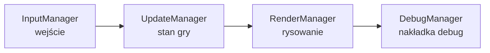
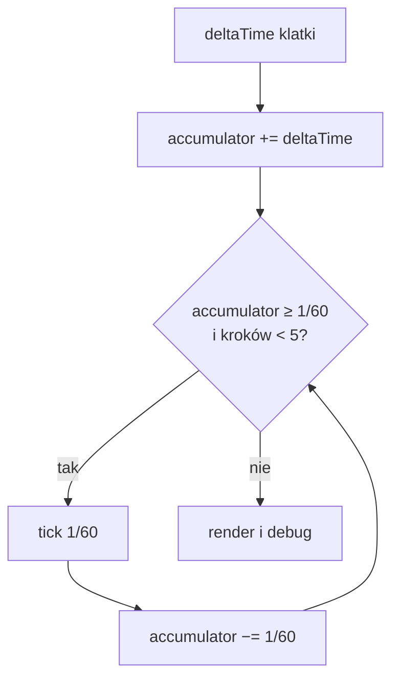

# Pętla i zegar silnika

Cała gra napędzana jest jedną pętlą: LibGDX wywołuje metodę `render()` raz na klatkę, a ta przepuszcza sterowanie przez cztery podsystemy w stałej kolejności. Ten rozdział opisuje tę pętlę, sposób, w jaki silnik utrzymuje **niezależny od liczby klatek** zegar gry, oraz tryby pauzy i krokowania.

## Model MVC

Każda klatka to przejście przez cztery managery — w tej kolejności:



1. **Input** — przetworzenie myszy i klawiatury, wyemitowanie wynikających z nich sygnałów.
2. **Update** — postęp stanu gry: [timery](timers.md), [animacje](animation.md), kolizje i dźwięk.
3. **Render** — narysowanie sceny (patrz [Renderowanie](rendering.md)).
4. **Debug** — opcjonalna nakładka diagnostyczna (FPS, podgląd obiektów).

Na końcu klatki wykonywany jest jeszcze zrzut ekranu na potrzeby [`CANVAS_OBSERVER`](../reference/CANVAS_OBSERVER.md), który udostępnia skryptom aktualny obraz kanwy.

## Stały krok czasowy {#staly-krok-czasowy}

Najważniejsza decyzja projektowa pętli: **wejście i renderowanie biegną z prędkością klatek monitora, ale stan gry aktualizowany jest stałym krokiem 60 Hz** (`TICK = 1/60 s`).

!!! info "Dlaczego nie po prostu `deltaTime`?"
    Stały krok daje **determinizm i powtarzalność** — stan gry ewoluuje identycznie niezależnie od liczby klatek na sekundę, co ułatwia testy i odtwarzanie błędów. Gdyby Rex-EMoolator aktualizował stan wprost o zmienny `deltaTime` klatki, animacje i timery rozjeżdżałyby się na szybszym i wolniejszym sprzęcie.

!!! quote "Jak robił to oryginał"
    Oryginał działał inaczej. Dekompilacja `bloomoodll.dll` pokazuje, że silnik mierzył **realny czas każdej klatki** zegarem wysokiej rozdzielczości (`QueryPerformanceCounter`, klasa `CHiResTimer` — globalne `appTime`, `frameTime`, `fps`) i posuwał logikę o tę **zmienną deltę**. Zaplanowane zdarzenia i skryptowe [timery](timers.md) obsługiwał osobny mechanizm multimedialnych timerów Win32 (`timeSetEvent`, klasy `CXTimer`/`CTimerNotificator`). Stały krok 60 Hz to więc **świadoma decyzja emulatora** dla determinizmu, a nie odtworzenie zachowania oryginału, który sztywnego ticka nie miał.

Realizuje to klasyczny **akumulator** (wzorzec *„Fix Your Timestep!"*): czas każdej klatki dokładany jest do akumulatora, z którego silnik „wypłaca" pełne kroki po `1/60 s`.



- **`MAX_STEPS = 5`** — w jednej klatce wykonuje się najwyżej 5 kroków aktualizacji. Jeśli klatka mocno utknie (np. zacięcie systemu), nadmiar czasu jest **porzucany** zamiast nadrabiany. To zabezpieczenie przed *spiralą śmierci*, w której coraz dłuższe klatki generują coraz więcej kroków do nadrobienia.
- Przy typowych 60 FPS na klatkę przypada dokładnie jeden krok; przy 144 FPS — średnio co druga–trzecia klatka wykonuje krok; przy spadku do 30 FPS — po dwa kroki na klatkę.

## Zegar silnika

Aktualizacje **nie korzystają z zegara ściennego** (czasu systemowego). Każdy krok dokłada `TICK` do monotonicznego **zegara silnika**, liczonego w milisekundach:

```java
public void tick(float fixedDt) {
    game.advanceEngineTime(fixedDt);      // (1)
    updateTimers(game.getEngineTimeMs()); // (2)
    updateAnimations(game.getEngineTimeMs());
    updateCollisions();
    updateAudio(fixedDt);
}
```

1. Posuwa zegar silnika o stały krok (~16,67 ms).
2. [Timery](timers.md) i [animacje](animation.md) dostają **bieżący czas silnika**, a nie czas systemowy — dzięki temu są w pełni deterministyczne i zatrzymują się razem z pauzą.

Kolejność wewnątrz kroku jest stała: **czas → timery → animacje → kolizje → dźwięk**.

!!! tip "Konsekwencja dla skryptów"
    Ponieważ wszystko mierzy ten sam zegar, [timer](../reference/TIMER.md) ustawiony na `1000 ms` wyemituje `ONTICK` po dokładnie 60 krokach — niezależnie od tego, czy gra chodzi w 30, czy w 240 FPS.

## Pauza i krokowanie

Pętla obsługuje dwa tryby diagnostyczne sterowane przez `EngineConfig`:

| Tryb | Zachowanie |
|---|---|
| **Pauza** (`paused`) | `deltaTime` jest zerowany — stan gry stoi, ale klatki nadal się rysują (można obracać kamerą debug, oglądać scenę). |
| **Krok klatki** (`stepFrame`) | Wymusza dokładnie **jeden** krok `TICK` i z powrotem wpada w pauzę. Pozwala przewijać grę klatka po klatce. |

W trybie kroku akumulator jest pomijany — wykonywany jest pojedynczy, izolowany `tick(TICK)`, co ułatwia analizę pojedynczej zmiany stanu.

## Powiązane tematy

- [Renderowanie](rendering.md) — co dzieje się w kroku „Render".
- [System animacji](animation.md) — jak animacje korzystają z zegara silnika.
- [Czas i timery](timers.md) — `TIMER` i sygnał `ONTICK` na zegarze silnika.
