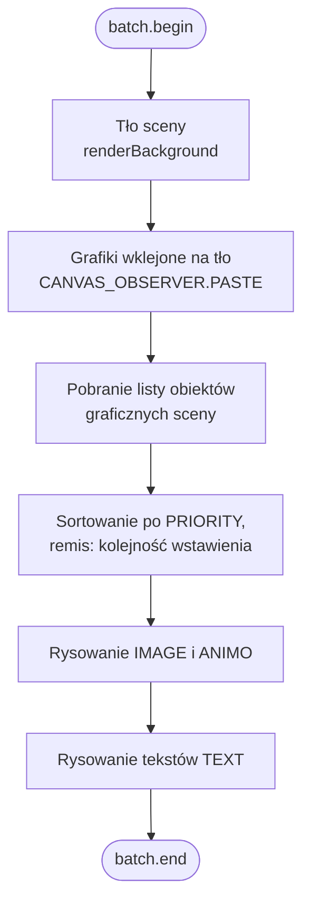
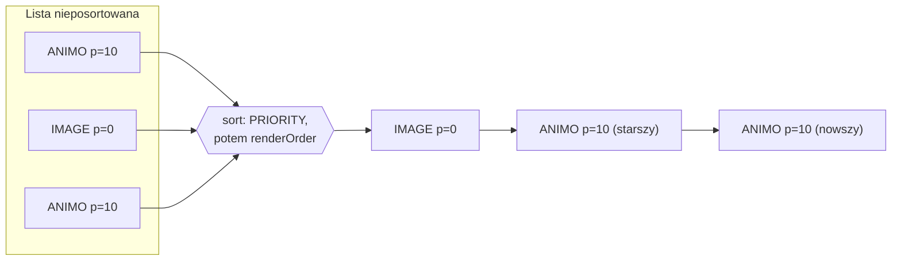
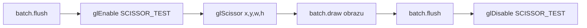

# Renderowanie

Silnik rysuje całą scenę **od nowa w każdej klatce** (ang. *immediate mode*). Nie ma tu pojęcia trwałego „obiektu na ekranie", który silnik przesuwa — zamiast tego co klatkę przechodzi listę obiektów graficznych, sortuje je i rysuje jeden po drugim na czystym buforze. W tym rozdziale opisany jest cały potok renderowania w Rex-EMoolatorze oraz to, czym różnił się on od oryginalnego silnika.

!!! info "Gdzie to się dzieje"
    Renderowanie to trzeci krok w [pętli klatki](loop.md) — po przetworzeniu wejścia i aktualizacji stanu gry. Cała logika żyje w `RenderManager` oraz pomocniczych klasach `GraphicsRenderer`, `TextRenderer`, `MaskRenderer` i `AlphaMaskRenderer`.

## Potok jednej klatki

Metoda `RenderManager.render()` zawsze wykonuje te same kroki w tej samej kolejności:



Kolejność jest istotna — to ona, obok priorytetów, decyduje co znajdzie się „na wierzchu":

1. **Tło sceny** — pojedynczy obraz tła aktualnej sceny, rysowany jako pierwszy (najgłębiej).
2. **Grafiki wklejone** — bitmapy „wypalone" na tło metodą [`CANVAS_OBSERVER^PASTE`](../reference/CANVAS_OBSERVER.md). Stają się częścią warstwy tła i nie podlegają już sortowaniu.
3. **Obiekty graficzne** — wszystkie widoczne [`IMAGE`](../reference/IMAGE.md) i [`ANIMO`](../reference/ANIMO.md) sceny, posortowane (patrz niżej).
4. **Teksty** — obiekty [`TEXT`](../reference/TEXT.md), rysowane na końcu, zawsze nad grafiką.

!!! note "Tryb mieszania"
    Przed rysowaniem ustawiany jest standardowy *alpha blending* (`GL_SRC_ALPHA`, `GL_ONE_MINUS_SRC_ALPHA`). Renderowanie [masek alfa](#maski-alfa) chwilowo zmienia tę funkcję i przywraca ją po zakończeniu.

## Układ współrzędnych i odbicie osi Y {#uklad-wspolrzednych-i-odbicie-osi-y}

To najczęstsze źródło nieporozumień przy czytaniu kodu renderera, więc warto je zrozumieć raz a dobrze.

Silnik Piklib/BlooMoo operuje na **wirtualnej kanwie 800×600 px** z początkiem układu w **lewym górnym rogu** — oś Y rośnie w dół, tak jak w większości API 2D z tamtej epoki. Tymczasem LibGDX (i pod spodem OpenGL) używa kamery ortograficznej z początkiem w **lewym dolnym rogu** — oś Y rośnie w górę.

Dlatego każda współrzędna pionowa jest przy rysowaniu odbijana:

```java
screenY = 600 - top - height   // (1)
```

1. `600` to stała wysokość kanwy (`VIRTUAL_HEIGHT`), `top` to górna krawędź obiektu w układzie silnika, a `height` to wysokość bitmapy. Wynik to pozycja **lewego dolnego** rogu sprite'a w układzie LibGDX.

=== "Układ silnika (skrypty)"

    ```
    (0,0) ┌──────────────┐
          │  ▢ top=50     │   Y rośnie w dół
          │               │
          └──────────────┘ (800,600)
    ```

=== "Układ renderera (LibGDX)"

    ```
    (0,600) ┌──────────────┐
            │               │   Y rośnie w górę
            │  ▢ y=600-50-h │
      (0,0) └──────────────┘ (800,0)
    ```

!!! tip "Skutek praktyczny"
    W skryptach i w [referencji typów](../reference/index.md) wszystkie współrzędne podawane są w układzie silnika (lewy górny róg). Odbicie jest wyłącznie szczegółem implementacyjnym renderera — nie ujawnia się na poziomie skryptu.

## Priorytety i kolejność rysowania

Obiekty graficzne sortowane są przed narysowaniem według dwóch kluczy:

| Klucz | Pole | Zachowanie |
|---|---|---|
| Główny | `PRIORITY` | rosnąco — **niższy priorytet rysowany jest wcześniej** (głębiej), wyższy ląduje na wierzchu |
| Pomocniczy (remis) | kolejność wstawienia (`renderOrder`) | obiekt dodany do sceny później rysowany jest później (nad starszym) |

Innymi słowy: priorytet zachowuje się jak współrzędna `Z`. Dwa obiekty o tym samym priorytecie zachowają względną kolejność, w jakiej trafiły na scenę.



Priorytet zmienia się ze skryptu metodami [`SETPRIORITY`](../reference/ANIMO.md#setpriority) / [`GETPRIORITY`](../reference/ANIMO.md#getpriority).

## Widoczność

Obiekt zostaje pominięty w rysowaniu, jeśli:

- nie jest widoczny (`VISIBLE = FALSE`, np. po [`HIDE`](../reference/ANIMO.md#hide)), albo
- w przypadku animacji ma wyłączone rysowanie na kanwie ([`TOCANVAS = FALSE`](../reference/ANIMO.md#tocanvas)) — silnik **nadal odtwarza** taką animację i emituje jej zdarzenia, ale jej nie rysuje, albo
- nie ma jeszcze załadowanej tekstury (bitmapy klatki / obrazu).

## Przycinanie (clipping)

[`IMAGE^SETCLIPPING(x1, y1, x2, y2)`](../reference/IMAGE.md) ogranicza rysowanie obrazu do prostokąta. Renderer realizuje to **testem nożycowym** GPU (`glScissor`): bufor poleceń jest opróżniany, włączany jest `GL_SCISSOR_TEST`, ustawiany prostokąt (z [odbiciem osi Y](#uklad-wspolrzednych-i-odbicie-osi-y)), rysowany obraz, po czym test jest wyłączany.



## Maski alfa

[`IMAGE^MERGEALPHA(x, y, maska)`](../reference/IMAGE.md) rysuje obraz przez maskę przezroczystości, gdzie kanał alfa pochodzi z **innego** obrazu. Renderer zapisuje najpierw alfę maski do kanału alfa bufora docelowego (`glColorMask(false,false,false,true)`), a następnie rysuje właściwy obraz modulowany tą alfą (`GL_DST_ALPHA` / `GL_ONE_MINUS_DST_ALPHA`). Maskę można łączyć z przycinaniem.

!!! warning "Kolejność operacji ma znaczenie"
    Maska alfa wymaga dwóch przebiegów rysowania z wymuszonym opróżnieniem bufora (`flush`) pomiędzy nimi. Dlatego obiekty z maską są droższe od zwykłych sprite'ów — w praktyce używa się ich oszczędnie (przejścia, winiety, zanikanie).

## Filtry

Obiekty [`IMAGE`](../reference/IMAGE.md) i [`ANIMO`](../reference/ANIMO.md) mogą mieć podpięty filtr graficzny ([`STATICFILTER`](../reference/STATICFILTER.md): obrót, skalowanie). Jeśli filtr jest obecny, renderer deleguje rysowanie do niego zamiast wywoływać `batch.draw` bezpośrednio.

!!! note "Stan implementacji"
    Aktualnie renderer stosuje wyłącznie **pierwszy** podpięty filtr. Łączenie wielu filtrów na jednym obiekcie nie jest jeszcze obsługiwane.

## Jak to działało w oryginale

Oryginalny Piklib/BlooMoo to silnik z przełomu wieków, działający na 32-bitowym Windowsie i sprzęcie bez powszechnej akceleracji 3D. Jego model renderowania był z konieczności inny niż współczesne podejście „rysuj wszystko co klatkę na GPU".

=== "Rex-EMoolator (dziś)"

    - Pełne **przerysowanie całej kanwy** w każdej klatce.
    - Rysowanie przez GPU (LibGDX `SpriteBatch` → OpenGL).
    - Tekstury RGBA8888 w pamięci karty graficznej.
    - Koszt klatki ~stały, niezależny od tego, ile się zmieniło.

=== "Oryginał (bloomoodll.dll)"

    - **Tylny bufor** (back buffer) i blitting przez **DirectDraw** (`DirectDrawCreateEx`, klasa `CDirectDrawSurface`).
    - Prezentacja klatki przez `CSurface::Flip` — przełączenie powierzchni primary ↔ back.
    - Blity wykonywane **prostokątami**: `CDirectDrawSurface::Blt(źródło, CXPoint, CXRect*)`.
    - **Dirty rectangles** — przerysowywane były tylko regiony, które faktycznie się zmieniły. Realizowała to klasa `CRefreshScreen` z kolejką `CValidationQuene`/`CValidationElement` oraz `CInvalidateObserver`: invalidacja obiektu graficznego (`CRefreshScreen::Invalidate(CGraphicsObject*)`) kolejkowała jego prostokąt do odświeżenia.
    - Powierzchnie w trybie **hi-color**: RGB565 lub RGB555 (15/16 bitów) — wynika z [formatów `IMG`/`ANN`](../formats/index.md).
    - Stała kanwa **800×600**.

!!! quote "Skąd to wiemy"
    Powyższe **potwierdzono dekompilacją `bloomoodll.dll`** (Ghidra): import `DirectDrawCreateEx`, klasy `CDirectDrawSurface`, `CSurface::Flip`, `CRefreshScreen` z `CValidationQuene`/`CInvalidateObserver` oraz blity przyjmujące `CXRect*`. Głębia kolorów RGB565/555 i kanwa 800×600 wynikają z [formatów zasobów](../formats/index.md) i stałych silnika. To już nie rekonstrukcja — to model odczytany z biblioteki oryginału.

Najważniejsza różnica koncepcyjna: oryginał oszczędzał pracę, przerysowując i blitując **tylko nieczyste prostokąty**, podczas gdy Rex-EMoolator przerysowuje **całą kanwę** co klatkę i pozostawia optymalizację GPU. Na dzisiejszym sprzęcie pełne przerysowanie 800×600 jest tańsze niż księgowanie nieczystych regionów, a kod jest dzięki temu znacznie prostszy.

## Powiązane tematy

- [Pętla i zegar silnika](loop.md) — kiedy i jak często wywoływane jest `render()`.
- [System animacji](animation.md) — skąd bierze się bitmapa klatki, którą renderer rysuje.
- [Formaty plików](../formats/index.md) — jak zakodowane są obrazy i animacje na dysku.
- Referencja: [`IMAGE`](../reference/IMAGE.md), [`ANIMO`](../reference/ANIMO.md), [`TEXT`](../reference/TEXT.md), [`CANVAS_OBSERVER`](../reference/CANVAS_OBSERVER.md), [`STATICFILTER`](../reference/STATICFILTER.md).
