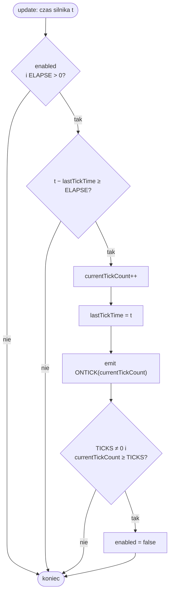

# Czas i timery

Obiekt [`TIMER`](../reference/TIMER.md) to cykliczny licznik czasu: co zadany interwał emituje sygnał `ONTICK`, do którego skrypt podpina obsługę. Timery są podstawowym narzędziem do opóźnień, animowanych przejść sterowanych ze skryptu i powtarzalnych akcji. Ten rozdział opisuje, jak timery liczą czas i jak zachowują się ich metody.

## Czas mierzony zegarem silnika

Timery **nie używają zegara systemowego**. Tykają na [monotonicznym zegarze silnika](loop.md#zegar-silnika), posuwanym o stały krok `1/60 s` w każdym kroku aktualizacji [pętli](loop.md):

- zegar przechowywany jest jako akumulator w milisekundach (krok dokłada `16,666… ms`),
- `getEngineTimeMs()` zwraca jego część całkowitą.

!!! tip "Determinizm i pauza"
    Dzięki temu timery są w pełni deterministyczne i **zatrzymują się razem z [pauzą](loop.md#pauza-i-krokowanie)** — czas nie płynie, gdy gra stoi. Timer ustawiony na `1000 ms` wyemituje `ONTICK` po dokładnie 60 krokach silnika (`60 × 16,666… = 1000`), niezależnie od liczby klatek na sekundę.

## Pola timera

| Pole | Znaczenie |
|---|---|
| `ELAPSE` | interwał między tyknięciami, w milisekundach |
| `TICKS` | maksymalna liczba tyknięć; `0` oznacza **bez limitu** |
| `enabled` | czy timer aktualnie tyka |
| `currentTickCount` | ile tyknięć już nastąpiło (wartość niesiona przez `ONTICK`) |
| `lastTickTime` | czas silnika ostatniego tyknięcia (akumulator interwału) |

## Logika tyknięcia

W każdym kroku aktualizacji silnik wywołuje `update()` na timerze:

Kluczowe szczegóły:

- po tyknięciu `lastTickTime` ustawiane jest na **bieżący** czas silnika (bez przenoszenia reszty), więc okno kolejnego tyknięcia liczy się od nowa,
- gdy `TICKS` jest dodatnie i licznik osiągnie tę wartość, timer **sam się wyłącza** po ostatnim tyknięciu,
- przy `TICKS = 0` timer tyka w nieskończoność, aż do `DISABLE`.

!!! note "Ziarnistość"
    Sprawdzenie zachodzi raz na krok (~16,67 ms), więc interwał jest praktycznie zaokrąglany w górę do najbliższej granicy kroku. Interwały będące wielokrotnością `1/60 s` (np. 50, 100, 1000 ms) trafiają idealnie; pozostałe wypadną na pierwszym kroku przekraczającym próg.

## Metody i ich pułapki

Część metod ma zachowanie, które łatwo przeoczyć — zostało ono odwzorowane wprost z oryginalnego BlooMooDLL:

| Metoda | Działanie | Uwaga |
|---|---|---|
| [`ENABLE`](../reference/TIMER.md) | włącza timer, zeruje licznik, restartuje okno interwału | **no-op, jeśli timer już jest włączony** — nie zeruje wtedy licznika |
| [`DISABLE`](../reference/TIMER.md) | zatrzymuje tykanie | zachowuje `currentTickCount` |
| [`RESET`](../reference/TIMER.md) | zeruje `currentTickCount` i restartuje okno interwału | nie zmienia `enabled` |
| [`SET`](../reference/TIMER.md) | ustawia `TICKS` **oraz** zeruje slot (licznik + okno) | nie tylko zmienia limit |
| [`SETELAPSE`](../reference/TIMER.md) | zmienia `ELAPSE` | **zachowuje akumulator** (`lastTickTime`) — przestrojenie interwału w locie nie gubi już odliczonego czasu |
| [`GETTICKS`](../reference/TIMER.md) | zwraca `currentTickCount` | |

!!! warning "`ENABLE` na włączonym timerze nic nie robi"
    Jeśli chcesz zrestartować już tykający timer (wyzerować licznik i odliczanie), użyj [`RESET`](../reference/TIMER.md) albo `DISABLE` + `ENABLE`. Samo `ENABLE` zostanie zignorowane.

## Czym różni się od oryginału

W `bloomoodll.dll` timery napędzane były **multimedialnymi timerami Win32** (`timeSetEvent`, klasy `CXTimer`/`CTimerNotificator`), a nie pętlą renderowania. Rex-EMoolator tyka je zamiast tego na [zegarze silnika](loop.md#zegar-silnika) w kroku `1/60 s`. Sama logika tyknięcia jest jednak ta sama.

!!! quote "Potwierdzone dekompilacją"
    Metoda `CMC_Timer::onTimer` w oryginalnej bibliotece robi dokładnie to, co opisano wyżej: sprawdza flagę „włączony", inkrementuje licznik tyknięć, wyłącza timer po osiągnięciu limitu `TICKS`, a następnie emituje sparametryzowany sygnał `ONTICK^<licznik>` oraz `ONTICK`.

## Powiązane tematy

- [`TIMER`](../reference/TIMER.md) — referencja metod i sygnałów.
- [Pętla i zegar silnika](loop.md) — źródło czasu dla timerów.
- [Zdarzenia i sygnały](../engine/events.md) — jak `ONTICK` propaguje się przez drzewo wywołań.
